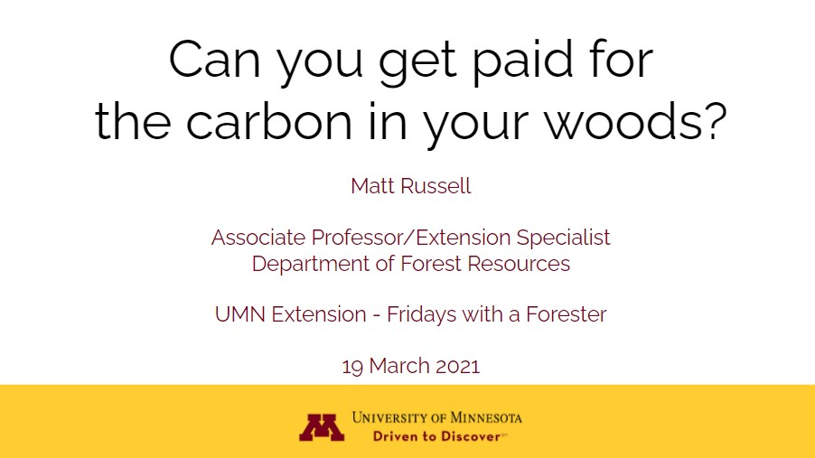

{width=500px}

 
##  
## 

Forest carbon markets are becoming a popular source of revenue for private woodland owners. Learn about the role of carbon sequestration in forests and how carbon markets might work for Minnesota landowners. 

This presentation and discussion and discussion was a part of UMN Extension's Fridays with a Forester series. 

[WATCH THIS WEBINAR](https://youtu.be/3aw8K5ttDHI) presented by Matt Russell on March 19, 2021.

[READ THE SLIDES.](http://z.umn.edu/FridayCarbon) 