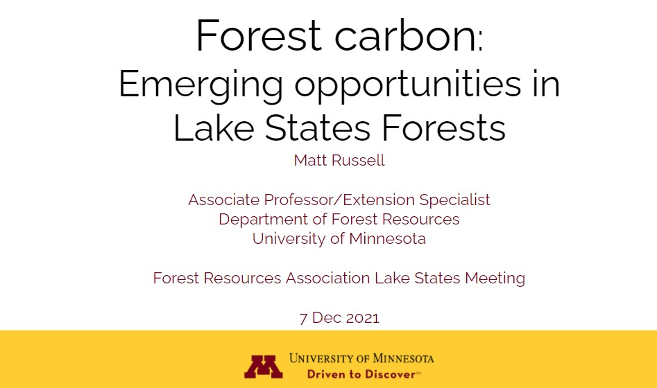

{width=500px}

 
Forest carbon presents many opportunities for forest resources professionals. This presentation was a part of a panel at the Forest Resources Association's Lake States Winter Meeting on forest carbon. 

[READ THE SLIDES](https://docs.google.com/presentation/d/1oJGLnx-MoohVu9tNdLraxQTmhy3axWFyaiZRGOgy4so/edit?usp=sharing). 