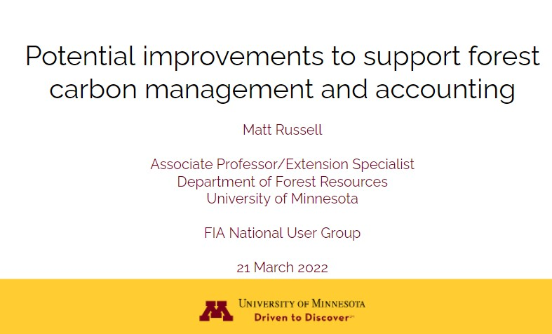

{width=500px}

 
## 

Improvements are needed in the current forest inventory and monitoring programs to support forest carbon management and accounting. This presentation was a part of a Special Focus session of the Forest Inventory and Analysis National User Group. 

[READ THE SLIDES](https://docs.google.com/presentation/d/11j0xDbZWE89YfJOGgS7g3YAj658U8wiO_tSJjQGTpCg/edit?usp=sharing). 