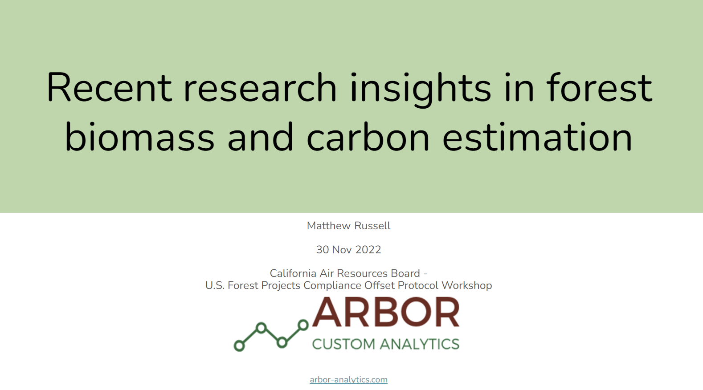

{width=500px}

##

Recent research within the forest biometrics community is helping to generate more precise estimates of forest carbon using new methods and technologies. This presentation was delivered to the California Air Resources Board Public Workshop on US Forest Projects Compliance Offset Protocol on November 30, 2022.

[READ THE SLIDES.](https://docs.google.com/presentation/d/1j58n-xS3HudJ0FezbSnFk4AHLWcmlpySbapKPqFOax4/edit?usp=sharing)