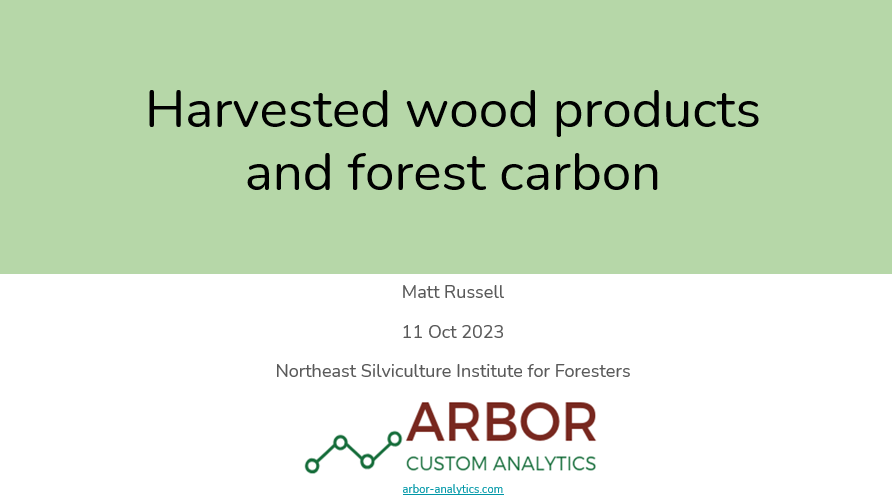

{width=500px}

## 
 
Harvested wood products store carbon from sustainably-managed forests. These slides were presented at the Northeast Silviculture Institute for Foresters in Gardner, MA on Oct. 11, 2023.

[READ THE SLIDES](https://www.dropbox.com/scl/fo/qa0d9k7fmq278w1qqypiy/h?dl=0&preview=Russell_harvested_woods_products_silviculture_institute.pdf&rlkey=4d0v361b7drpk2sy9tx717odz). 