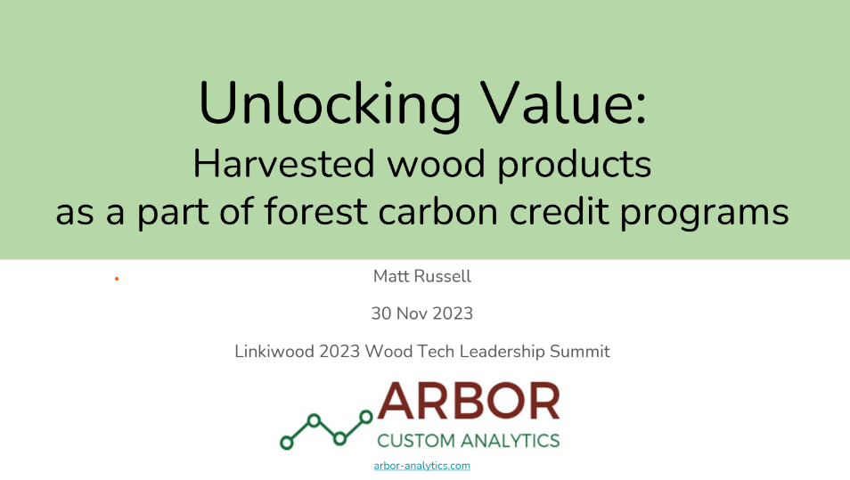

{width=500px}

## 
 
Harvested wood products store carbon in many different forms. Increasingly, forest carbon programs are available to diverse forest landowners, and harvested wood products that result from enrolled properties need to be counted. These slides were presented at the [Linkiwood 2023 Wood Tech Leadership Summit](https://linkiwood.com/business-summit-2023/) on Nov. 30, 2023.

[READ THE SLIDES HERE](https://drive.google.com/file/d/1F0zbkyewxLu26YE_ex3NOTJ6L0Vp53Hn/view?usp=sharing). 