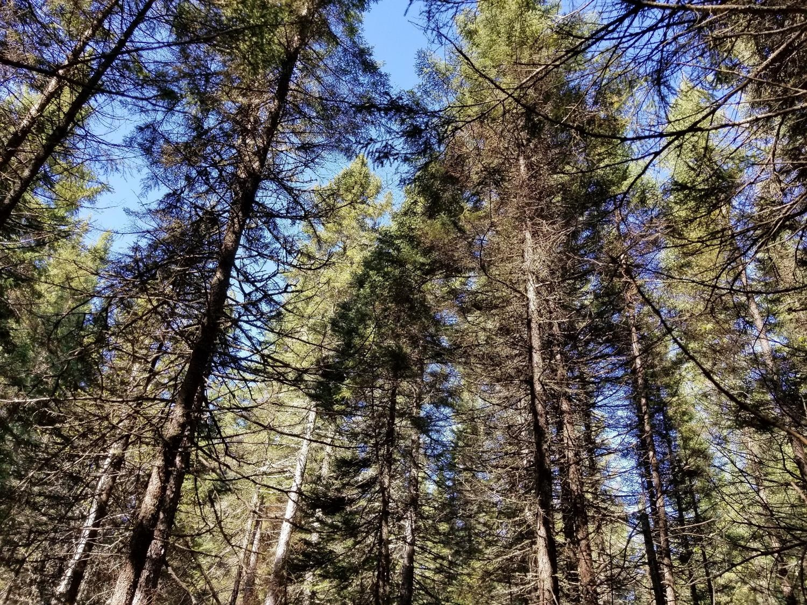

{width=500px}

*A black spruce forest in northern Minnesota.* 

# 

Carbon is quickly becoming one of the hottest forest products of the 2020s. Carbon sequestration is the reason why trees and forests are being placed front and center in discussions about natural climate solutions. Emerging markets are encouraging landowners to manage forests for the carbon they provide.

You can very quickly can get lost in the definitions, units, and vocabulary used in the forest carbon world. What's the difference between a ton and a tonne? Are carbon and carbon dioxide the same thing? Is a forest that's managed for carbon storage also being managed for carbon sequestration?

Below you'll find a reading list for beginners that presents forest carbon concepts in an approachable way:

## Carbon facts and figures

* [**Greenhouse gas emissions and removals from forest land, woodlands, and urban trees in the United States, 1990-2018**](https://www.nrs.fs.fed.us/pubs/59852) (USDA Forest Service). Every year the USDA Forest Service reports an economy-wide inventory of greenhouse gas (GHG) emissions and removals in the country. This most recent document provides an overview of the status and trends of GHG emissions and removals from forests, woodlands, harvested wood products, and urban trees in the United States from 1990 to 2018. It includes national and state-level reports.  

* [**Carbon fact sheets**](https://www.forestresources.org/policy-priorities/carbon-fact-sheets) (Forest Resources Association). I worked with FRA to develop fact sheets that show the role of forests in sequestering and storing carbon. The fact sheets present the status and trends in forest carbon storage and sequestration using data from the USDA Forest Service. The fact sheets have reports at the national, regional, and state levels. 

## Carbon and forest management
*  [**Forest carbon: an essential natural solution to climate change**](https://masswoods.org/caring-your-land/forest-carbon) (UMass Extension). This is an excellent publication that lists definitions of forest carbon with great graphics and illustrations. It showcases the differences between managing forests for carbon sequestration, storage, or both.  It is one of the best publications for landowners and decision makers to learn about the complexities of forest carbon.  

* [**Forest carbon management**](https://forestadaptation.org/focus/forest-carbon-management) (USDA Forest Service, Northern Institute of Applied Climate Science). Managing forests for carbon and climate change introduces the topic of adaptation as a forest management tool. This website describes adaptation strategies and approaches for forest carbon management, including links to case studies showing real-world adaptation demonstration projects.

* [**Carbon benefits of wood-based products and energy**](https://www.fs.usda.gov/ccrc/topics/carbon-benefits-wood-based-products-and-energy) (USDA Forest Service, Northern Institute of Applied Climate Science). Forest management produces diverse forest products that store carbon for decades or even centuries. This resource describes the role of forest management in providing carbon storage in harvested wood products and bioenergy.
  
## Carbon markets

* [**An introduction to forest carbon offset markets**](https://content.ces.ncsu.edu/an-introduction-to-forest-carbon-offset-markets) (North Carolina State Extension). A gentle introduction to forest carbon markets is provided in this resource. It includes a description of the different types of forest carbon offset projects, how voluntary and compliance markets differ, and how carbon credit registries work. 
* [**Family-owned forests: how to unlock the carbon potential in America's backyard**](https://www.forestfoundation.org/white-paper-carbon-family-forests) (American Forest Foundation). This white paper captures a lot of the energy behind carbon markets designed for small landowners, focusing on AFF's program. Many of these voluntary markets have exploded in the last year, and this is a great reading that distills the language of carbon markets for a private landowner. You'll need to sign up for their email list to download the white paper.

* [**State of the voluntary carbon markets**](https://www.ecosystemmarketplace.com/carbon-markets/) (Ecosystem Marketplace). This document has been the best consistent resource that tracks the status of voluntary markets. Updated annually, this resource provides insights into voluntary carbon market dynamics, supply, and demand. You'll need to sign up for their email list to download the document.

## Conclusion

There is an abundance of information on forest carbon on the web. To be able to discuss it the context of forest as natural climate solutions or in terms of the role forests play in carbon markets, these readings present the material in an approachable way.    

Which documents did I miss? [Send me an email](mailto:matt@arbor-analytics.com) with any suggestions.

--

*By Matt Russell. Sign up for my [monthly newsletter](https://mailchi.mp/d96897dc0f46/arbor-analytics) for in-depth analysis on data and analytics in the forest products industry.*