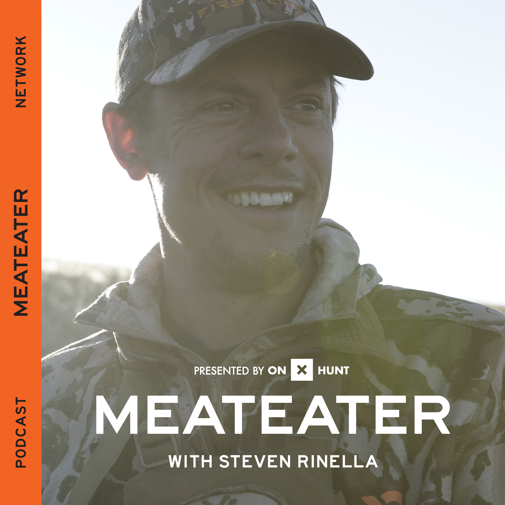

{width=250px}

*The MeatEater podcast.* 

# 

The MeatEater Podcast is one of the most widely listened to podcasts in the outdoor genre. It has over 33,000 ratings on Apple Podcasts and consistently ranks as one of the most downloaded podcasts in the outdoors and wilderness categories.

I’m a semi-regular listener and enjoy the questions from listeners, hunting stories, and discussions on conservation issues. For a podcast that talks about the outdoors so much, I’ve always found it lacks a discussion on forests, one of the ecosystems that the MeatEater crew spends so much time in. 

Conversations on trees, forests, and forest management have typically been few and far between on the podcast. This is somewhat surprising even as podcast host and famed author Steven Rinella often tells stories of his past career as a tree climber and arborist.

Forestry recently came up on an episode of the podcast. It was a great conversation that placed our profession in good light. On [Episode 258 (“The Chit and the Poof”)](https://www.themeateater.com/listen/meateater/ep-258-the-chit-and-the-poof), guests Rick Hutton and Seth Morris described their time as forestry students in the forest technology program at Penn State Mont Alto.

Both mentioned their desires for wanting to enroll in a forestry program, for reasons that are familiar to many of us. Studying forestry would mean more time in the woods. It would make you a better outdoorsman and naturalist. The logic goes, a degree in forestry might be easy because the people that sign up for them are already familiar with the outdoors. 

On the podcast, the guests reflected on being wrong about the “forestry is easy” idea. They mentioned enrolling in challenging classes in math and statistics as a part of their forest technician program. They reminisce on their dendrology class and describe the pain and headaches in learning how to identify 120 different tree species. You have to memorize Latin names for the family, genus, AND species! 

The guests also mentioned the attrition of forestry students in their program and how they “dropped like flies” by the end of the program. They talk about concepts of tree growth and the definition of stands.

The lack of a basic understanding of trees and forests by some of the most famous outdoorsmen also comes up. This is summarized well when Rinella describes how some of the most seasoned and well-rounded deer hunters he knows often lack basic tree identification skills: “They can’t tell you what kind of tree their treestand is standing in.”

With an audience of hundreds of thousands of listeners, the MeatEater conversation sent a good message about our profession: a forestry education is challenging, but learning about trees can take your understanding of the natural world to the next level. After listening, the podcast made me feel proud of the message it sent to younger people thinking about becoming foresters in the future.   

[Listen to the podcast here.](https://www.themeateater.com/listen/meateater/ep-258-the-chit-and-the-poof) The conversation on forestry begins at minute 24:00 in the podcast and lasts for about 10 minutes. 

--

*By Matt Russell. [Email Matt](mailto:matt@arbor-analytics.com) with any questions or comments. Sign up for my [monthly newsletter](https://mailchi.mp/d96897dc0f46/arbor-analytics) for in-depth analysis on data and analytics in the forest products industry.*