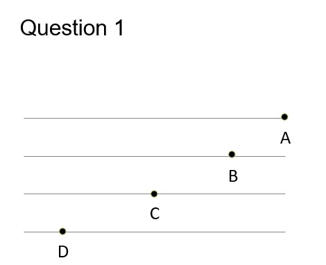
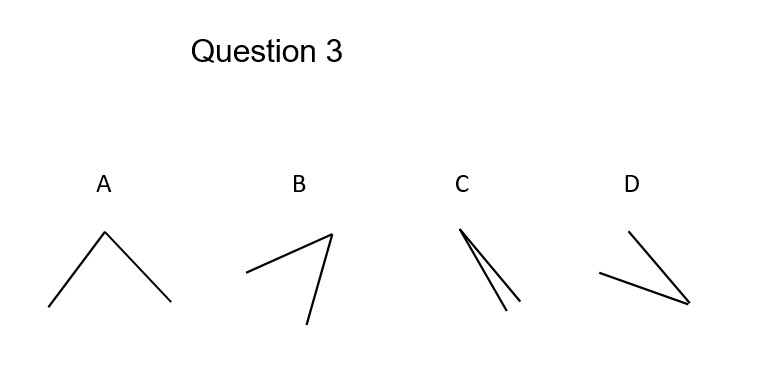
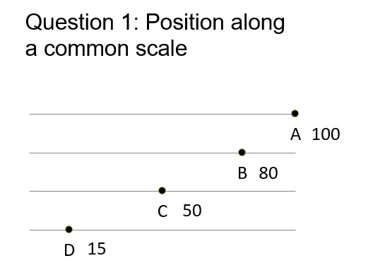
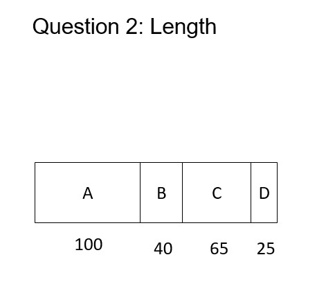
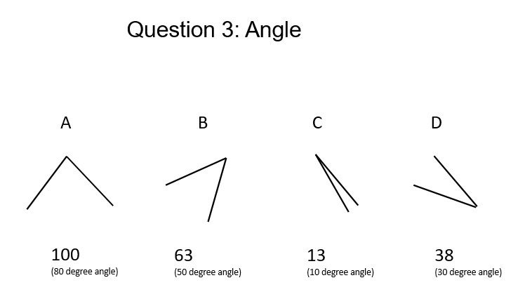

> "The only thing worse than a pie chart is several of them." -*Edward Tufte*

I was in college when I first head that pie graphs were bad. I didn't really understand why at first, but I always appreciated how easy they were to make in Excel and Minitab.

Over time I learned about the drawbacks to visualizing data with pie graphs. I eventually came across the papers by Cleveland and McGill (1984, 1985), works that effectively showed which types of graphs to produce and which to avoid. In the age of Twitter and social media, there's a strong community [against pie graphs](https://twitter.com/dataandme/status/1031362448404738049).

Pie graphs are used to display categorical data. They show the distribution of variables as a “pie” whose slices are sized by the counts or percents for the categories.

Pie graphs are ineffective because the human eye does a poor job in judging angles. Similarly, the eye is terrible when judging color in pie graphs. Instead, the human eye does a great job of discerning position and lengths of objects, and we should develop visualizations that emphasize those elements.

This post will describe an in-class activity I've conducted in several statistics classes. I'll show some data I've collected on why pie charts are problematic compared to other visualizations.

## Class activity: Graphical perception

I've used graduate students in my NR 5021: Statistics for Agricultural and Natural Resources Professionals class as my "pie graph lab rats". In five different classes over the last five years, I've collected data from 114 students that tested their graphical perception of different types of visualizations.

Students decoded quantitative information from a series of graphs that I showed on the projector screen. They entered their response into a Goggle Form that allowed me to quickly analyze the results and show them in class. (You can try these yourself.)

Students saw a series of three questions and were asked to estimate the percentage of a data point (**B**, **C**, and **D**), relative to the data point **A**. For example, the first question asked about positions along a common scale. If students thought **C** was half the value of **A**, they entered 50%:

<center>

{width="250px"}

</center>

The questions became more difficult. The second question asked about perceiving the length and area of an object:

<center>

{width="250px"}

</center>

And the third question asked about judging the size of angles, your task when you see a pie graph:

<center>

{width="500px"}

</center>

## The answers

For Question 1, most people had trouble estimating **D**, the smallest value. On average, students overpredicted the value of Q1D by 5%: 

<center>

{width="250px"}

</center>

For Question 2, on average students **underpredicted** every value, up to 7%:

<center>

{width="250px"}

</center>

For Question 3, on average students **overpredicted** every value, up to 8%. This question was a challenge for many students because the reference angle was 80 degrees and not oriented with a horizontal axis:

<center>

{width="500px"}

</center>

To summarize the results, here is the average difference from the true value for each of the questions:

```{r, echo = F, warning = F, message = F}

# Load library
library(tidyverse)

# Read in data
graphs<-read.csv('C:/Users/russellm/Documents/Projects/z_Archived/Graphs/graphperception_all.csv')

# Input correct pie graph answers

graphs$Q1B_right<-80
graphs$Q1C_right<-50	
graphs$Q1D_right<-15	
graphs$Q2B_right<-40	
graphs$Q2C_right<-65	
graphs$Q2D_right<-25	
graphs$Q3B_right<-62.5	
graphs$Q3C_right<-12.5	
graphs$Q3D_right<-37.5

# Calculate error of pie graph answers
graphs$Q1B_error<-(graphs$Q1B_right-graphs$Q1B)
graphs$Q1C_error<-(graphs$Q1C_right-graphs$Q1C)
graphs$Q1D_error<-(graphs$Q1D_right-graphs$Q1D)
graphs$Q2B_error<-(graphs$Q2B_right-graphs$Q2B)
graphs$Q2C_error<-(graphs$Q2C_right-graphs$Q2C)
graphs$Q2D_error<-(graphs$Q2D_right-graphs$Q2D)
graphs$Q3B_error<-(graphs$Q3B_right-graphs$Q3B)
graphs$Q3C_error<-(graphs$Q3C_right-graphs$Q3C)
graphs$Q3D_error<-(graphs$Q3D_right-graphs$Q3D)

# Make data set of pie graph errors
m1<-as.data.frame(colMeans(graphs))
colnames(m1) <- c("mean_error")

m1$name<-rownames(m1)
m2<-m1[m1$name %in% c("Q1B_error","Q1C_error","Q1D_error",
                      "Q2B_error","Q2C_error","Q2D_error",
                      "Q3B_error","Q3C_error","Q3D_error"),]

m2$name2<-substr(rownames(m2),1,3)

m2$Type<-ifelse(m2$name2 %in% c("Q1B","Q1C","Q1D"),"Position",
                ifelse(m2$name2 %in% c("Q2B","Q2C","Q2D"),"Length", "Angle"))


# Plot mean error values
m2$Type <- factor(m2$Type,levels = c("Position", "Length", "Angle"))

p.mean_error<-ggplot(m2, aes(x = name2, y = mean_error, fill = Type))+
  geom_bar(stat = "identity", col = "black")+
  ylab("Average difference from true value")+
  xlab("Question number")+
  ggtitle("n = 114 student responses")+
  theme(panel.background = element_rect(fill = "NA"),
        axis.line = element_line(color = "black"),
        axis.ticks = element_line(size = 0.5, color = "black"))
p.mean_error

```

## Conclusion

Pie charts should be used with caution. There are several reasons for overlooking pie graphs and instead favoring other kinds of graphs. Several reasons behind this are pointed out in early work by Cleveland and McGill (1984, 1985):

* The human eye does a poor job in judging angles. This makes it difficult to discern the values within pie graphs.
* Pie graphs contain color, and the human eye does a very poor job in judging color in graphs. This is especially true for individuals that are color blind or have other visual impairments.

Regardless, because of the widespread use of pie graphs it is helpful to learn how to interpret them. As an alternative, place more priority in developing graphs such as bar plots when displaying categorical data.

Cleveland and McGill (1984, 1985) recommend creating graphs that exploit the following aspects, ranked from highest to lowest:

1. Position along a common scale (like Question 1)
2. Position on identical but non-identical scales (think axes that are of the same magnitude but offset to one another)
3. Length (like Question 2)
4. Angle (Pie graphs, like Question 3)
5. Slopes and directions
6. Area
7. Volume, density, and color saturation
9. Color hue

The human eye does a fine job of discerning position and lengths of objects, so stick to creating those graphs in your data visualization. 

### References

Cleveland, W.S., and R. McGill. 1984. Graphical perception: theory, experimentation, and application to the development of graphical methods. *J. Am. Stat. Assoc.* 79: 531-554.

Cleveland, W.S., and R. McGill. 1985. Graphical perception and graphical methods for analyzing scientific data. *Science* 229: 828-833.

--

*By Matt Russell. [Email Matt](mailto:matt@arbor-analytics.com) with any questions or comments. Sign up for my [monthly newsletter](https://mailchi.mp/d96897dc0f46/arbor-analytics) for in-depth analysis on data and analytics in the forest products industry.*
