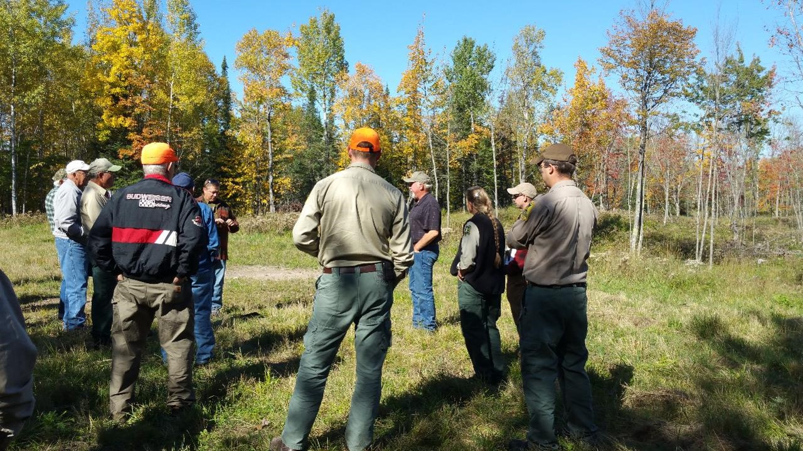

{width="500px"}

##   
## 

Voluntary forest carbon markets have expanded considerably over the last year. While compliance markets such as the California Air Resource Board’s Cap-and-Trade Regulation and their associated Forest Offset Protocol have existed for several years, it has primarily targeted large landowners with thousands of acres. 

One of the benefits of newer voluntary forest carbon programs is that they typically have small minimum acreage requirements and shorter contract lengths. These markets may be the greatest opportunity for private forestland owners with small properties (e.g., less than 100 acres).

With the expansion of many voluntary forest carbon market programs, it's difficult to keep track of them. Each program has their own minimum acreage. Contract lengths vary from one program to the next. Most allow timber harvesting, but many have restrictions about the volume of harvest allowed or the time period when harvesting can occur. 

Here is an overview of five voluntary forest carbon market programs that may be appealing to small landowners. Note that program enrollments continue to evolve and this is not meant to be a complete list of all available programs. This post only represents information obtained as of 12 March 2021. 

## Family Forest Carbon Program 

The [Family Forest Carbon Program](https://www.forestfoundation.org/family-forest-carbon-program) by the American Forestry Foundation and The Nature Conservancy was created to bring together forest landowners and companies to address climate change. A pilot program has been completed in Pennsylvania and it will soon be coming to landowners in the Upper Great Lakes.  

* **Minimum acreage**: 30 acres
* **Contract length**: 20 years
* **Is harvesting allowed?**: In the *Growing Mature Forests* program, harvesting is allowed with some restrictions. In their *Enhancing the Future Forest* program, any recent harvest or upcoming harvest is allowed.

## CORE Carbon

The [CORE Carbon program](https://corecarbon.com/) by Finite Carbon uses a digital platform and connects landowners with sustainable management and carbon sequestration. Their website indicates enrollment in the program will begin in early 2021. 

* **Minimum acreage**: 40 acres
* **Contract length**: Unknown
* **Is harvesting allowed?**: Unknown

## NCAPX

The [NCAPX program](https://www.silviaterra.com/ncapx) by SilviaTerra is a “data-driven forest carbon marketplace”. A pilot program has been completed in Pennsylvania. It will expand to 11 states in the US South in March 2021, followed by the rest of the US later in 2021.

* **Minimum acreage**: None
* **Contract length**: One year
* **Is harvesting allowed?**: Focuses on deferring harvest for over the annual contract year.

## Forest Carbon Works

The [Forest Carbon Works program](https://forestcarbonworks.org/) makes forest carbon projects accessible for small landowners. The program employs technology that uses a smartphone app to reduce the costs of inventorying forest carbon. 

* **Minimum acreage**: 40 acres
* **Contract length**: 125 years, in renewable six year contract periods
* **Is harvesting allowed?**: Harvesting shall not have occurred in the ten years prior to enrolling; must forgo harvesting in the first six years after enrolling.

## Bluesource

The [Bluesource program](http://www.bluesource.com/services/forest-carbon/) manages North America's largest carbon offset portfolio at over 2.3 million acres. Bluesource is also involved in other environmental services like biogas and methane reduction. It has several projects ongoing in northern US states.

* **Minimum acreage**: 3,000 acres
* **Contract length**: 40-100 years (depending on voluntary or compliance market)
* **Is harvesting allowed?**: Harvesting is permitted, so long as it does not exceed growth.

I encourage you to visit the websites mentioned to learn more about the requirements of each program. Many have email lists that keep you updated on the status and enrollment in the program.  

--

*By Matt Russell. [Email Matt](mailto:matt@arbor-analytics.com) with any questions or comments. Sign up for my [monthly newsletter](https://mailchi.mp/d96897dc0f46/arbor-analytics) for in-depth analysis on data and analytics in the forest products industry.*