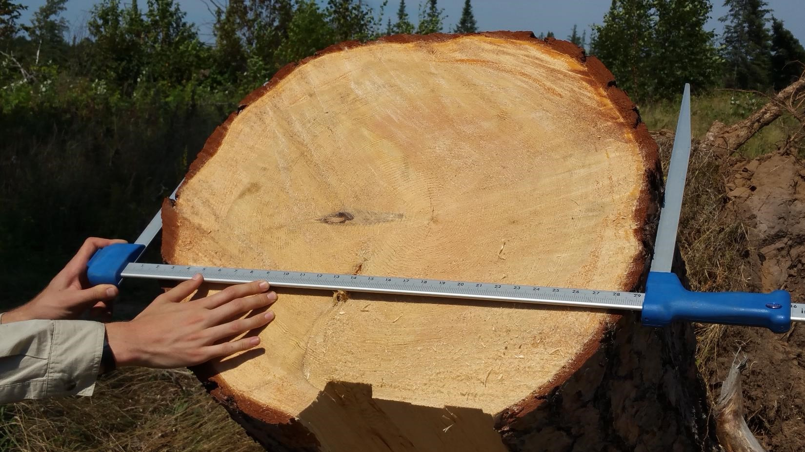

<center>
{width=500px}

</center>

"Half of the biomass of a tree is carbon." This has been a widely spoken statement made by many foresters and scientists alike. Most forest carbon assessments use the 50% rule and it generally works well.

In forest analytics, determining [the amount of carbon in a tree](https://arbor-analytics.com/post/how-to-calculate-how-much-carbon-is-in-a-tree/) is first based on estimating its biomass. At the individual tree level, a biomass equation can be developed based on a tree's diameter, height, species, region, and other tree and stand characteristics. 

Biomass is then multiplied by a carbon concentration factor for the wood, such as the 50% value. For example, if the aboveground dry weight for a 20-inch diameter tree is 3,000 pounds, it would contain 1,500 pounds of carbon.  

Wood is comprised of cellulose, hemicellulose, and lignin, each with varying carbon concentrations across different tree species and regions. So how well does the 50% assumption hold if we compare it to what was found in a recently published study? 

## Carbon in Maine's forests

In 2018, Martin and colleagues compiled a database of [wood concentrations for species around the world](https://www.nature.com/articles/s41561-018-0246-x). They found that for hardwood species in temperate regions, the average carbon concentration was **46.5%** (averaged across 111 species). For temperate conifers, the average carbon concentration of wood **50.1%** (averaged across 45 species).  

Obtaining data from the [tidyFIA package in R](https://arbor-analytics.com/post/2021-04-03-importing-fia-data-to-analyze-biomass-data-with-tidyfia/), we can simulate how these different carbon concentration factors result in different estimates of carbon at the tree and stand scales. Obtaining Forest Inventory and Analysis (FIA) data from Maine, USA results in 14,876 unique remeasurements of forest plots:

```{r, echo = F, warning = F, message = F}
library(tidyFIA)
library(tidyverse)
library(sf)
library(spData)
library(knitr)
library(kableExtra)
library(tidycensus)
library(urbnmapr)
```

```{r, echo = F, warning = F, message = F}
me_data <- tidy_fia(
  states = "ME",
  table_names = c("plot", "tree", "cond"),
  postgis = FALSE
  )
```

```{r, echo = F, warning = F, message = F}
plot <- me_data[["plot"]] %>% filter(invyr >= 1999)
cond <- me_data[["cond"]] %>% filter(invyr >= 1999)
tree <- me_data[["tree"]] %>% filter(invyr >= 1999)
```

```{r, echo = F, warning = F, message = F}
p.me <- plot(me_data) + 
  labs(title = "FIA plots in Maine, USA") 
p.me
```

Biomass and carbon of trees in the FIA program are estimated using the [component ratio method (CRM)](https://www.nrs.fs.fed.us/pubs/39555), a set of regional volume equations that ultimately predict carbon in aboveground portions of trees. We can modify the carbon concentration used in the CRM method to look at different assessments of carbon stored in individual trees. 

The figure below displays the carbon content of each tree, separated by conifers and hardwoods. Note that the carbon estimates for conifers are similar for both concentrations and generally follow the 1:1 line. (50.1% is awfully close to the default value of 50.0%.) However, for large hardwood trees, note that the 50% carbon assumption leads to "overestimates" compared to the revised 46.5% concentration: 

```{r, echo = F, warning = F, message = F}
ref_species <- read_ref_table("REF_SPECIES") %>%
  select(spcd, common_name)

common_spp <- me_data[["tree"]] %>%
  group_by(spcd) %>%
  tally %>%
  top_n(6, wt = n) %>%
  pull(spcd)

tree <- tree %>%
  left_join(ref_species) 

tree <- tree %>%
  mutate(carbon_ag_new = ifelse(spcd < 300, drybio_ag * 0.501,  drybio_ag * 0.465),
         sp_type = ifelse(spcd < 300, "Conifers",  "Hardwoods"))
```


```{r, echo = F, warning = F, message = F}
p.carb <- ggplot(tree, aes(x = carbon_ag, y = carbon_ag_new)) +
     geom_point(alpha = 0.2) +
     facet_wrap(~ sp_type) +
  geom_abline(intercept = 0, slope = 1) +
     labs (x = "Aboveground tree carbon (pounds; \nassume mass = 50% carbon)",
           y = "Aboveground tree carbon (pounds; \nassume mass = varying carbon)") +
      theme(panel.background = element_blank(),
         axis.line = element_line(color = "black"),
         axis.text = element_text(color = "black"))
p.carb
```

```{r, echo = F, warning = F, message = F}
plot_stats <- tree %>%
  group_by(plt_cn) %>%
  filter(statuscd == 1) %>% 
  summarize(
    bapa = sum(tpa_unadj * 0.005454 * dia ^ 2, na.rm = TRUE),
    cpa_0.5 =  sum(tpa_unadj * carbon_ag, na.rm = TRUE),
    cpa_new =  sum(tpa_unadj * carbon_ag_new, na.rm = TRUE)
  ) %>%
  full_join(
    plot %>% select(cn, statecd, unitcd, countycd, plot, invyr),
    by = c("plt_cn" = "cn")
  ) %>%
  mutate(cpa_0.5_tons = cpa_0.5 /2000,
         cpa_new_tons = cpa_new /2000) %>% 
  replace_na(replace = list(bapa = 0, cpa_0.5_tons = 0, cpa_new_tons = 0))
```

At the individual tree level, slight differences in carbon estimates will occur, especially for large-diameter hardwoods. But what about when trees are scaled to the pot level and represented on a per acre basis?

The figure below shows the "overprediction" of carbon using the 50% assumption relative to the carbon concentrations which vary for hardwoods and conifers (46.5% and 50.1%). The blue regression line follows the trend for FIA plots in Maine and can be compared to the black 1:1 line: 

```{r, echo = F, warning = F, message = F}
p.plot <- ggplot(plot_stats, aes(x = cpa_0.5_tons, y = cpa_new_tons)) +
  geom_point() +
  stat_smooth() +
  geom_abline(intercept = 0, slope = 1) +
     labs (x = "Aboveground tree carbon (US tons per acre; \nassume mass = 50% carbon)",
           y = "Aboveground tree carbon (US tons per acre; \nassume mass = varying carbon)") +
    theme(panel.background = element_blank(),
         axis.line = element_line(color = "black"),
         axis.text = element_text(color = "black"))
p.plot
```

On average, there's **4% less carbon** on FIA plots in Maine using the hardwood- and conifer-specific carbon concentrations compared to the 50% assumption. There are 16.2 tons/acre for the 50% concentration and 15.6 tons/acre using the hardwood- and conifer-specific carbon concentration. For stands with large trees with lots of biomass (e.g., large-diameter oaks and maples in Maine), these differences would be more apparent.

```{r, echo = F, warning = F, message = F}
plot_stats_c<- plot_stats %>% 
  ungroup() %>% 
  summarize(`FIA plots` = n(), 
            `Mean carbon` = round(mean(cpa_0.5_tons, na.rm = T), 1),
            `SD carbon` = round(sd(cpa_0.5_tons, na.rm = T), 1),
            `Min carbon` = round(min(cpa_0.5_tons, na.rm = T), 1),
            `Max carbon` = round(max(cpa_0.5_tons, na.rm = T), 1))

plot_stats_c_new <- plot_stats %>% 
  ungroup() %>% 
  summarize(`FIA plots` = n(), 
            `Mean carbon` = round(mean(cpa_new_tons, na.rm = T), 1),
            `SD carbon` = round(sd(cpa_new_tons, na.rm = T), 1),
            `Min carbon` = round(min(cpa_new_tons, na.rm = T), 1),
            `Max carbon` = round(max(cpa_new_tons, na.rm = T), 1))
```

```{r, echo = F, warning = F, message = F}
plot_stats_big <- plot_stats %>% 
  filter(cpa_0.5_tons >= 50)
  
plot_stats_c<- plot_stats_big %>% 
  ungroup() %>% 
  summarize(`FIA plots` = n(), 
            `Mean carbon` = round(mean(cpa_0.5_tons, na.rm = T), 1),
            `SD carbon` = round(sd(cpa_0.5_tons, na.rm = T), 1),
            `Min carbon` = round(min(cpa_0.5_tons, na.rm = T), 1),
            `Max carbon` = round(max(cpa_0.5_tons, na.rm = T), 1))

plot_stats_c_new <- plot_stats_big %>% 
  ungroup() %>% 
  summarize(`FIA plots` = n(), 
            `Mean carbon` = round(mean(cpa_new_tons, na.rm = T), 1),
            `SD carbon` = round(sd(cpa_new_tons, na.rm = T), 1),
            `Min carbon` = round(min(cpa_new_tons, na.rm = T), 1),
            `Max carbon` = round(max(cpa_new_tons, na.rm = T), 1))
```

We can analyze the Maine data to better understand carbon differences across ecological subsections. Six of Maine's most common ecological subsections vary in terms of their species composition and stand structures.

```{r, echo = F, warning = F, message = F}
plot_stats_for <- tree %>%
  group_by(plt_cn) %>%
  filter(statuscd == 1) %>% 
  summarize(
    bapa = sum(tpa_unadj * 0.005454 * dia ^ 2, na.rm = TRUE),
    cpa_0.5 =  sum(tpa_unadj * carbon_ag, na.rm = TRUE),
    cpa_new =  sum(tpa_unadj * carbon_ag_new, na.rm = TRUE)
  ) %>%
  full_join(
    plot %>% select(cn, statecd, unitcd, countycd, plot, invyr, ecosubcd),
    by = c("plt_cn" = "cn")
  ) %>%
  mutate(cpa_0.5_tons = cpa_0.5 /2000,
         cpa_new_tons = cpa_new /2000) %>% 
  replace_na(replace = list(bapa = 0, cpa_0.5_tons = 0, cpa_new_tons = 0))
```

```{r, echo = F, warning = F, message = F}
common_eco <- plot_stats_for %>%
  group_by(ecosubcd) %>%
  tally %>%
  top_n(6, wt = n) %>%
  pull(ecosubcd)
```

```{r, echo = F, warning = F, message = F}

ref_eco<- tribble(
  ~ecosubcd, ~name,
  "211Aa", "Aroostook Hills Subsection",
  "211Bb", "Maine-New Brunswick Lowlands Subsection",
  "211Da", "Central Maine Embayment Subsection",
  "M211Ab", "St. John Upland Subsection",
  "M211Ac", "Maine Central Mountains Subsection", 
  "M211Af", "Connecticut Lakes Subsection"
)
 ref_eco %>%
   kable("html", format.args = list(big.mark = ","),
         caption = 'Six most common ecological subsections in Maine.') %>%
   kable_styling()
```

Regions that have a strong hardwood component, such as the Maine Central Mountains Subsection and the Connecticut Lakes Subsection, show stark different in high biomass areas when comparing the different carbon concentration factors.  

```{r, echo = F, warning = F, message = F}
plot_stats_for %>%
  filter(ecosubcd %in% common_eco) %>%
  left_join(ref_eco) %>%
  ggplot(aes(x = cpa_0.5_tons, y = cpa_new_tons)) +
  geom_point() +
  stat_smooth() +
  facet_wrap(~ecosubcd) +
  geom_abline(intercept = 0, slope = 1) +
     labs (x = "Aboveground tree carbon (US tons per acre; \nassume mass = 50% carbon)",
           y = "Aboveground tree carbon (US tons per acre; \nassume mass = varying carbon)") +
    theme(panel.background = element_blank(),
         axis.line = element_line(color = "black"),
         axis.text = element_text(color = "black"))

```

## Summary

The choice of which concentration factor to use will provide different values in any carbon assessment. It is important to be familiar with which carbon concentration factors are used in the assessments you're involved with. While "half of the biomass of a tree is carbon" is generally a true statement for conifers in temperate regions, analysts working on carbon projects with large-diameter hardwood species should assess these broad assumptions about carbon in wood. 


--

*By Matt Russell. [Email Matt](mailto:matt@arbor-analytics.com) with any questions or comments. Sign up for my [monthly newsletter](https://mailchi.mp/d96897dc0f46/arbor-analytics) for in-depth analysis on data and analytics in the forest products industry.*
