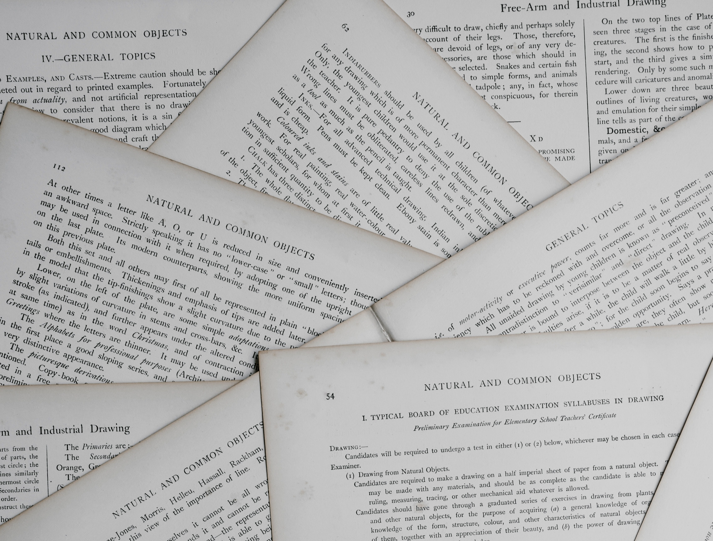

<center>
{width=500px}

</center>

This summer I completed my 100th peer review of a manuscript in forest science. Peer review is mostly a non-compensated service to the profession, but the process probably works as best as any other system for evaluating the merit and impact of scientific studies. The individuals best qualified to evaluate scientific work are scientists working on similar research problems.

For the process, typically a journal will reach out to a reviewer over email with an invitation. The reviewer has between two and six weeks to read the manuscript, write a thoughtful review, and provide comments back to the journal through their online editorial management website. The process generally works fine, provided the associate editor of a journal can (1) find enough reviewers to evaluate the manuscript and (2) receive comments from reviewers in a timely manner.

As a graduate student, the peer review process was a black box to me. I remember attending a national forestry conference and seeing on the agenda a meeting scheduled for one of forestry’s most well-known journals. Next to the event listing on the agenda was listed in big italics: *For Associate Editors only*. What were they talking about in there? How to take over the world? Even after completing a healthy share of manuscript reviews, some aspects of peer review are still curious to me. 

In the effort to share more about experiences in peer review, below I share some takeaways as I reflect on completing my 100th peer review. I separate them into strategies and tactics:

# Peer review strategies 

## Put yourself in a growth mindset as you review
After being asked to evaluate someone else’s work, it’s easy to put on your “critiquing glasses” and immediately begin finding flaws in a study. While pointing out flaws is certainly one of the responsibilities of reviewers, instead, consider your time with the review as a learning experience. This will allow you to have a favorable view on the peer review experience. 

For example, I’ve never set foot in a forest in eastern Africa, but I’ve reviewed manuscripts from the region. Having the opportunity to review work from Ghana allowed me to learn more about the deforestation of hardwood forests and the contribution of the forest products industry in the country.

Good reviewers will get asked to provide reviews more than bad reviewers. This is fortunate for the journal, but unfortunate for you. As you publish more articles and simultaneously conduct more reviews, the number of review requests sent your way will increase. Do all that you can to use your peer reviews as a learning experience instead of just a task that needs to be checked off your list.      

## Good science is easy to review, poor science takes time
It is difficult to judge how long a quality review will take. Certainly an 80-page manuscript will take more time than a 20-page manuscript, but I’ve learned to block out more time than I think is needed for any review. 

Great manuscripts take a shorter time to review than poorly-written manuscripts. All manuscripts have at least some aspects of them that can be improved. The educator in me always wants to provide useful feedback even if it's poor work. I once heard someone say that with anything you write, you should always imagine your grandmother is going to read it. Be critical and provide feedback on the work, but don’t do it in a way that is condescending, rude, or my favorite new term, “mansplains”.  

## Keep track of your reviews
For most academics with research appointments, peer review is a service activity that is encouraged by university department heads and administrators. Documenting your peer review activities will benefit you as you gather materials for your tenure and promotion. How quickly you can forget if you reviewed that paper for this journal or that one, even a month after you complete the review.

For graduate students and other early career researchers, having experience with conducting a few peer reviews and putting them on your CV will set you apart from others at a similar career stage.

Historically, how many peer reviews a researcher conducts has been largely known only to themselves. Fortunately, websites like [Publons](https://publons.com/about/home/) allow you to digitally track your peer review contributions and see how many reviews your colleagues have done. I’ve been using Publons since 2017 and have found it to be a useful tool that peeks “behind the curtain” of the peer review process.
  
In addition to tools like Publons, I suggest keeping your own spreadsheet with information such as manuscript title, journal the work was submitted to, country/region of study, your decision on the manuscript (e.g.,  reject or resubmit with revisions), and the journal's ultimate decision about the manuscript. Most journals in the forest sciences will correspond with reviewers via email on the final decision of the manuscript. In keeping my own data of peer review contributions up-to-date, I’m able to share graphs like the following with my department head: 

```{r, echo = F, warning = F, message = F}
library(tidyverse)
```

```{r, echo = F, warning = F, message = F}
# Journals I've reviewed for and number of manuscripts 
# As of 18 July 2021
journals <- tribble(
  ~Journal, ~num_reviewed,
"Annals of Forest Science", 1,				
"Australian Forestry", 2,
"BioScience", 1,						
"Bosque", 1,						
"Canadian Journal of Fisheries and Aquatic Sciences", 1,	
"Canadian Journal of Forest Research", 6, 	
"Carbon Balance and Management", 2,			
"Computers and Electronics in Agriculture", 1,
"East African Agricultural and Forestry Journal", 3,		
"Ecological Applications", 1,					
"Ecological Modelling", 1, 					
"Ecological Research", 1,					
"Ecology", 1,						
"Ecosphere", 1,						
"Environmental Monitoring and Assessment", 1,		
"European Journal of Forest Research", 1,		 	
"Forestry", 3,						
"Forests", 7,						
"Forest Ecology and Management", 22,			
"Forest Ecosystems", 2,	
"Forest Products Journal", 1,					
"Forest Science", 8,					
"GCB Bioenergy", 1,					
"Global Change Biology", 2,	
"Human and Ecological Risk Assessment", 1,			
"Journal of Applied Ecology", 2,
"Journal of Biogeography", 1,				
"Journal of Ecology", 1,				
"Journal of Environmental Management", 1,			
"Journal of Extension", 2,
"Journal of Forestry", 7,					
"Journal of Forestry Research", 1,				
"Journal of Sustainable Forestry", 1,				
"Journal of the Torrey Botanical Society", 1,			
"Nature Communications", 2,				
"Northern Journal of Applied Forestry", 1,			
"PLoS ONE", 5,						
"Remote Sensing of Environment", 1,				
"Scandinavian Journal of Forest Research", 1,			
"Science of the Total Environment", 1,			
"Sustainability", 1,						
"Teaching Statistics", 2,
)
```

```{r, echo = F, warning = F, message = F}
p.journals <- journals %>% 
 filter(num_reviewed >= 3) %>% 
  ggplot(aes(x = reorder(Journal, num_reviewed), y = num_reviewed)) +
  geom_bar(stat =  "identity") +
   coord_flip() +
  labs(x = "", y = "Manuscripts reviewed by Matt (n >= 3)") +
   theme(panel.background = element_blank(),
          axis.line = element_line(color = "black"),
          axis.text = element_text(color = "black"))
p.journals
```

## Read reviews written by others
I am easily persuaded by reading what other experts say. Another benefit of the review process is that most journals in the forest sciences will forward **all** review comments to both the authors **and** all peer reviewers. This gives you the benefit of understanding how other researchers interpreted the study. 

Reading reviews written by others can confirm your criticisms (e.g., “I’m glad the other reviewers found the error in how they ran the model...”). Reading other reviews can also open your mind to aspects of the study you missed (e.g., “Why didn’t I spot that they didn't explain that graph?…”) or provide you a different perspective on an issue or interpretation of a finding (e.g., “I didn’t see that part of the analysis as a major part of the work, but the reviewer raises a good point...”).

Take time to read the review comments that others provided to work that you reviewed, and you will learn much more about the work.

## Journal editors: celebrate peer reviewers
With the rise of digital publishing and databases such as Web of Science and Google Scholar, finding metrics on the relative impact of journals is relatively straightforward. Google lists [forestry’s top journals](https://scholar.google.com/citations?view_op=top_venues&hl=en&vq=bio_forestsforestry) and additional information such as impact factors is often reported on journal websites. 

Much of the success in journals is due to the peer reviewers that provide volunteer service. Little information about peer reviewers is found on journal websites aside from an annual appreciation list published by the journal. Some journals like the *Canadian Journal of Forest Research* dole out [Outstanding Reviewer awards](https://cdnsciencepub.com/journal/cjfr/about/outstanding-reviewers), but this recognizes a small portion of the total reviewer pool. More actions that recognize the service of peer reviewers should be initiated by forestry journals, in particular for reviewers early in their career stage and from diverse backgrounds.     

## Ask about the peer review process.
Peer review and publishing in journals are not exactly transparent processes. Journal websites will only provide so much information. Don’t hesitate to ask your senior colleagues about their experiences with peer review or reach out to Associate Editors listed on journal websites. This can include their experiences with the peer review process, differences in journals they selected, and recommendations for outlets for your work. 

In 2015, Aaron Weiskittel published a [great paper on peer review in the forest sciences](http://mcfns.net/index.php/Journal/article/view/MCFNS7.2_4). It is well worth reading for its perspectives on roles and responsibilities in peer review. It also describes several alternatives to the process of traditional peer review. 

# Peer review tactics 

## Review two papers for every paper you publish
This was a [recommendation by Weiskittel](http://mcfns.net/index.php/Journal/article/view/MCFNS7.2_4), and I have tried to keep to this ratio. If you can imagine that two or three reviewers provide comments on every manuscript, this ratio makes sense. For me, this means I’m reviewing a paper about once a month, so I generally always have a manuscript on my desk to review.

From the journal’s perspective, it is often difficult to find enough reviewers to agree to complete a review, much less provide a quality review in return. This is magnified by the fact that the number of forestry researchers has [declined by 12% since 2002](https://arbor-analytics.com/post/the-decline-of-researchers-in-forest-science/), yet the number of journals and articles in forestry has increased. Don’t review too much or too little, but find the right number of manuscripts that you should be reviewing on an annual basis.

## Don’t review too much for a single journal
Just like you don’t want to write for only one journal, don’t review for the same journal over and over. For the journal editor, it certainly makes their lives easier if you continue to accept review requests and provide quality feedback. I once learned that a colleague was able to have the article processing charge (APC) for a manuscript he submitted waived because he provided seven reviews for a journal within the last 12 months. Every article review was rewarded with a few hundred dollars off the APC. While a nice gesture of appreciation by the journal, I think the journal received more value from his numerous review comments than they did for a single APC from an author. 

A good journal should value feedback from a diversity of reviewers. Journal editors should also recognize that you’ve been contributing a lot of reviews by keeping track of your efforts in their online system.

I once replied back to a journal asking to be removed from their reviewer list because they asked me to review a new paper while I was already reviewing another one for their journal. While this might have been an honest mistake, everyone’s time is valuable and editors should recognize that. 

Don’t hesitate to decline reviews or ask not to be sent reviews by a specific journal. To diversify the journals you review for, sign up to be a reviewer on journal websites or reach out to senior colleagues inquiring if you can help them with a review for a new journal.     

## Separate between general comments and minor comments.
Your ability to make your review comments easy to digest and comprehend will benefit you, the authors, and the Associate Editor. Editors first like to see that the reviewer has understood and interpreted the work presented in the manuscript. Then, by starting your review with a narrative of your general comments on the work, you will show the editor that you’ve reflected on the entire work and synthesized it in a comprehensive way. 

Minor comments can be written in a bulleted list, but if your comments are more than two sentences on a topic, it might deserve to be treated as a general comment. As an AE I loathe when reviewers attach a Word document with Track Changes and edits as a part of their review. Your job as a peer reviewer is to provide feedback to the authors to improve the quality of the work and to judge the scientific merit of a study. Reviewers review, authors edit.

## Print the manuscript.
There is value in reading things on paper, and I like to do this with manuscripts. Reviewing a paper on a screen is problematic for me as I often switch over to my email or other task which distracts me. Printing on paper also allows me to take the paper with me anywhere, whereas relying on a screen means I can only review the paper at my desk or where I can take my laptop.

I like to read the manuscript first to understand what the authors set out to accomplish and their results. Then, during a second read through I’ll make notes and annotations in the margins. After that I’ll type my responses as I thumb through the manuscript and my annotations. 

# Conclusion
Peer review is a non-compensated activity and is not perfect, but the process is one that’s likely to stay in the near future. As a reviewer, I point out several strategies and tactics that you might find insightful when conducting your own reviews of forestry manuscripts. Put yourself in a growth mindset while you review, learn how others review manuscripts, and dedicate the time to provide a quality review. 

--

*By Matt Russell. [Email Matt](mailto:matt@arbor-analytics.com) with any questions or comments. Sign up for my [monthly newsletter](https://mailchi.mp/d96897dc0f46/arbor-analytics) for in-depth analysis on data and analytics in the forest products industry.*
