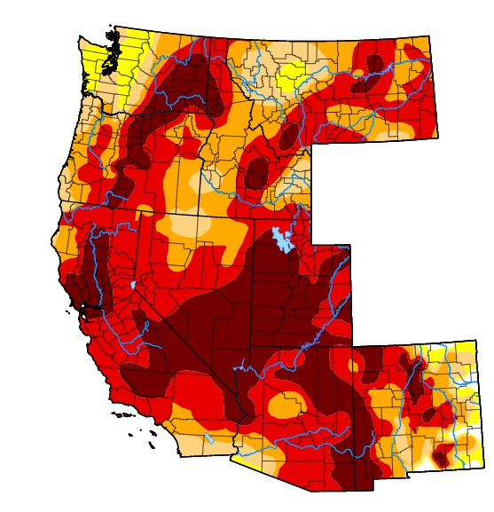

<center>
{width=300px}
</center>
*Drought conditions in the western US, 20 July 2021. From US Drought Monitor.*

## 

Much of the western United States is currently under severe drought conditions. Drought impacts trees and forests in the short and long term. Trees and forests can tolerate some extended dry periods depending of species and local conditions, but without adequate moisture availability, drought can ultimately lead to tree mortality.

Perhaps the greatest impact of drought is the stress it places on trees. This stress leads trees being attacked by insects, diseases, and other forest pests. Wildfire is a significant concern in forests that have seen drought conditions. Dead and dying trees with dry conditions make for excellent ingredients to start of a wildfire.

The impacts of drought are difficult to tease apart when looking at forests on the whole because this disturbance compounds with other ones. Fortunately there are some data available that lend insight into drought impacts. 

## Monitoring drought in forests
Field crews working as part of the [USDA Forest Inventory and Analysis program](https://www.fia.fs.fed.us/) collect information on disturbances that occur at each forest inventory plot they visit. In the western US where plots are on a 10-year remeasurement cycle, a plot is noted as being disturbed if it experienced a disturbance since the last plot inventory (i.e., within the last 10 years). For a plot to be considered disturbed, the disturbance must equal or exceed one acre in size and affect at least 25% of the trees in the forest condition.

Drought is one disturbance category collected by FIA field crews. Data from the [FIA's EVALIDator program](https://apps.fs.usda.gov/Evalidator/evalidator.jsp) collected across western US states from 2008 through 2019 reveal some important trends about drought impacts.

Over the last ten years, drought has impacted **1.7 million acres of forests** across nine western US states. These have been direct observations on FIA plots where trees show signs of drought impacts such as yellowing foliage on conifers or wilted leaves on hardwood species.

In the FIA data collection protocol, up to three types of disturbances can be labeled on each plot. Drought is one of the most common disturbance types that is also observed with others. These disturbances include insect and disease damage to overstory and understory trees.

California and New Mexico saw the largest amount of drought impacts to forests, each with over 600,000 acres affected over the last 10 years. Within each state, drought impacted over 2% of the total forestland within each state:

```{r, echo = F, message = F, warning = T}
library(tidyverse)
library(knitr)
library(kableExtra)
options(scipen = 100)
```

```{r, echo = F, message = F, warning = T}
# Data from FIA EVALIDator, 23 July 2021. Measurements between 2008 and 2019
west <- read_csv('C://Users//russellm//Documents//Arbor//Data//west_drought.csv')
```

```{r, echo = F, message = F, warning = T}
west_summ <- west |> 
  filter(State != "All states") |> 
  group_by(State) |> 
  summarize(acs_drought = sum(Drought, na.rm = T)) |> 
  arrange(desc(acs_drought))

west_summ2 <- west |> 
  filter(State != "All states") |> 
  summarize(acs_drought = sum(Drought, na.rm = T)) 
```

```{r, echo = F, message = F, warning = T}
area <- west |> 
  filter(State != "All states" & DIST == 1) |> 
  select(State, Total)
  
west_summ <- west_summ |> 
  inner_join(area) |> 
  mutate(pct_drought = round((acs_drought/Total)*100, 2)) |> 
  arrange(desc(pct_drought))
```

```{r, echo = F, message = F, warning = T}
p.drought <- ggplot(west_summ, aes(x = reorder(State, acs_drought), y = acs_drought/1000)) +
  geom_bar(stat = "identity", col = "black", fill = "brown1") +
  coord_flip()+
     labs (x = "",
           y = "Acres affected by drought (x 1,000)",
           caption = "Source: USDA Forest Inventory and Analyis")+
      theme(panel.background = element_blank(),
         axis.line = element_line(color = "black"),
         axis.text = element_text(color = "black"))
p.drought
```

All other western states saw drought impacts affecting less than one percent of their forests over this last ten years:

```{r, echo = F, message = F, warning = T}
west_summ_new <- west_summ |> 
  select(-Total) |> 
  rename(`Acres in drought` = acs_drought,
         `% forestland in drought` = pct_drought)
 
knitr::kable(west_summ_new[,], "html",
             caption = "Drought impacts in western US states, 2008-2019.")
```

## Conclusion
Drought has had a large impact in western US forests in the 2021 summer. It is difficult to separate trees dying directly as a result of drought because this disturbance interacts with others to lead to tree mortality. While forest inventory data have their limitations in monitoring drought impact, dry weather has resulted in stressed trees on at least 170,000 acres every year in western US forests.   

--

*By Matt Russell. [Email Matt](mailto:matt@arbor-analytics.com) with any questions or comments. Sign up for my [monthly newsletter](https://mailchi.mp/d96897dc0f46/arbor-analytics) for in-depth analysis on data and analytics in the forest products industry.*