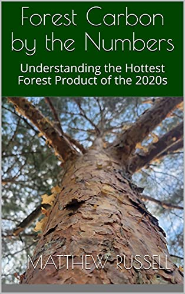

## 
## 
## 

Now available on Amazon is [*Forest Carbon by the Numbers: Understanding the Hottest Forest Product of the 2020s*](https://www.amazon.com/dp/B09CC1WT69). 

Carbon is becoming a highly valued commodity of forests. Trees sequester carbon dioxide and turn it into wood, storing carbon in forests and long-lived forest products for long time periods. Despite the increased recognition of carbon as a natural climate solution and several emerging markets that monetize it, few professionals in forestry and natural resources have a grasp on the amount and extent of forest carbon in the ecosystems they work in.

In *Forest Carbon by the Numbers*, I share insights and visualizations of the current status and trends in forest carbon and how it impacts the forest products industry.

In *Forest Carbon by the Numbers*, you will understand:

* Terminology associated with forest carbon measurements and markets,
* How forest carbon is quantified (from individual tree to landscape scales),
* How to leverage forest inventory data to understand forest biomass and carbon, and
* Trends and future opportunities in forest carbon.

[GET THE EBOOK](https://www.amazon.com/dp/B09CC1WT69) to learn more about forest carbon and how it can be better understood in your own organization.

--

*By Matt Russell. [Email Matt](mailto:matt@arbor-analytics.com) with any questions or comments. Sign up for my [monthly newsletter](https://mailchi.mp/d96897dc0f46/arbor-analytics) for in-depth analysis on data and analytics in the forest products industry.*