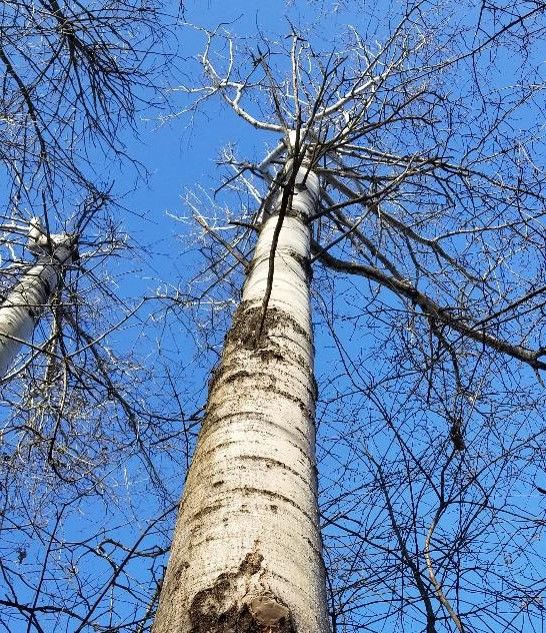
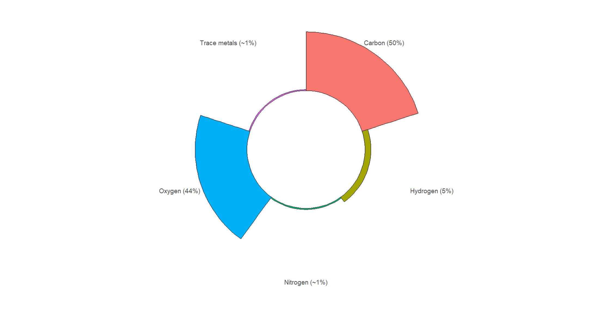

<center>
{width=250px}
</center>

# 

> "You wrote earlier that “since half of biomass is carbon, I multiply by 0.5.” What is the other half of biomass?"

I was sent this question this question over email last week. As foresters, we're often concerned with only carbon stored and sequestered in trees. But the are other elements that form the chemical composition of wood. While there are slight deviations to the ["50% of biomass in wood is carbon" assumption](https://arbor-analytics.com/post/2021-06-18-testing-the-assumption-half-of-the-biomass-of-a-tree-is-carbon/), it is a statement that provides an approximation about the amount of carbon in wood. 

Flashbacks of your middle school biology classes might enter your mind as you remember equations for photosynthesis and plant growth. The other 50% of wood is mostly oxygen (~44%), hydrogen (~6%), nitrogen (~1%), and other trace metals. Other trace metals include calcium, potassium, and iron, among other elements. We can view the wood characteristics in a polar area diagram:

```{r, echo = F, message = F, warning = F}
# library(tidyverse)
# 
# # wood <- tribble(
# #   ~Element, ~Pct,
# #   "Carbon", 50,
# #   "Oxygen", 44,
# #   "Hydrogen", 6,
# #   "Nitrogen", 0.5,
# #   "Other trace metals", 0.5
# # )
# 
# value <- c("50%", "44%", "6%", "~1%", "~1%" )
# 
# wood <- read_csv("C://Users//russellm//Documents//Arbor//Data//wood_comp2.csv")
# ggplot(wood, aes(x = Element, fill = Element)) +
#   geom_bar(width = 1, colour = "black") +
#   labs(x = "", y = "") +
#   coord_polar() +
#   ylim(-50, 50) +
#   theme(panel.background = element_blank(),
#         legend.position = "none",
#         axis.text = element_text(size = 14),
#         axis.ticks = element_blank())
```


<center>

</center>


Although the chemical compositions of wood vary by species and regions, these are approximations for "the other half". The major components of wood - lignin, cellulose, and hemicellulose - each vary in terms of the proportion of carbon found in them. It's a useful reminder of the unique chemical composition of wood.

--

*By Matt Russell. [Email Matt](mailto:matt@arbor-analytics.com) with any questions or comments. Sign up for my [monthly newsletter](https://mailchi.mp/d96897dc0f46/arbor-analytics) for in-depth analysis on data and analytics in the forest products industry.*
