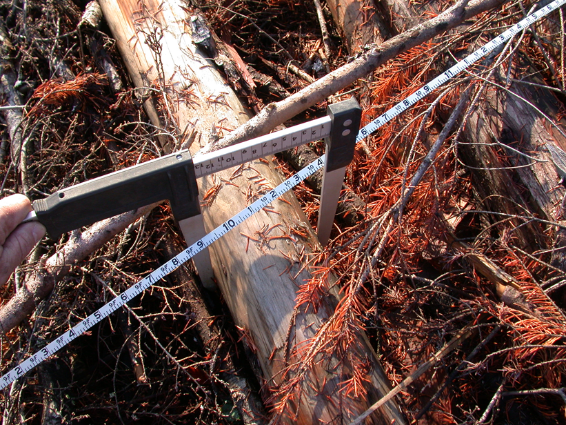

{width=500px}

## 

## 

The Homeland Security Department [recently recognized forestry](https://www.federalregister.gov/documents/2022/01/21/2022-01188/update-to-the-department-of-homeland-security-stem-designated-degree-program-list) as a science, technology, engineering, and mathematics (STEM) discipline. Homeland Security has added both the general forestry and forest resources production and management fields of study to the Optional Practical Training (OPT) program.

This is significant for the forestry profession because colleges and universities will have access to additional funding to support students. The announcement also makes it easier for non US citizens with advanced degrees (such as Masters and PhD graduates) that are in STEM disciplines to obtain lawful permanent resident status in the United States. 

Ultimately, this announcement can help to spur growth and innovation in the US economy. In an industry like forestry with limited pools for professionals with advanced degrees, this announcement is welcomed. 

Special thanks to the [Society of American Foresters](https://www.eforester.org/Main/SAF_News/2022/DHS-Recognizes-Forestry-as-STEM.aspx) for their work in getting forestry recognized as a STEM discipline. 

--

*By Matt Russell. Sign up for my [monthly newsletter](https://mailchi.mp/d96897dc0f46/arbor-analytics) for in-depth analysis on data and analytics in the forest products industry.*