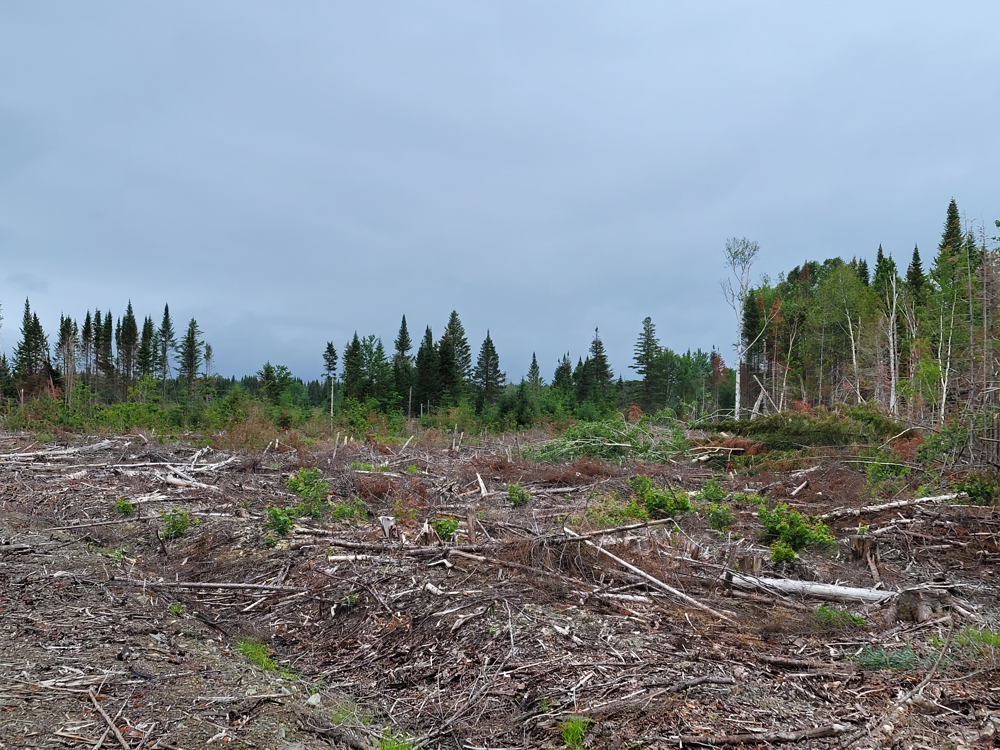

<center>
{width=400px}
</center>

## 
 
Logging companies in the US Lake States requested $49.7 million in Paycheck Protection Program loans offered through the Small Business Administration in 2020 and 2021. These loans were offered to 1,445 logging businesses in the Lake States.

The [SBA Paycheck Protection Program](https://www.sba.gov/funding-programs/loans/covid-19-relief-options/paycheck-protection-program/ppp-data) provides information on PPP loan distributions to businesses throughout the COVID-19 pandemic. Depending on the size of the business and its needs, loan amounts varied.

For all logging businesses, the average loan amount was \$34,412 and there were an average of 3.6 jobs reported across all PPP loan applications: 

```{r,  echo = F, message = F, warning = F}
options(scipen=10000)

library(tidyverse)
library(knitr)
library(formattable)
library(kableExtra)
```

```{r, echo = F, message = F, warning = F}
# Make a NAICS Code table
NAICS <- tribble(
  ~NAICSCode, ~IndustryTitle, ~IndustryCat, ~NAICSName, ~n_bus,
1131, "Agriculture, Forestry, Fishing and Hunting",	"Timber Tract Operations", "Timber Tract Operations", 2067,
113110,"Agriculture, Forestry, Fishing and Hunting", "Timber Tract Operations", "Timber Tract Operations", 2067,	
1132, "Agriculture, Forestry, Fishing and Hunting",	"Forest Nurseries and Gathering of Forest Products", "Forest Nurseries and Gathering of Forest Products", 962, 	
113210, "Agriculture, Forestry, Fishing and Hunting",	"Forest Nurseries and Gathering of Forest Products", "Forest Nurseries and Gathering of Forest Products", 962,	
1133, "Agriculture, Forestry, Fishing and Hunting",	"Logging", "Logging", 8250,
113310, "Agriculture, Forestry, Fishing and Hunting",	"Logging", "Logging", 8250,
1153,"Agriculture, Forestry, Fishing and Hunting",	"Support Activities for Forestry", "Support Activities for Forestry", 5277,
115310,"Agriculture, Forestry, Fishing and Hunting",	"Support Activities for Forestry", "Support Activities for Forestry", 5277,
3211, "Manufacturing",	"Sawmills and Wood Preservation",	"Sawmills and Wood Preservation",3120,
321113, "Manufacturing",	"Sawmills and Wood Preservation","Sawmills",	2480,
321114, "Manufacturing", "Sawmills and Wood Preservation",	"Wood Preservation",	640,
3212, "Manufacturing", "Veneer, Plywood, and Engineered Wood Product Manufacturing",	"Veneer, Plywood, and Engineered Wood Product Manufacturing",	1617,
321211, "Manufacturing", "Veneer, Plywood, and Engineered Wood Product Manufacturing",	"Hardwood Veneer and Plywood Manufacturing",	299,
321212, "Manufacturing", "Veneer, Plywood, and Engineered Wood Product Manufacturing",	"Softwood Veneer and Plywood Manufacturing",	80,
321213, "Manufacturing", "Veneer, Plywood, and Engineered Wood Product Manufacturing",	"Engineered Wood Member (except Truss) Manufacturing",	58,
321214, "Manufacturing", "Veneer, Plywood, and Engineered Wood Product Manufacturing",	"Truss Manufacturing",	869,
321219, "Manufacturing", "Veneer, Plywood, and Engineered Wood Product Manufacturing",	"Reconstituted Wood Product Manufacturing",	311,
3219, "Manufacturing",	"Other Wood Product Manufacturing", "Other Wood Product Manufacturing",	26742,
321911, "Manufacturing", "Other Wood Product Manufacturing", "Wood Window and Door Manufacturing",	1259,
321912, "Manufacturing", "Other Wood Product Manufacturing", "Cut Stock, Resawing Lumber, and Planing",	1225,
321918, "Manufacturing", "Other Wood Product Manufacturing", "Other Millwork (including Flooring)",	14687,
321920, "Manufacturing", "Other Wood Product Manufacturing", "Wood Container and Pallet Manufacturing",	3383,
321991, "Manufacturing", "Other Wood Product Manufacturing", "Manufactured Home (Mobile Home) Manufacturing",	570,
321992, "Manufacturing", "Other Wood Product Manufacturing", "Prefabricated Wood Building Manufacturing",	1111,
321999, "Manufacturing", "Other Wood Product Manufacturing",	"All Other Miscellaneous Wood Product Manufacturing",	4507,
3221, "Manufacturing",	"Pulp, Paper, and Paperboard Mills", "Pulp, Paper, and Paperboard Mills",	2956,
322110, "Manufacturing", "Pulp, Paper, and Paperboard Mills",	"Pulp Mills",	343,
322121, "Manufacturing", "Pulp, Paper, and Paperboard Mills",	"Paper (except Newsprint) Mills",	1921,
322122, "Manufacturing", "Pulp, Paper, and Paperboard Mills",	"Newsprint Mills",	34,
322130, "Manufacturing", "Pulp, Paper, and Paperboard Mills", "Paperboard Mills",	658,
3222, "Manufacturing", "Converted Paper Product Manufacturing", "Converted Paper Product Manufacturing",	6059,
322211, "Manufacturing", "Converted Paper Product Manufacturing", "Corrugated and Solid Fiber Box Manufacturing",	1852,
322212, "Manufacturing", "Converted Paper Product Manufacturing", "Folding Paperboard Box Manufacturing",	147,
322219, "Manufacturing", "Converted Paper Product Manufacturing", "Other Paperboard Container Manufacturing",	663,
322220, "Manufacturing", "Converted Paper Product Manufacturing", "Paper Bag and Coated and Treated Paper Manufacturing",	1471,
322230, "Manufacturing", "Converted Paper Product Manufacturing", "Stationery Product Manufacturing",	412,
322291, "Manufacturing", "Converted Paper Product Manufacturing", "Sanitary Paper Product Manufacturing",	374,
322299, "Manufacturing", "Converted Paper Product Manufacturing", "All Other Converted Paper Product Manufacturing",	1140
)
```

```{r, echo = F, message = F, warning = F}
# Make a list of NAICS codes
NAICS_list <- c(1133, 
                113310, 
                1132, 
                113210,
                1133,
                113310,
                1153,
                115310,
                3211,
                321113,
                321114,
                3212,
                321211,
                321212,
                321213,
                321214,
                321219,
                3219,
                321911,
                321912,
                321918,
                321920,
                321991,
                321992,
                321999,
                3221,
                322110,
                322121,
                322122,
                322130,
                3222,
                322211,
                322212,
                322219,
                322220,
                322230,
                322291,
                322299)

# Read in data from US SBA website

# Data last updated January 2022

public_up_to_150k_1 <- read_csv('https://data.sba.gov/dataset/8aa276e2-6cab-4f86-aca4-a7dde42adf24/resource/af49f823-84da-4900-8a29-14d37783312c/download/public_up_to_150k_1_220102.csv')

public_up_to_150k_1 <- public_up_to_150k_1 %>%
  filter(NAICSCode %in% NAICS_list)
  
public_up_to_150k_2 <- read_csv('https://data.sba.gov/dataset/8aa276e2-6cab-4f86-aca4-a7dde42adf24/resource/7dd5066e-587b-4e7f-97d6-aeeb8d43e95e/download/public_up_to_150k_2_220102.csv')

public_up_to_150k_2 <- public_up_to_150k_2 %>%
  filter(NAICSCode %in% NAICS_list)

public_up_to_150k_3 <- read_csv('https://data.sba.gov/dataset/8aa276e2-6cab-4f86-aca4-a7dde42adf24/resource/87226a98-ab63-4d24-8c13-862dc4e231ce/download/public_up_to_150k_3_220102.csv')

public_up_to_150k_3 <- public_up_to_150k_3 %>%
  filter(NAICSCode %in% NAICS_list)

public_up_to_150k_4 <- read_csv('https://data.sba.gov/dataset/8aa276e2-6cab-4f86-aca4-a7dde42adf24/resource/9fc51bda-fb7f-4e60-a768-9f872bc97e20/download/public_up_to_150k_4_220102.csv')

public_up_to_150k_4 <- public_up_to_150k_4 %>%
  filter(NAICSCode %in% NAICS_list)

public_up_to_150k_5 <- read_csv('https://data.sba.gov/dataset/8aa276e2-6cab-4f86-aca4-a7dde42adf24/resource/3c6c0c0e-ed9f-478f-a6f4-56e0c7819a9d/download/public_up_to_150k_5_220102.csv')

public_up_to_150k_5 <- public_up_to_150k_5 %>%
  filter(NAICSCode %in% NAICS_list)

public_up_to_150k_6 <- read_csv('https://data.sba.gov/dataset/8aa276e2-6cab-4f86-aca4-a7dde42adf24/resource/de046832-58bb-4239-ac46-e17d42352126/download/public_up_to_150k_6_220102.csv')

public_up_to_150k_6 <- public_up_to_150k_6 %>%
  filter(NAICSCode %in% NAICS_list)

public_up_to_150k_7 <- read_csv('https://data.sba.gov/dataset/8aa276e2-6cab-4f86-aca4-a7dde42adf24/resource/77531198-8895-4bf2-ba25-cf0b74449545/download/public_up_to_150k_7_220102.csv')

public_up_to_150k_7 <- public_up_to_150k_7 %>%
  filter(NAICSCode %in% NAICS_list)

public_up_to_150k_8 <- read_csv('https://data.sba.gov/dataset/8aa276e2-6cab-4f86-aca4-a7dde42adf24/resource/0ac12ffc-0502-4655-81ff-a479b4302ee7/download/public_up_to_150k_8_220102.csv')

public_up_to_150k_8 <- public_up_to_150k_8 %>%
  filter(NAICSCode %in% NAICS_list)

public_up_to_150k_9 <- read_csv('https://data.sba.gov/dataset/8aa276e2-6cab-4f86-aca4-a7dde42adf24/resource/0b2cbc69-9a58-4b28-8fd6-3426243b8f90/download/public_up_to_150k_9_220102.csv')

public_up_to_150k_9 <- public_up_to_150k_9 %>%
  filter(NAICSCode %in% NAICS_list)

public_up_to_150k_10 <- read_csv('https://data.sba.gov/dataset/8aa276e2-6cab-4f86-aca4-a7dde42adf24/resource/0e8a121f-3baa-4b7e-ba71-466b867dcae8/download/public_up_to_150k_10_220102.csv')

public_up_to_150k_10 <- public_up_to_150k_10 %>%
  filter(NAICSCode %in% NAICS_list)

public_up_to_150k_11 <- read_csv('https://data.sba.gov/dataset/8aa276e2-6cab-4f86-aca4-a7dde42adf24/resource/23cbab5f-781d-498c-b7d7-7604d5cb6bde/download/public_up_to_150k_11_220102.csv')

public_up_to_150k_11 <- public_up_to_150k_11 %>%
  filter(NAICSCode %in% NAICS_list)

public_up_to_150k_12 <- read_csv('https://data.sba.gov/dataset/8aa276e2-6cab-4f86-aca4-a7dde42adf24/resource/809345ac-f85d-487e-b07b-f9a34064564d/download/public_up_to_150k_12_220102.csv')

public_up_to_150k_12 <- public_up_to_150k_12 %>%
  filter(NAICSCode %in% NAICS_list)

# BIG
public_150k_plus <- read_csv('https://data.sba.gov/dataset/8aa276e2-6cab-4f86-aca4-a7dde42adf24/resource/c84fa84d-c047-4b66-8056-5748f6a2bfca/download/public_150k_plus_220102.csv')

public_150k_plus <- public_150k_plus %>%
  filter(NAICSCode %in% NAICS_list)
```

```{r, echo = F, message = F, warning = F}
# Combine all PPP loan data and join to NAICS code table

ppp <- rbind(public_up_to_150k_1,
             public_up_to_150k_2,
             public_up_to_150k_3,
             public_up_to_150k_4,
             public_up_to_150k_5,
             public_up_to_150k_6,
             public_up_to_150k_7,
             public_up_to_150k_8,
             public_up_to_150k_9,
             public_up_to_150k_10,
             public_up_to_150k_11,
             public_up_to_150k_12,
             public_150k_plus)

ppp <- inner_join(ppp, NAICS)
```

```{r, echo = F, message = F, warning = F}
ls <- ppp %>%
  filter(NAICSCode %in% c(1133, 113310) & BorrowerState %in% c("MI", "WI", "MN") & JobsReported < 100)
  
mean_ls <- ls %>% 
  summarize(mean_loan = mean(CurrentApprovalAmount),
            mean_jobs = mean(JobsReported, na.rm=T)) 

# sum(ls$CurrentApprovalAmount)

ls_names <- tribble(
  ~BorrowerState, ~BorrowerStateName,
  "MI", "Michigan",
  "MN", "Minnesota",
  "WI", "Wisconsin"
)

ls <- inner_join(ls, ls_names)

p.numloans <- ggplot(ls, aes(CurrentApprovalAmount/1000))+
  geom_histogram(bins = 15, fill="cyan", col = "black")+
  facet_wrap(~BorrowerStateName) +
    labs(y = "Number of PPP loans", 
         x = "Loan amount ($, in thousands)") +
    theme(panel.background = element_rect(fill = "NA"),
        axis.line = element_line(color="black"),
        axis.text = element_text(color = "black"),
        legend.title = element_blank(),
        legend.key=element_blank(),
        legend.position = "none") 
p.numloans 

p.jobs<- ggplot(ls, aes(JobsReported, CurrentApprovalAmount/1000)) +
  geom_point() +
  geom_smooth() +
    labs(y = "Loan amount ($, thousands)", 
         x = "Number of jobs reported") +
    theme(panel.background = element_rect(fill = "NA"),
        axis.line = element_line(color="black"),
        axis.text = element_text(color = "black"),
        legend.title = element_blank(),
        legend.key=element_blank(),
        legend.position = "none") 
p.jobs
```

The town of Crandon, WI saw the greatest number of loan distributions to logging companies. Medford and Laona, WI ranked second with over 20 loan distributions. Bemidji, MN and Gladstone, MI were those towns with the greatest number of PPP loans offered to logging businesses in those states: 

```{r, echo = F, message = F, warning = F}
ls_city_all<- tibble(City = c(ls$BorrowerCity),
                     State = c(ls$BorrowerState))

ls_city2 <- ls_city_all %>% 
  mutate(CITY = str_to_upper(paste(City, ",", State), locale = "en")) %>% 
  group_by(CITY) %>% 
  summarize(n_city = n())

ls_city3 <- ls_city2 %>% 
  rename(`Number of loans` = n_city) %>% 
  filter(`Number of loans` >= 10) %>% 
  arrange(desc(`Number of loans`))
  
ls_city3 %>% 
   kable("html", caption = 'Number of PPP loans offered to logging businesses in Lake States cities.') %>%
   kable_styling()
```

The PPP program has provided needed loans to assist logging and other forest products businesses keep their workers employed throughout the COVID-19 pandemic. For more data that summarizes PPP loans, [see this recent post](https://arbor-analytics.com/post/2022-02-12-how-the-forest-products-industry-used-paycheck-protection-program-loans/) which describes funds provided to the forest products industry.

--

*By Matt Russell. [Email Matt](mailto:matt@arbor-analytics.com) with any questions or comments. Sign up for my [monthly newsletter](https://mailchi.mp/d96897dc0f46/arbor-analytics) for in-depth analysis on data and analytics in the forest products industry.*