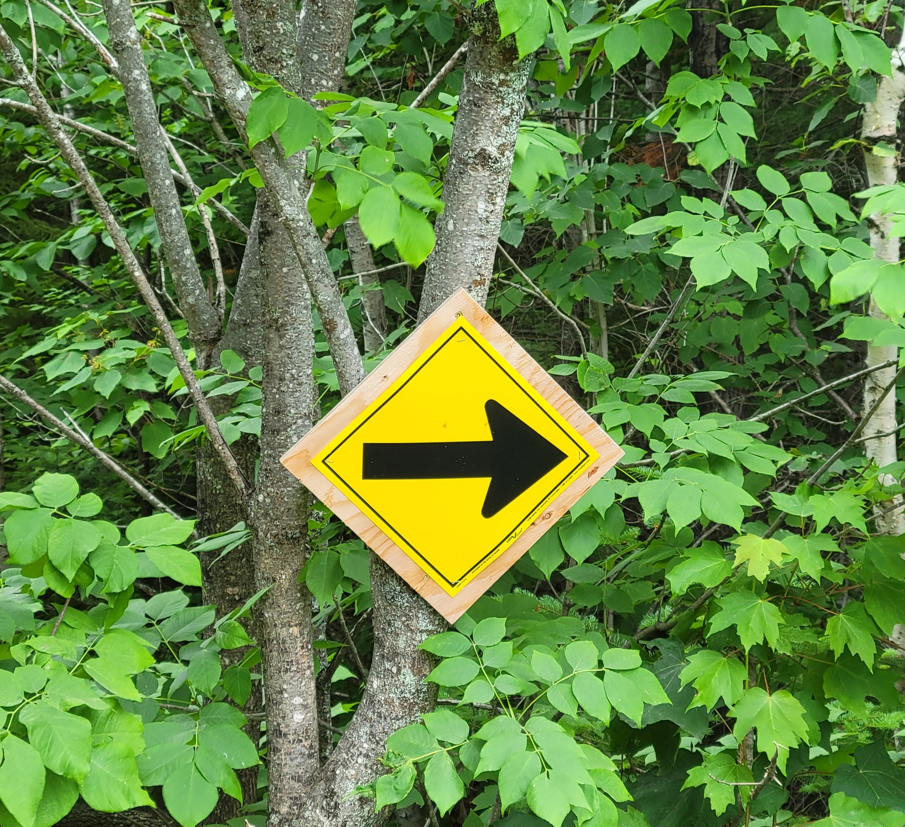

{width=300px}

##

Tell me if this has ever happened to you. 

You’re taking a walk or you’re on a run in the dark, and you have a headlamp on. It’s raining or snowing - not too hard, but enough to make your time outside a little uncomfortable. 

When the light is shining on your headlamp, you can see every raindrop or snowflake in front of you. You feel every one of them as they hit your face.

But the interesting thing is if you turn your headlamp off, you barely seem to notice the raindrops or snowflakes hitting your face. 

What is revealing about this is that the conditions are the same, but you seem to suffer more when you have a bright headlight and can see the discomfort in front of you. But switch the headlamp off, and you can bound through the conditions as if nothing is in your way. 

This revelation might relate to our sense of risk. If danger is ahead and we can see it, we’re likely to be more cautious and conservative in our decision making. If we do not sense danger ahead, we’re likely to go about our business and accept more risk.

Donald Rumsfeld, former US Secretary of Defense, popularized the [famous quote](https://en.wikipedia.org/wiki/There_are_known_knowns) that there are “known unknowns” and “unknown unknowns”. Known unknowns are the everyday risks that you’re aware of, e.g., the risk of a car accident when driving through snow. Unknown unknowns are unexpected risks you might encounter that are nearly impossible to plan ahead for, e.g., a global pandemic. 

Run with a headlamp on in the rain and you’re faced with a known unknown. The rain can make conditions slippery, so you better have a great pair of running shoes with good tread. Turn the headlamp off and you might not know what you’re up against with the rain.

In the forestry community, we’re faced with several uncertainties ahead of us. Forests that have traditionally been managed for timber, recreation, or wildlife habitat are now being called on to store and sequester carbon. Forest analysts are being asked to forecast what these forests will look like in 50 or 100 years, based on little information about what environmental conditions will be in the future.

While we know that forests have challenges ahead that we can plan for, we should also be cognizant that there are “unknowns unknowns” that we will face.

I doubt in 2019 many forestry organizations had in their business plans a protocol for working through a global health pandemic. Economists could not predict the tremendous rise in lumber prices that we saw in 2020. The recognition of trees and forests as natural climate solutions has been building, but no one could have forecasted the tremendous rise in voluntary forest carbon markets in the last three years. 

Foresters have always been challenged by unknown conditions ahead of them. Engaging in project management activities can help identify these uncertainties and plan for them. I encourage you to consider what known knowns and unknown unknowns are facing you and your organization.  

--

*By Matt Russell*

*[Email Matt](mailto:matt@arbor-analytics.com) with any questions or comments. Sign up for [The Landing](https://mailchi.mp/d96897dc0f46/arbor-analytics) for monthly in-depth analysis on data and analytics in the forest products industry.*