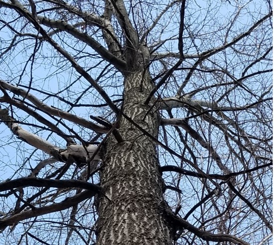

<center>

{width=500px}

</center>

##

You might have heard this before: "I just saw the largest **X** tree in the state!"

I have always been curious about the trees that make the list of state tree champions, or "big trees". For nearly every state in the US, a list of the largest trees of each species are maintained. As landowners and foresters roam the woods, they can report a potential champion tree. (For context, in 2018 a team of wildlife researchers came across the [largest jack pine in the US](https://www.twincities.com/2018/12/05/jack-pine-voyageurs-national-park-mn-largest-recorded-in-us/) when they were studying wolves in northern Minnesota.)

A tree becomes a champion after a careful measurement of the circumference, height, and crown width of the tree. A points system tallies up these measurements and compares it to the current champion for that species.

While these big trees might be considered "outliers" from a forest measurements perspective, understanding how they compare to measurements of the same species can be insightful. There is scientific interest in understanding the growth and size limits of trees. A lot more carbon is stored in a big tree, and there are few studies which have directly measured the amount of biomass in big trees. 

## The Maine Register of Big Trees

I was curious to see how these champion trees compare the the size of most trees growing in a state. So I turned to some data.

[The Maine Register of Big Trees](https://digitalmaine.com/for_docs/265/) contains measurements from 146 different species representing big trees in the state, including six national champion trees. I chose to focus on the ten most common species in the state, identified from summarizing the [Forest Inventory and Analysis (FIA) data](https://www.nrs.fs.fed.us/fia/data-tools/state-reports/ME/default.asp).

For all species, northern red oak was the largest in diameter, with a circumference of 255 inches. Now, many of these champion trees show swelling or have cankers along their trunk. Many champion trees are forked or contain multiple stems. This complicates a true measurement at breast height, but for comparison I also calculated the tree's diameter to compare with diameter distributions from FIA data.

To compare the sizes of trees sampled randomly from Maine, I compiled the FIA data from the ten species from a recent measurement. The data were collected from approximately 3,100 FIA plots across diverse forest conditions. 

The following figure shows the distribution of tree diameter measurements recorded on FIA plots in Maine, along with the diameter of largest tree in red, as recorded in Maine Register of Big Trees:

```{r, echo = F, message = F, warning = F}
library(tidyverse)
library(knitr)
library(kableExtra)

bigtree <- read_csv('C://Users//russellm//Documents//Arbor//Data//mainebigtrees.csv')

bigtree <- bigtree %>% 
  mutate(`Big tree diameter (in)` = Circum/3.14)

fia <- read_csv('C://Users//russellm//Documents//Arbor//Data//ME_TREE.csv')

fia <- fia %>% 
  select(INVYR, STATUSCD, SPCD, DIA, HT) %>% 
  filter(INVYR >= 2011 & 
           STATUSCD == 1 &
           DIA >= 5 &
           SPCD %in% c(97, 316, 129, 12, 241, 261, 318, 371, 375, 833))

tree <- inner_join(fia, bigtree)
```

```{r, echo = F, message = F, warning = F}
p.dia <- ggplot(data = tree, aes(DIA)) +
#stat_density(geom = 'line') +
  geom_histogram(aes(y = ..density..), binwidth = 0.5, fill = 'black') +
  geom_vline(aes(xintercept = `Big tree diameter (in)`, col = "red")) +
  labs(x = "Tree diameter (in)", 
       y = "Proportion of trees") +
  facet_wrap(~Species, ncol = 3) +
  theme(legend.position = "none")
p.dia
```

Note that for each species, the champion trees have a much greater diameter compared to the distribution of trees from the FIA database. For species with a large maximum diameter, like yellow birch and northern red oak, these differences are large. For smaller-diameter species like balsam fir and red spruce, these differences are less drastic.

The following table shows a summary of each champion tree's diameter along with the maximum diameter found in the FIA data. The last column shows the percent of the maximum diameter compared with that of the state champion tree:

```{r, echo = F, message = F, warning = F}

fia_summ <- tree %>% 
  group_by(Species) %>% 
  summarize(`Mean FIA diameter (in)` = mean(DIA),
            `Maximum FIA diameter (in)` = max(DIA))

tree_summ <- inner_join(fia_summ, bigtree) %>% 
  select(Species, `Maximum FIA diameter (in)`, `Big tree diameter (in)`)

tree_summ <- tree_summ %>% 
  mutate(`Big tree diameter (in)` = round(`Big tree diameter (in)`, 1),
         `Percent FIA of Big Tree` = round((`Maximum FIA diameter (in)`/`Big tree diameter (in)`)*100),1) %>% 
  select(-`1`)

tree_summ %>% 
  kable("html", format.args = list(big.mark = ","),
        caption = 'Summary of tree diameter measurements.') %>%
  kable_styling()
```

For balsam fir, an 18.7-inch tree measured in an FIA plot was almost as large as the diameter of the Maine's champion tree (19.7 in). Many FIA plots did not record a tree that was at least 50% of the diameter of the largest champion tree.

This short exercise indicates how we can use champion tree data to better understand the maximum size of trees. Whether to understand the longevity of a species or to quantify the amount of volume, biomass, or carbon within it, insights can be unearthed by looking at these data that may otherwise be categorized as "outliers".
 
--

*By Matt Russell. Sign up for my [monthly newsletter](https://mailchi.mp/d96897dc0f46/arbor-analytics) for in-depth analysis on data and analytics in the forest products industry.*
