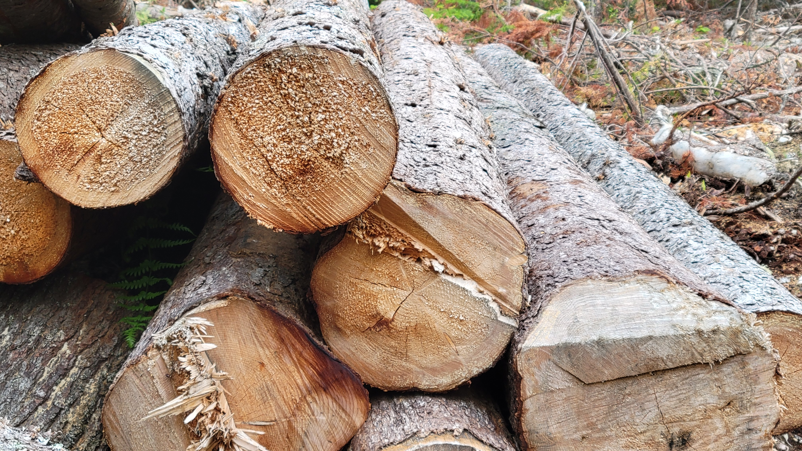

 
<center>

{width=500px}

</center>

# 

Foresters are accustomed to converting units of measure from one to another. Data are often collected in one unit of measure (e.g., the height of a tree in feet), but need to be converted to another for some part of the analysis or report (e.g., its height in meters).

When it comes to calculating the volume of a tree, the number of equations and models are overwhelming. Not only are there a myriad of log rules to determine wood volume of standing timber, but even more volume equations can make determining wood volume for a species of interest a mess. As an example, [the National Volume Estimator Library](https://www.fs.fed.us/forestmanagement/products/measurement/volume/nvel/index.php) contains files with the equations for estimating tree volume for US species - its files are *megabytes* in size.

With the increased interest in understanding the amount of carbon stored in forests and harvested wood products, being able to convert between wood volume and mass is essential. Traditionally, these volume-to-weight conversions were developed by mills and other forest industries to better understand their wood utilization and products. 

Still to this day, most foresters measure the volume of wood when they inventory forests. While a specific company may use their own volume-to-weight conversions, they are often developed for localized regions and are not widely published.

## Volume-to-weight conversions with FIA data

To develop a simple set of volume-to-weight conversions, we can turn to the USDA Forest Service's Forest Inventory and Analysis data. Specifically, the reference species table available through the [FIA DataMart](https://apps.fs.usda.gov/fia/datamart/CSV/datamart_csv.html) contains data on over 2,600 tree and shrub species that occur across the US. Contained in it are a few key variables for help when converting between wood volume and weight:

* **WOOD_SPGR_GREENVOL_DRYWT**: The green specific gravity of wood (green volume and oven-dry weight),
* **BARK_SPGR_GREENVOL_DRYWT**: The green specific gravity of bark (green volume and oven-dry weight), 
* **BARK_VOL_PCT**:	Bark volume as a percent of wood volume,
* **MC_PCT_GREEN_WOOD**: The moisture content of green wood as a percent of oven-dry weight, and 
* **MC_PCT_GREEN_BARK**: The moisture content of green bark as a percent of oven-dry weight. 

Top start, we can calculate the weight of one cubic meter of wood, in kilograms:

$$ \mbox{KG_PER_CUMTR_WOOD} = (\mbox{WOOD_SPGR_GREENVOL_DRYWT}*1000)*(1+(\mbox{MC_PCT_GREEN_WOOD}/100))$$

Then, we can convert this value to pounds per cubic foot:

$$ \mbox{LBS_PER_CUFT_WOOD} = \mbox{KG_PER_CUMTR_WOOD}*2.2046)/35.3145$$

Cords are a typical volume measure used to describe the volume of wood across many regions. We then convert this value to the weight of pounds per cord, assuming 90 cubic feet of wood are found in one cord of wood:

$$ \mbox{LBS_PER_CORD_WOOD} = \mbox{LBS_PER_CUFT_WOOD} * 90$$

We shouldn't forget about the bark component of trees, which can make up a considerable portion of the total volume of a tree. We can follow the same approach to determine volume in bark by using the following formulas:

$$ \mbox{KG_PER_CUMTR_BARK} = (\mbox{BARK_SPGR_GREENVOL_DRYWT}*1000)*(1+(\mbox{MC_PCT_GREEN_BARK}/100))$$

$$ \mbox{LBS_PER_CUFT_BARK} = \mbox{KG_PER_CUMTR_BARK}*2.2046)/35.3145$$

$$ \mbox{LBS_PER_CORD_BARK} = \mbox{LBS_PER_CUFT_BARK} * 90$$

Finally, we can compute the number of tons per cord by adding the wood and bark components and dividing by the number of pounds in a ton (2,000):

$$ \mbox{GREEN_TONS_PER_CORD} = (\mbox{LBS_PER_CUFT_WOOD} + \mbox{LBS_PER_CUFT_BARK})/2000 $$

## An example with sugar maple

As an example, consider we wish to determine the number of green tons per cord in sugar maple (*Acer saccharrum*). We start by calculating the volume in the wood component:

$$ \mbox{KG_PER_CUMTR_WOOD}_{SM} = (0.56*1000)*(1+(57.39286/100)) = 881.4$$

$$ \mbox{LBS_PER_CUFT_WOOD}_{SM} = 881.4*2.2046)/35.3145 = 55.0237$$

$$ \mbox{LBS_PER_CORD_WOOD}_{SM} = 55.0237* 90 = 4952.13$$

Then, we can determine the amount in the bark component:

$$ \mbox{KG_PER_CUMTR_BARK}_{SM} = (0.54*1000)*(1+(89.92593/100)) = 165.9$$

$$ \mbox{LBS_PER_CUFT_BARK}_{SM} = (165.9*2.2046)/35.3145 = 10.3579$$

$$ \mbox{LBS_PER_CORD_BARK}_{SM} = 10.3579 * 90 = 932.22$$

Finally, we can compute the *GREEN_TONS_PER_CORD* conversion factor for sugar maple:

$$ \mbox{GREEN_TONS_PER_CORD}_{SM} = (4952.13 + 932.22)/2000 = 2.94$$

So, each cord of sugar maple wood weighs approximately 2.94 tons. 

If you commonly deal with measurements in thousand board feet (MBF), you can multiply that number by two to convert between MBF and green weight. This uses the common assumption that one cord is equal to 500 board feet. Using this approach, one MBF of sugar maple would weigh 5.88 tons.

## Volume-weight data set for US species


From the FIA species list, here's the distribution of 119 conifers and 339 hardwood species, representing the primary ones across the US. Hardwoods have a greater ratio than conifers:

```{r, echo=F, message=F, warning=F}
library(tidyverse)
```

```{r,echo=F, message=F, warning=F}
tree <- read_csv("C://Users//matt//Documents//Arbor//Projects//VolumeWeight//OnGitHub//volumeweight.csv")

tree <- tree %>% 
  mutate(SF = ifelse(SPCD <= 299, "Conifers", "Hardwoods")) %>% 
  filter(SPCD <= 999)

# tree %>% 
#   group_by(SF) %>% 
#   summarize((num_spp = n()))
```

```{r,echo=F, message=F, warning=F}
p.SF <- ggplot(tree, aes(CORDS_TO_GREEN_TONS, group = SF, fill = SF)) +
  geom_density(adjust = 1.75, alpha =0.4) +
  labs(x = "Cords to green tons conversion") +
  theme(legend.title = element_blank())
p.SF
```

Using this approach, I've provided a data set based on FIA's species reference table. It contains volume to weight conversions for over 2,500 species, which you can find here:

* [Volume to mass conversion data set](https://github.com/mbrussell/volume_to_mass)

You might be interested to compare these conversion factors with ones you may be familiar with. As mentioned previously, these simple conversion factors are not always easy to find, but here are a few sources I came across that might be of interest:

* The USDA Forest Service's Southern Research Station presents a number of conversion factors for US species that are separated by region and product class in [Timber products monitoring: unit of measure conversion factors for roundwood receiving facilities]().
* In his [Forest Research Notes Vol. 16 Num. 1](http://www.forestresearchgroup.com/Newsletters/Vol16No1.pdf), Jack Lutz presents volume to weight conversion factors for several species. (See table 1).  
* Check with your local state agency. As an example, the [Maine Forest Service](https://digitalmaine.com/cgi/viewcontent.cgi?article=1274&context=for_docs) and [New Hampshire Division of forests and Lands](https://www.revenue.nh.gov/mun-prop/property/documents/timber-conversion-formulas.pdf) present conversion factors for the primary commercial species in their state.  

How do the volume-weight conversions work for you? [Drop me an email](mailto:matt@arbor-analytics.com) to let me know if you've found them useful in your own work.

--

*By Matt Russell. Sign up for my [monthly newsletter](https://mailchi.mp/d96897dc0f46/arbor-analytics) for in-depth analysis on data and analytics in the forest products industry.*
