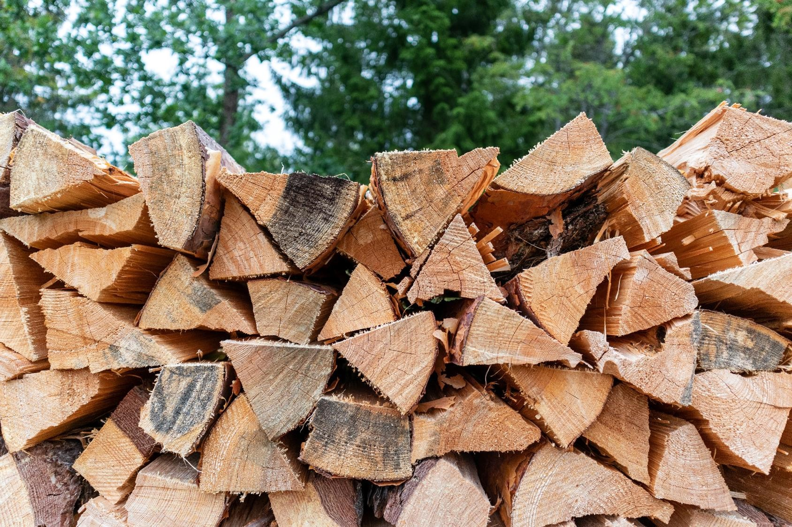

<center>

{width=400px}
</center>

*Photo by <a href="https://unsplash.com/@anaspata?utm_source=unsplash&utm_medium=referral&utm_content=creditCopyText">Andreas Pajuvirta</a> on <a href="https://unsplash.com/s/photos/firewood?utm_source=unsplash&utm_medium=referral&utm_content=creditCopyText">Unsplash</a>*
</center>

##


The bill that was left on our door was what many homeowners are hit with this time of year: $1,082 for 175 gallons. 

Like most homes in central Maine, we heat with fuel oil in the winter. It's a common source of home heating across northern New England, and the high price of heating oil was brought up repeatedly throughout the midterm elections. 

Many homes in these parts also use wood to heat their homes. Nearly 90% of the state of Maine is covered in forests, so a local supply of wood is close by. Whether a wood boiler, pellet stove, or a newer masonry heater, wood is often looked at when oil and other energy prices are high.

## Home heating data

Every year the American Community Survey asks homeowners about their [primary source of home heating](https://data.census.gov/cedsci/table?q=house%20heating%20fuel%20by%20state&tid=ACSDT1Y2010.B25040&moe=false). A part of the US Census Bureau, the survey has been tracking home heating trends for several years. Homeowners can report their primary heating method as one of the following sources:

* Utility gas,
* Bottled, tank, or LP gas,
* Electricity,
* Fuel oil, kerosene, etc.,
* Coal or coke,
* Wood, or
* Solar energy.

From the nearly 129 million homes estimated in the survey, approximately **1.8 million households heat their homes with wood**. The states with the largest percentage of homes that heat with wood are located in northern New England and the northern Rocky Mountains. 

```{r, echo = F, warning = F, message = F}
library(tidyverse)
library(lubridate)
library(tidycensus)
library(urbnmapr)
library(readxl)
library(devtools)
library(usmap)
library(patchwork)
library(maps)
library(kableExtra)
```


```{r, echo = F, warning = F, message = F}
# Data from: https://data.census.gov/cedsci/table?q=house%20heating%20fuel%20by%20state&tid=ACSDT1Y2010.B25040&moe=false
fuel <- read_csv("C://Users//matt//Documents//Arbor//Projects//Blog//fuel.csv") %>% 
  pivot_longer(Alabama:`Puerto Rico`, names_to = "State", values_to = "n_homes")
```

```{r, echo = F, warning = F, message = F}
fuel_2021 <- fuel %>% 
  filter(Type == "Total:" & Year == 2021)

fuel_2021_wood <- fuel %>% 
  filter(Type == "Wood" & Year == 2021)
```

```{r, echo = F, warning = F, message = F}
fuel_summ <- fuel %>%
  filter(!Type == "Total:") %>% 
   group_by(State, Year) %>%   
   mutate(Pct = n_homes / sum(n_homes) * 100)

fuel_summ2 <- fuel_2021 %>%
   group_by(Type) %>%   
   mutate(sum_homes = sum(n_homes) * 100)
```

```{r, echo = F, warning = F, message = F}
states_map <- map_data("state")

fuel_map <- fuel_summ %>% 
  mutate(region = tolower(State)) %>% 
  filter(!State %in% c("Puerto Rico", "District of Columbia") & 
           Year == 2021 & 
           Type == "Wood")

fuel_map2 <- inner_join(states_map, fuel_map)

p.map <-  ggplot(fuel_map2, mapping = aes(long, lat, group = group, 
                                               fill = Pct)) +
  geom_polygon(color = "black", size = 0.25) +
  coord_map(projection = "albers", lat0 = 39, lat1 = 45) +
  scale_fill_gradient(name="Homes heated \nwith wood (%)", low="white", high="red") +
    labs(caption = "Source: American Community Survey , 2021") +
  theme(panel.background = element_rect(fill = "NA"),
        axis.title = element_blank(),
        axis.ticks = element_blank(),
        axis.text = element_blank(),
        axis.line = element_blank(),
        legend.position = c(0.9, 0.4)) 
p.map
```

The state that has the largest portion of its residents heating with wood is Vermont, where 12.3% of all homes indicate using wood as the primary heating source. Maine comes in at a distant second with 7.8% of homes using wood. Most states have a small number of homes heating with wood:

```{r, echo = F, warning = F, message = F}
fuel_map_trim <- fuel_map %>% 
  ungroup() %>% 
  select(State, n_homes, Pct) %>% 
  rename(Number = n_homes ,
         Percent = Pct) %>% 
  mutate(Percent = round(Percent, 1))

fuel_map_trim[order(fuel_map_trim$Percent, decreasing=TRUE),] %>%
  kbl(caption = "Number and percentage of homes that heat with wood, 2021.") %>%
  kable_paper("hover", full_width = F)
```

The number of homes in the US that heat with wood has seen a decline since 2011. In 2014, 2.5 million  homes indicated using wood as their primary heating source compared to 1.8 million in 2021:

```{r, echo = F, warning = F, message = F}
fuel_wood <- fuel %>% 
  filter(Type == "Wood")

fuel_wood_all <- fuel_wood %>% 
  group_by(Year) %>% 
  summarize(num_homes = sum(n_homes))

p.wood <- ggplot(fuel_wood_all, aes(x = Year, y = num_homes/1000000)) +
  geom_point() +
  geom_line() +
  labs(x = "Year",
       y = "Number of US homes that heat with wood (millions)",
       caption = "Source: American Community Survey data, 2010-2021") +
  theme(panel.background = element_rect(fill = "NA"),
        axis.line = element_line(color = "black")) 

p.wood
```


```{r, echo = F, warning = F, message = F}
fuel_solar <- fuel %>% 
  filter(Type == "Solar energy")

fuel_solar_all <- fuel_solar %>% 
  group_by(Year) %>% 
  summarize(num_homes = sum(n_homes))

p.solar <- ggplot(fuel_solar_all, aes(x = Year, y = num_homes/1000000)) +
  geom_point() +
  geom_line() +
  labs(x = "Year",
       y = "Number of US homes heated with solar (millions)",
       caption = "Source: American Community Survey, 2010-2021") +
  theme(panel.background = element_rect(fill = "NA"),
        axis.line = element_line(color = "black")) 
```

```{r, echo = F, warning = F, message = F}
fuel_summ_wood <- fuel_summ %>% 
  filter(Type == "Wood" & Year %in% c(2011, 2021)) %>% 
  pivot_wider(id_cols = State, names_from = Year, values_from = Pct, values_fill = 0) %>% 
  mutate(pct_diff = `2021`-`2011`)
```

The largest gain in home energy heating has come through electric sources. In 2010, 35.2% of US homes heated with electricity, compared to 41.5% in 2021. Utility gas remains the largest source of heating across US homes, with 47.0% of homes heated with the source. Solar energy remains a small contribution of US home heating, with 0.3% of homes heated through solar in 2021.  

```{r, echo = F, warning = F, message = F}
fuel_all <- fuel %>% 
  filter(!Type == "Total:")

fuel_all <- fuel_all %>% 
  group_by(Type, Year) %>% 
  summarize(num_homes = sum(n_homes))

fuel_all2 <- fuel_all %>% 
    group_by(Year) %>% 
    mutate(Pct = num_homes / sum(num_homes) * 100)

fuel_all3 <- fuel_all2 %>% 
    group_by(Year) %>% 
    summarize(sum_all = sum(Pct))

p.all <- ggplot(fuel_all2, aes(x = Year, y = Pct, col = Type)) +
  geom_point() +
  geom_line() +
  facet_wrap(~Type, ncol = 3) +
  labs(x = "Year",
       y = "Percent of US homes by home heating type",
       caption = "Source: American Community Survey, 2010-2021") +
  theme(panel.background = element_rect(fill = "NA"),
        axis.line = element_line(color = "black"),
        legend.position = "none") 
p.all
```

While fewer homes heat with wood compared to twelve years ago, it is important to recognize its value in many regions. Wood is a sustainable resource if it is sourced from a well-managed forest. Homeowners that heat with wood can also support local economies, as wood is often sourced from nearby forests and supports jobs in the local community.    

--

*By Matt Russell. Sign up for [my monthly newsletter](https://mailchi.mp/d96897dc0f46/arbor-analytics) for in-depth analysis on data and analytics in the forest products industry.*

