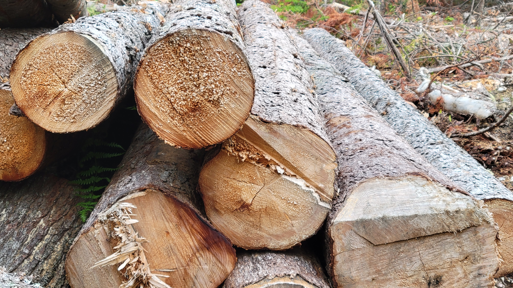

<center>
{width=400px}
</center>

#

Many states provide information on stumpage prices for commonly harvested timber species. This information provides land managers and landowners a sense of what current prices are for different timber species, products, and regions throughout a state.

The Maine Forest Service (MFS) collects data on timber sales through a notification process when timber sales occur. The last report from MFS contains over 1,600 reports from landowners that conducted a timber sale in 2020.

The information is used by MFS and the state to accurately determine land valuations and to estimate the amount of area harvested in a given year. Although markets can fluctuate quickly, the data is also useful to landowners and land managers to better understand a fair price for timber across different regions and product classes.

The [2020 stumpage report by MFS](https://www.maine.gov/tools/whatsnew/attach.php?id=6915492&an=1) was published in March 2022 and contains statewide and county-level data for product classes (e.g., sawlogs, pulpwood, and palletwood) and species (e.g., oak, pine, maple). The report also contains values from the previous year to compare with current prices:

```{r, echo = F, warning = F, message = F}
library(tidyverse)
```

```{r, echo = F, warning = F, message = F}
stumpage <- read_csv("C://Users//matt//Documents//Arbor//Projects//Seven Islands//me_stumpage.csv")
```

```{r, echo = F, warning = F, message = F, fig.cap = "*Statewide stumpage prices in Maine, 2019 and 2020.*"}
stumpage_all <- stumpage %>% 
  filter(County == "*Statewide*")

p.stumpage <- ggplot(stumpage_all, aes(x = reorder(Species, Avg), y = Avg, fill = factor(Year))) +
  geom_bar(stat = "identity", position = "dodge", col = "black") +
  scale_fill_brewer(palette="GnBu") +
  #facet_wrap(~County, ncol=2) +
  coord_flip() +
  labs(x = " ", 
       y = "Sawlog price ($USD per MBF)",
       caption = "Source: Maine Forest Service, 2020 stumpage price report") +
  theme(panel.background = element_rect(fill = "NA"),
        legend.title = element_blank())
p.stumpage
```

Here we can see that red oak, sugar maple, and ash have the greatest sawlog prices for all species across the state. You will also note generally lower prices for sawlogs in 2020 compared to 2019 levels. 

For species with a substantial number of reported values, the minimum and maximum values of stumpage prices are also provided. Here are the stumpage prices for sawlogs in 2020 for all Maine counties:

```{r, echo = F, warning = F, message = F, fig.cap = "*Stumpage prices by Maine county, 2019 and 2020. NOTE: Capital area includes Kennebec, Knox, Lincoln, and Waldo counties; Casco Bay includes Androscoggin, Cumberland, Sagadohoc, and York counties.*"}
stumpage_all_2020 <- stumpage %>% 
  filter(Year == 2020)

p.stumpage.range <- ggplot(stumpage_all_2020, aes(x = Species, y = Avg)) +
  geom_bar(stat = "identity") +
  geom_errorbar(aes(ymin = Min, ymax = Max), width = 0.25) +
    facet_wrap(~County, ncol=4) +
    coord_flip() +
  scale_fill_brewer(palette="GnBu") +
  labs(x = "Species", 
       y = "Sawlog price ($USD per MBF)",
       subtitle = "Mean sawtimber price +/- min max value reported",
       caption = "Source: Maine Forest Service, 2020 stumpage price report") +
  theme(panel.background = element_rect(fill = "NA"),
        axis.text.y = element_text(size = 4))
p.stumpage.range
```

Forest data analysts can use data like these to understand market conditions for different species. If you're interested in seeing the data set that contains these prices, I've made a spreadsheet [available on Github.](https://github.com/mbrussell/myblog/tree/master/content/post/2022-12-23-visualizing-stumpage-prices-for-sawlogs-in-maine-2019-2020)

--

*How do you use data like stumpage prices in your organization? I’m always curious to know, so [let me know via email](mailto:matt@arbor-analytics.com).*

*By Matt Russell. Sign up for [my monthly newsletter](https://mailchi.mp/d96897dc0f46/arbor-analytics) for in-depth analysis on data and analytics in the forest products industry.*

