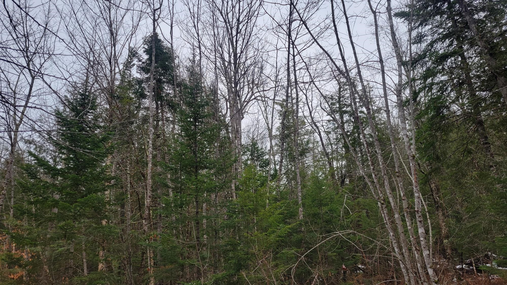

{width=400px}

##

In 2021 a 40-acre tract of land in Wyoming was sold and purchased. A land sale like this will not typically make news headlines. But what turned heads about this sale was that the land was purchased by 5,000 different individuals from several countries.

It was possible because of the state of Wyoming passing Bill 38 in 2021, legislation that provided a structure for decentralized autonomous organizations, or DAOs, to have legal rights in the state. DAOs are member-owned communities that operate with decentralized leadership and employ blockchain technology to record financial transactions.

Wyoming has been a state that has led in innovation in business. In 1977 it was the first state to authorize and recognize limited liability companies (LLCs) operating in the state. Many private forest landowners operate their properties under LLCs because its structure facilitates one or many members and the transfer of ownership between generations is seamless.

Wyoming considers the business entity type of DAOs to be similar to LLCs. From there, the similarities between LLCs and DAOs ends. Whereas LLCs are organized by people termed members or managers, DAOs can be managed by a combination of people and computer algorithms. 

The 40-acre tract that sits an hour north of Cody, WY is not much of anything. It’s largely barren and devoid of trees, but members of [CityDAO](https://www.citydao.io/), the online community that purchased the land, are seeking to build a “decentralized city of the future.”  

CityDAO raised $6 million for the project in 2021 through the sale of [10,000 non-fungible tokens](https://www.youtube.com/watch?v=_coElwTNIJM), or NFTs. It currently has more than 5,200 citizens from over 100 locations that engage in discussions and govern CityDAO through their voting rights. Buying a piece of land in CityDAO is done in a transparent manner through Ethereum, blockchain software that operates with cryptocurrency. Discussions among its citizens happen through Discord, an online social messaging platform. Scott Fitsimones, the creator of CityDAO, refers to it as [“group chat with a bank account.”](https://www.youtube.com/watch?v=zTStDvUtQWc) 

The decentralization of units and organizations has many benefits. Blockchain technologies like those operated by CityDAO employ smart contracts that can automate the execution of agreements. This can speed up decision-making and reduce bureaucracy, including eliminating long permitting times. Voting can take place among members to support or reject projects that are brought up in the community. In the broadest sense, DAOs are collectively owned and operated and work toward a shared mission.

DAOs are still very early in their development and are not without their criticism. The use of cryptocurrency in DAOs brings negative stereotypes, as evident in what was seen in late 2022 with the fall of FTX. DAOs have also been [subject to hacking](https://www.nytimes.com/2016/06/18/business/dealbook/hacker-may-have-removed-more-than-50-million-from-experimental-cybercurrency-project.html), providing more uneasiness from early adopters of the technology.  

Just as members of DAOs operate toward a shared mission, so do private family forest owners. Private family forest owners manage nearly 300 million acres of forest in the US. They own them for many reasons, many of which cite “to enjoy beauty or scenery” or “to protect or improve wildlife habitat” as their primary motivations. They own 35% of all forestland in the US but provide [up to 60% of all harvested timber in the country](https://www.fs.usda.gov/research/treesearch/21682), providing an essential resource to the forest products industry.

Landowners that collectively own a tract of land with others may have conflicts or ongoing issues with other individuals that have a legal claim to the property. Should we harvest timber this year or not? Should we enroll our property in a forest carbon program to become a part of the climate solution, even if it places barriers on our decisions like delaying a timber harvest?

The data point to the rising number of forest landowners that collectively own land. According to data from the National Woodland Owner Survey, [72% of family forest landowner properties](https://link.springer.com/article/10.1007/s11842-017-9370-5) have multiple owners. This can lead to a large number of acres in the US with potential differences in opinion about how the land should be managed.

The concept of shared ownership also has applications in entities such as land trusts and other conservation organizations that own and manage forestland. In the interest of shared stewardship, structures like DAOs can democratize stewardship decisions for tracts of land that have conservation or climate adaptation objectives.

Forests grow slowly. Trees take decades to mature. And land management decisions such as the decision to harvest should be made in careful consultation with professional foresters. Landowners will want to know the full environmental impacts of a decision to do something on their land. So it’s not likely that landowners will benefit from some of the offerings of DAOs like smart contracts. 

Still, owners of forest land should be aware of the benefits of collective decision-making and governance of DAOs. The democratization of DAOs can promote a shared stewardship ethic that many forest landowners have for the natural world, particularly in the face of understanding forests as natural climate solutions.

--

*By Matt Russell. Sign up for [my monthly newsletter](https://mailchi.mp/d96897dc0f46/arbor-analytics) for in-depth analysis on data and analytics in the forest products industry.*