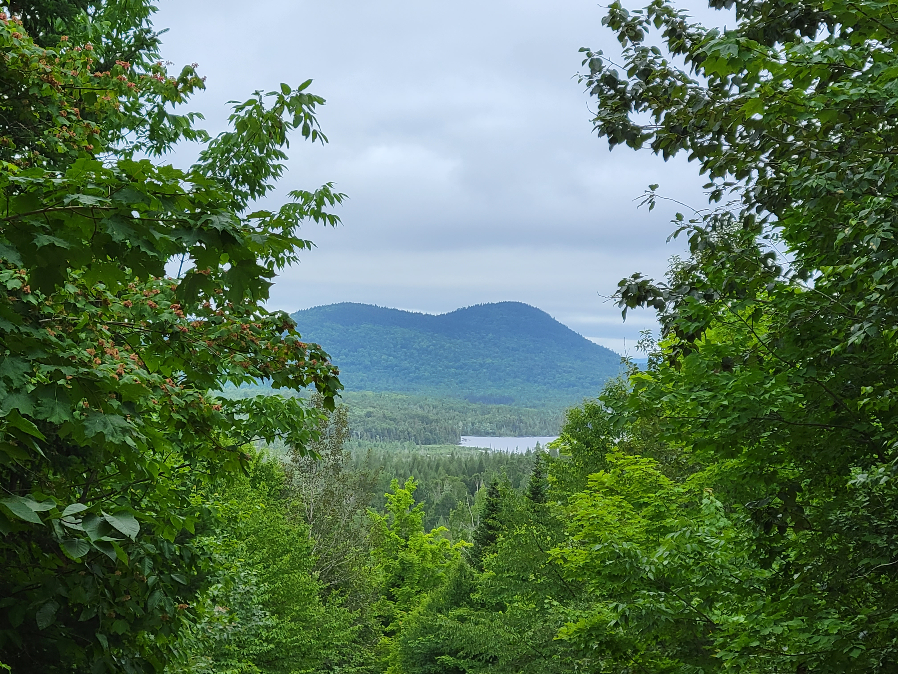

<center>

{width=500px}
</center>
##

Carbon storage and sequestration is one of the most important attributes that forests provide. Carbon has quickly become a mechanism to address current and future climate challenges.  

Forest carbon projects have traditionally relied on compliance markets such as California Air Resources Board's Cap and Trade Regulation program and their associated Forest Offset Protocol. Increasingly, new carbon programs developed in the voluntary markets are offering the ability for smaller landowners to enroll their lands in the forest carbon marketplace.

In two different conversations in the last year, forestry professionals have asked me if there is a data layer that exists that contains all properties enrolled in a forest carbon project. While that data set would cost considerable time and effort to put together (notwithstanding the data privacy concerns with many properties enrolled in voluntary markets), it would provide an excellent overview of forest carbon program enrollment in a spatial context.   

Forest industry professionals are especially interested in knowing where forest carbon projects are located. This would enable them to know where timber harvest restrictions associated with forest carbon program enrollment might be across a region where timber is supplied.

I was curious to know how much of Maine's forestland is enrolled in forest carbon projects. I searched the web and several climate registries to identify the owners, project developers, number of acres enrolled, and general location. I found most helpful [this webinar hosted by Maine Woodland Owners](https://www.youtube.com/watch?v=grh7FJyf5cU) to identify Maine forest properties that are currently enrolled in forest carbon programs.  

I've compiled the data set [which you can find here](https://github.com/mbrussell/myblog/tree/master/content/post/2023-03-21-how-much-of-maine-s-forests-are-enrolled-in-carbon-programs) and provided a snapshot of properties enrolled in carbon markets in Maine which you can find below. The size of each point relates to the acreage of each property:

```{r, echo = F, warning = F, message = F}
library(tidyverse)
library(readxl)
library(usmap)
```

```{r, echo = F, warning = F, message = F}
maine <- read_excel("C:/Users/matt/Documents/Arbor/Data/maine carbon enrollment.xlsx") %>% 
  mutate(Lon = Lon_apx,
         Lat = Lat_apx)
```

```{r, echo = F, warning = F, message = F}
states <- map_data("state")
counties <- map_data("county")

tree_states <- subset(states, 
                region %in% c("maine"))
tree_counties <- subset(counties, 
                region %in% c("maine"))

p.carbon <- ggplot(data = tree_states, 
                      mapping = aes(x = long, y = lat, group = group)) + 
  geom_polygon(color = "black", fill = "white") +
  geom_polygon(data = tree_counties, color = "grey", fill = "white") +
    geom_point(data = maine, aes(x = Lon_apx, y = Lat_apx, size = Acres, col = Owner), 
               inherit.aes = F, alpha = 0.5) +
    scale_size(range = c(.1, 10), name="Property size (acres)") +
  coord_map("conic", lat0 = 40) +
  labs(title = "Maine properties enrolled in forest carbon programs") +
  theme_classic() +
  theme(axis.text = element_blank(),
        axis.title = element_blank(),
        axis.ticks = element_blank(),
        axis.line = element_blank(),
        legend.position = c()) 
p.carbon
```

```{r, echo = F, warning = F, message = F}
sum_acs <- sum(maine$Acres)
```

In total, approximately 531,000 acres of Maine forestlands are enrolled in forest carbon programs. In a state with 17.5 million acres of forests, this means that **approximately 3% of Maine forests are currently enrolled in a forest carbon program**.

--

*By Matt Russell. NOTE: I've done my best to compile [this list of properties in Maine](https://github.com/mbrussell/myblog/tree/master/content/post/2023-03-21-how-much-of-maine-s-forests-are-enrolled-in-carbon-programs) that are enrolled in carbon programs, but it may be incomplete. [Email me](mailto:matt@arbor-analytics.com) with any properties you're aware of that can be added to the list.*


