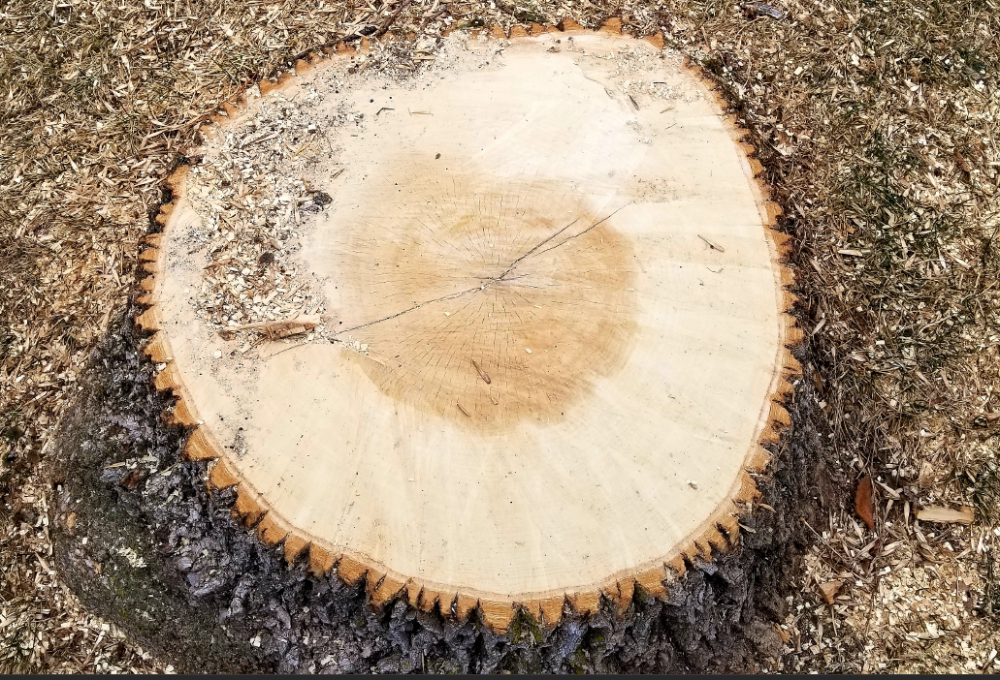

<center>

{width=500px}
</center>

## 

In one of the first presentations I gave as a graduate student, I discussed a set of regression equations that fit a nonlinear model predicting a forest growth index for several species. As all graduate students do, I spent considerable time preparing my slides and practicing my talk. The presentation went well.

I used a data splitting approach in my analysis that I presented on, a common technique that trains a model on a large portion of the data (usually around 70%) then tests it on a smaller portion of data not used in model fitting (usually around 30%). After my presentation, a faculty member came up to me and asked, "You ever considered bootstrapping?"

Up to then, I think I learned about bootstrapping in half a lecture in one of my statistics courses. In my defense, there weren't great tutorials on how to do bootstrapping in my own field of applied forest science, and statistical packages in software like R weren't as common as they are today. That day, I learned that bootstrapping regression models could be a viable alternative to traditional regression approaches.

In a nutshell, bootstrapping is more computationally intensive but doesn't rely on distribution assumptions (i.e., the assumption of errors that are normally distributed). It works well with data that are "messy" and in situations where only a small number of samples are available.

The general approach to bootstrapping a regression model is to (1) iteratively sample a subset of the data with replacement, (2) fit the regression model to each subset, and (3) output the regression coefficients from each subset so that you can visualize and interpret results. 

In this tutorial, I use bootstrapping with with **tidymodels** package in R and apply it to estimating tree biomass for several species from the southern United States.

## Tree biomass data

To begin, we'll use many functions from the **tidyverse** package in R to work with the data:

```{r, warning=F, message=F}
library(tidyverse)
```

```{r, echo = F, warning=F, message=F}
library(knitr)
library(kableExtra)
```

The objective of this post is to fit a subsample of models that determine the aboveground biomass of trees using tree diameter as a predictor variable. I've gathered data from [LegacyTreeData](http://www.legacytreedata.org/), an online repository of individual tree measurements such as volume, weight, and wood density. 

I queried the database to provide all tree measurements for pine species the US State of Georgia. (You can [find the raw data here](http://github.com/mbrussell), and I've previously [written about these data](https://arbor-analytics.com/post/fit-many-models-with-broom/).)

There are 566 observations from six species that contain a value for the tree's diameter at breast height(`ST_OB_D_BH`; cm) and its aboveground dry weight (`AG_DW`; kg). In this data set, most trees are small in diameter and do not weigh a lot: 

```{r, echo=F, warning=F, message=F}
tree_in <- read_csv("C:\\Users\\matt\\Documents\\Arbor\\Data\\ga_tree.csv")

spp <- tibble (
  SPCD = c(131, 110, 111, 121, 132, 611, 129),
  Species = c("Loblolly pine", "Shortleaf pine", "Slash pine", 
              "Longleaf pine", "Virginia pine", "Sweetgum", "Eastern white pine")
)

tree2 <- inner_join(tree_in, spp)

tree <- tree2 %>% 
  filter(!is.na(ST_OB_D_BH),
         !is.na(AG_DW),
         Species != "Sweetgum")

tree3 <- tree %>% 
  group_by(Species) %>% 
  summarize(`Num trees` = n(),
            `Mean DBH` = round(mean(ST_OB_D_BH*2.54, na.rm=T), 1),
            `Max DBH` = round(max(ST_OB_D_BH*2.54, na.rm=T), 1),
            `Min DBH` = round(min(ST_OB_D_BH*2.54, na.rm=T), 1),
            `Mean weight`= round(mean(AG_DW*0.453592, na.rm=T), 1),
            `Max weight` = round(max(AG_DW*0.453592, na.rm=T), 1),
            `Min weight` = round(min(AG_DW*0.453592, na.rm=T), 1))%>% 
  arrange(desc(`Num trees`))
```

```{r, echo=F, warning=F, message=F}
tree <- tree %>% 
  mutate(AG_DW = AG_DW*0.453592,
         ST_OB_D_BH = ST_OB_D_BH*2.54
         )
```

```{r}
ggplot(tree, aes(ST_OB_D_BH, AG_DW, col = Species)) +
  geom_point() +
  labs(x = "Diameter at breast height (cm)", 
       y = "Aboveground dry weight (kg)") +
  theme(panel.background = element_rect(fill = "NA"),
        axis.line = element_line(color = "black"))
```

Here is a summary of the data we'll use in the modeling exercise:

```{r, echo = F}
knitr::kable((tree3[,]), 
             caption = 'Summary statistics for diameter at breast height (DBH; cm) 
             and aboveground dry weight (weight; kg) for six pine species from the southeastern US.') %>% 
   kable_styling(bootstrap_options = "bordered",
                full_width = FALSE)
```

## Nonlinear regression model of tree biomass

From the previous graph and what we know about tree size-mass relationships, nonlinear equation forms work best. In this case, we'll refit the classic [Jenkins et al. tree biomass models](https://www.fs.usda.gov/research/treesearch/6996) using our the pine tree data. The model form is an exponential model which we'll save in R as the `bio_pred` object. 

With most nonlinear applications in R, we'll also need to specify starting values for each coefficient. Here we'll use the values for the pine species group from the Jenkins et al. publication and store them in the `start_vals` object:

```{r}
bio_pred <- as.formula(AG_DW ~ exp(b0 + b1*log(ST_OB_D_BH)))

start_vals <- list(b0 = -2.5356, b1 = 2.4349)
```

A classic use of these data would be to use the `nls()` function in R. Here's how we can specify that:  

```{r}
m.bio <- nls(bio_pred,
             start = start_vals,
             data = tree)
summary(m.bio)
```

We can see that each coefficient has a small *p*-value. If we compare the size and magnitude of the coefficients to the ones presented in Jenkins et al., we see that they are similar, giving us some confidence in our analysis moving forward.

## Bootstrapping regressions with tidymodels

The [**tidymodels** package in R](https://www.tidymodels.org/packages/) has a number of helpful tools for performing regressions and handling their output. The package draws from many useful functions from other packages like **rsample** and **broom**:

```{r, message=F, warning=FALSE}
library(tidymodels)
```

One helpful function is `tidy()`, which compiles regression output into a "tibble", or a data set that can be used in subsequent analyses. I love this function because you can use the tibble that it creates by merging it to a new data set or visualizing the output: 

```{r}
tidy(m.bio)
```

Before we bootstrap, we'll create a generic function to perform the subset of regressions: 

```{r}
fit_fx <- function(split){
  nls(bio_pred, data = analysis(split), start = start_vals)
  }
```

The `bootstraps()` function from **tidymodels** performs the bootstrap resampling. We'll ask it to resample from the `tree` data set a total of 500 times. We set `apparent = TRUE` to take one additional sample in the analysis, a requirement for some estimates that are produced after the sampling.

We use the `map()` function to create a data frame of modeling results, including the coefficients. This is stored in `bio_boot`:

```{r}
set.seed(123)

bio_boot <-
  bootstraps(tree, times = 500, apparent = TRUE) %>%
  mutate(models = map(splits, ~ fit_fx(.x)), 
      coef_info = map(models, tidy))

bio_boot
```

If we wanted to look at a specific sample (say samples 1 and 167), we could extract the output directly from `bio_boot`. Note the differences in the b0 and b1 coefficients between the two samples:

```{r}
bio_boot$models[[1]]
bio_boot$models[[167]]
```

A more efficient way might be to extract the coefficients and store them in a data set named `bio_coef`:

```{r}
bio_coef <- 
  bio_boot %>%
  select(-splits) %>%
  unnest(cols = c(coef_info)) %>%
  select(id, term, estimate) 

bio_coef
```

Then, we can visualize the distribution in the coefficients from the 500 samples in the form of a histogram:

```{r}
p.coef <- bio_coef %>% 
  ggplot(aes(x = estimate)) + 
  geom_histogram(bins = 20, col = "white") + 
  facet_wrap(~ term, scales = "free_x")

p.coef
```

While it's helpful to visualize the distribution of coefficients, we also may want to quantify the key quantiles of them. The `int_pctl()` function calculates confidence intervals from bootstrap samples. Here are the lower and upper confidence interval values from the bootstrapped estimates:

```{r, warning = F, message = F}
pct_ints <- int_pctl(bio_boot, coef_info, alpha = 0.05)

pct_ints
```

We can add these values to our visualization to see that the upper and lower bounds (in blue) are not uniformly distributed around the mean estimate (in orange) for each coefficient:

```{r, warning = F}
p.coef + 
  geom_vline(data = pct_ints, aes(xintercept = .estimate), 
             col = "orange", linewidth = 2, linetype = "dashed") + 
  geom_vline(data = pct_ints, aes(xintercept = .lower), 
             col = "blue") + 
  geom_vline(data = pct_ints, aes(xintercept = .upper), 
             col = "blue")
```

Next, we can use the `augment()` function to obtain the fitted and residual values for each resampled data point. We'll sample from 250 runs to limit some of our output:

```{r}
boot_aug <- 
  bio_boot %>% 
  sample_n(250) %>% 
  mutate(augmented = map(models, augment)) %>% 
  unnest(augmented)

boot_aug
```

Then, we can visualize how the resampling approach with bootstrapping results in varying relationships in predicting aboveground tree biomass based on tree diameter, with each bootstrapped model shown in blue: 

```{r}
ggplot(boot_aug, aes(x = ST_OB_D_BH, y = AG_DW )) +
  geom_line(aes(y = .fitted, group = id), alpha = .2, col = "blue") +
  geom_point() +
  labs(x = "Diameter at breast height (cm)", 
       y = "Aboveground dry weight (kg)") +
  theme(panel.background = element_rect(fill = "NA"),
        axis.line = element_line(color = "black"))
```

## Comparing biomass model predictions

Finally, we may be interested to see how the different models we've considered result in predictions of biomass. The `tree_test` object is a small data set that applies each of three predictions from the models we've considered:

* The original Jenkins et al. 2004 model for the pine species group,
* The nonlinear least squares model fit with parametric techniques (from the `m.bio` object), and
* The NLS models fit with bootstrap estimates.

The `AG_DW_pred` variable stores the predicted biomass:

```{r}
tree_test <- tibble(model = rep(c("Jenkins et al. 2004", 
                                  "NLS refit", 
                                  "NLS refit, with bootstrap"),
                                c(20, 20, 20)),
                    dbh = rep(seq(1, 20, by = 1), 3))

fx_AG_DW <- function(model, ST_OB_D_BH){
  if(model == "Jenkins et al. 2004")
    {AG_DW <- exp(-2.5356 + 2.4349*log(ST_OB_D_BH))}
  else if(model == "NLS refit")
    {AG_DW <- exp(-3.31397 + 2.75972*log(ST_OB_D_BH))}
  else if(model == "NLS refit, with bootstrap")
    {AG_DW <- exp(as.numeric(pct_ints[1,3]) + 
                    as.numeric(pct_ints[2,3])*log(ST_OB_D_BH))}
  else(AG_DW <- 0)
  return(AG_DW = AG_DW)
}

tree_test$AG_DW_pred <- mapply(fx_AG_DW, 
                               model = tree_test$model, 
                               ST_OB_D_BH = tree_test$dbh)

```

Then, we can plot the models to observe their differences. The original Jenkins et al. model underpredicts at larger diameters relative to the models that were refit to the data:  

```{r}
ggplot(tree_test, aes(x = dbh, y = AG_DW_pred, col = model)) +
  geom_line() +
  geom_point() +
  labs(x = "Diameter at breast height (cm)", 
       y = "Predicted aboveground dry weight (kg)") +
  theme(panel.background = element_rect(fill = "NA"),
        axis.line = element_line(color = "black"))
```

## Conclusion

Using bootstrapping to estimate regression coefficients has many benefits. It works well with a small number of observations and the analyst does not need to rely on distribution assumptions about the data and the resulting error terms. The **tidymodels** package makes performing bootstrap methods a breeze, and a variety of functions enable the analyst to visualize and interpret output from the bootstrap samples.

--

*Special thanks to Julia Silge's [excellent tutorial on tidymodels](https://juliasilge.com/blog/beer-production/) that inspired this post, and the [tidymodels page from Posit](https://www.tidymodels.org/learn/statistics/bootstrap/) for helpful code.*