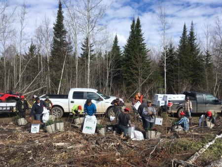

# 
<center>


</center>
  
```{r, echo = F, warning = F, message = F}
library(tidyverse)
library(readxl)
library(GGally)
library(rgdal)
library(patchwork)
library(usmap)
library(knitr)
library(kableExtra)

h2b_22 <- read_excel("C:\\Users\\matt\\Documents\\Arbor\\Data\\h2b\\H-2B_Disclosure_Data_FY2022_Q4.xlsx") %>% 
  mutate(SOC_CODE = str_sub(SOC_CODE, 1, 7))

soc <- read_excel("C:\\Users\\matt\\Documents\\Arbor\\Data\\h2b\\SOC_TITLE.xlsx")

h2b_22_2 <- full_join(h2b_22, soc)
```

# 
 
Guest workers hired through the H-2B visa program get jobs done. This is especially true across many forestry companies. Guest workers plant trees, clear brush, conduct vegetation management, and assist in tree nursery production.   

A strong guest worker program can lead to a future forest products industry that is healthy and sustainable in the long term. The [H-2B program](https://www.dol.gov/agencies/whd/immigration/h2b) organized through the US Department of Labor provides opportunities to hire temporary foreign workers to fill low-skill and non-agricultural positions. 

This post describes the status and trends of H-2B guest workers in forestry-related occupations using the most recent available data from the US Department of Labor. 

## H-2B guest worker database

All data are derived from the H-2B Disclosure Data available on the [Department of Labor, Office of Foreign Labor Certification's website](https://www.foreignlaborcert.doleta.gov/performancedata.cfm). Data from fiscal year 2022 are reported in this post. This represents the federal fiscal year for all workers employed between October 1, 2021 and September 30, 2022. Historical data dating back to 2011 also exist on the DOL website. 

Identifying forestry-related occupations can be done through querying each application's **Standard Occupational Classification (SOC)** code. The SOC code is used by federal agencies to classify workers into occupational categories.

A number of variables are available that can provide insight into the characteristics of forestry-related positions in the H-2B program: 

* Job title, 
* Employer name and contact information, 
* Number of requested and certified H-2B workers, 
* Full or part time, 
* Number of hours per week, 
* Nature of temporary work need (e.g., seasonal or peakload) 

## H-2B guest workers in forestry occupations

In FY 2022, 16,137 certified guest workers were employed in forestry-related occupations. These include the following occupations (number of positions in parentheses):  

* Forestry and conservation workers (13,769 guest workers), 
* Tree trimmers and pruners (1,277),
* Farm workers and laborers, crop, nursery, and greenhouse workers (957), and
* Recreation workers (134).

Forest and conservation workers was the occupation with the third highest number of certified guest workers, behind landscaping/groundskeeping workers and maids/housekeeping cleaners. Two of the other forestry-related workers (tree trimmers/pruners and farm workers/laborers in crops, nurseries, and greenhouses) were included in the top 26 of all occupations (as identified by SOC code):

```{r, echo = F, warning = F, message = F}
#h2b_22_2 %>%  
#  summarize(num_workers = sum(TOTAL_WORKERS_CERTIFIED, na.rm=T))
  

h2b_22_2.df <- h2b_22_2 %>% 
  group_by(MY_TITLE, FOR) %>% 
  summarize(num_workers = sum(TOTAL_WORKERS_CERTIFIED, na.rm=T)) 

h2b_22_2 %>% 
  group_by(MY_TITLE, FOR) %>% 
  summarize(num_workers = sum(TOTAL_WORKERS_CERTIFIED, na.rm=T)) %>% 
  filter(num_workers > 800 & !is.na(MY_TITLE)) %>% 
  ggplot(aes(reorder(MY_TITLE, num_workers),num_workers, fill = factor(FOR))) +
  geom_bar(stat = "identity", col = "white") +
  labs(x = "", 
       y = "Number of guest workers",
       title = "Number of H-2B guest workers in \nvarious occupations, 2022")+
  scale_fill_manual(breaks = levels(h2b_22_2$FOR), values=c('black', 'red'))+
  coord_flip() +
  theme(panel.background = element_rect(fill = "NA"),
        axis.line = element_line(color="black"),
        legend.position = "none")
```

“Forestry worker” was the most common job title listed on H-2B guest worker applications. There is a lot of similarity among job titles in forestry-related occupations:

```{r, echo = F, warning = F, message = F}
h2b_22_2_jobs <- h2b_22_2 %>% 
  subset(FOR == 1) %>% 
  mutate(`Job title` = str_to_lower(JOB_TITLE)) %>% 
  group_by(`Job title`) %>% 
  summarize(`Number of workers` = sum(TOTAL_WORKERS_CERTIFIED, na.rm=T)) %>% 
  filter(`Number of workers` > 250) %>% 
  arrange(desc(`Number of workers`))

knitr::kable((h2b_22_2_jobs[,1:2]), 
             caption = 'The eight most common forestry job titles listed on H-2B guest worker applications (2022).') %>% 
   kable_styling(bootstrap_options = "bordered",
                full_width = FALSE)
```

## Regional trends in H-2B guest workers in forestry 

Depending on forestry occupation, some regional trends existed for guest workers in FY 2022. These trends were examined for the state in which the guest workers performed their job:

* Forestry and conservation workers were most numerous in regions with the most productive forestland, namely the US Southeast and Pacific Northwest.
* Tree trimmers and pruners were concentrated in Texas and the southeastern US.
* Farm workers and laborers working in crops, nurseries, and greenhouses were concentrated in Texas and distributed across several other states.
* Recreation workers were most numerous in New Jersey and some areas of the US Southeast.

```{r, echo = F, warning = F, message = F}
h2b_22_num_workers <- h2b_22_2 %>%
  group_by(MY_TITLE) %>% 
  summarize(num_workers = sum(TOTAL_WORKERS_CERTIFIED, na.rm=T))

h2b_22_state <- h2b_22_2 %>%
  subset(MY_TITLE == "Forest and conservation workers") %>% 
  group_by(WORKSITE_STATE) %>% 
  summarize(num_workers = sum(TOTAL_WORKERS_CERTIFIED, na.rm=T))
 
h2b_22_state <- h2b_22_state %>% 
    mutate(fips = fips(WORKSITE_STATE))


p.fcw <- plot_usmap(data = h2b_22_state, values = "num_workers", 
                      include = c("AL","AZ","AR","CA","CO","CT","DE","FL","GA","ID","IL",
                       "IN","IA","KS","KY","LA","ME","MD","MA","MI","MN","MS",
                       "MO","MT","NE","NV","NH","NJ","NM","NY","NC","ND","OH",
                       "OK","OR","PA","RI","SC","SD","TN","TX","UT","VT","VA",
                       "WA","WV","WI","WY"))+
  scale_fill_continuous(low = "white", high = "blue", name = " ",na.value="white", label = scales::comma) + 
  labs(title = "Forest and conservation workers", 
       subtitle = "n = 13,769 guest workers") +
  theme(legend.position = "right",
        legend.key.size = unit(0.3, 'cm'))

h2b_22_state_fwl <- h2b_22_2 %>%
  subset(MY_TITLE == "Farmworkers and laborers, crop, nursery, and greenhouse workers") %>% 
  group_by(WORKSITE_STATE) %>% 
  summarize(num_workers = sum(TOTAL_WORKERS_CERTIFIED, na.rm=T))
 
h2b_22_state_fwl <- h2b_22_state_fwl %>% 
    mutate(fips = fips(WORKSITE_STATE))

p.fwl <- plot_usmap(data = h2b_22_state_fwl, values = "num_workers", 
                      include = c("AL","AZ","AR","CA","CO","CT","DE","FL","GA","ID","IL",
                       "IN","IA","KS","KY","LA","ME","MD","MA","MI","MN","MS",
                       "MO","MT","NE","NV","NH","NJ","NM","NY","NC","ND","OH",
                       "OK","OR","PA","RI","SC","SD","TN","TX","UT","VT","VA",
                       "WA","WV","WI","WY"))+
  scale_fill_continuous(low = "white", high = "blue", name = " ",na.value="white", label = scales::comma) + 
  labs(title = "Farm workers/laborers: \ncrop/nursery/greenhouse", 
       subtitle = "n = 957 guest workers") +
  theme(legend.position = "right",
        legend.key.size = unit(0.3, 'cm'))

h2b_22_state_rec <- h2b_22_2 %>%
  subset(MY_TITLE == "Recreation workers") %>% 
  group_by(WORKSITE_STATE) %>% 
  summarize(num_workers = sum(TOTAL_WORKERS_CERTIFIED, na.rm=T))
 
h2b_22_state_rec <- h2b_22_state_rec %>% 
    mutate(fips = fips(WORKSITE_STATE))

p.rec <- plot_usmap(data = h2b_22_state_rec, values = "num_workers", 
                      include = c("AL","AZ","AR","CA","CO","CT","DE","FL","GA","ID","IL",
                       "IN","IA","KS","KY","LA","ME","MD","MA","MI","MN","MS",
                       "MO","MT","NE","NV","NH","NJ","NM","NY","NC","ND","OH",
                       "OK","OR","PA","RI","SC","SD","TN","TX","UT","VT","VA",
                       "WA","WV","WI","WY"))+
  scale_fill_continuous(low = "white", high = "blue", name = " ",na.value="white", label = scales::comma) + 
  labs(title = "Recreation workers", 
       subtitle = "n = 134 guest workers") +
  theme(legend.position = "right",
        legend.key.size = unit(0.3, 'cm'))

h2b_22_state_tree <- h2b_22_2 %>%
  subset(MY_TITLE == "Tree trimmers and pruners") %>% 
  group_by(WORKSITE_STATE) %>% 
  summarize(num_workers = sum(TOTAL_WORKERS_CERTIFIED, na.rm=T))
 
h2b_22_state_tree <- h2b_22_state_tree %>% 
    mutate(fips = fips(WORKSITE_STATE))

p.tree <- plot_usmap(data = h2b_22_state_tree, values = "num_workers", 
                      include = c("AL","AZ","AR","CA","CO","CT","DE","FL","GA","ID","IL",
                       "IN","IA","KS","KY","LA","ME","MD","MA","MI","MN","MS",
                       "MO","MT","NE","NV","NH","NJ","NM","NY","NC","ND","OH",
                       "OK","OR","PA","RI","SC","SD","TN","TX","UT","VT","VA",
                       "WA","WV","WI","WY"))+
  scale_fill_continuous(low = "white", high = "blue", name = " ",na.value="white", label = scales::comma) + 
  labs(title = "Tree trimmers and pruners", 
       subtitle = "n = 1,277 total guest workers") +
  theme(legend.position = "right",
        legend.key.size = unit(0.3, 'cm'))

p.all <- p.fcw + p.tree + p.fwl + p.rec
p.all

# ggsave(plot = p.all, "C:\\Users\\matt\\Documents\\Arbor\\Data\\h2b\\guest_workers_us_FY22.png",
#         width = 6, height = 5, units = "in")

```

## Hiring demographics of H-2B forestry guest workers 

Seasonal work is common throughout forestry--think planting trees in spring. In H-2B applications, employers need to provide evidence that the work is tied to a season within a year (or some other event or pattern). The seasonal work must also be recurring in nature.

Peakload work is another type of work that can be specified in H-2B applications. While the employer may regularly employ permanent workers, peakload work indicates that the employer needs to supplement its permanent staff on a temporary basis due to a seasonal or short term demand.

82% of all forest and conservation guest workers are seasonal. 66% of farm workers and laborers working in crops, nurseries, and greenhouses were seasonal. Recreation workers and tree trimmers/pruners saw peakload guest workers exceeded the number of seasonal guest workers: 

```{r,echo=F,warning=F,message=F}
# Seasonal vs peakload
h2b_22_2 %>% 
  subset(FOR == 1)%>% 
    subset(NATURE_OF_TEMPORARY_NEED %in% c("Seasonal", "Peakload"))%>%
  group_by(MY_TITLE,NATURE_OF_TEMPORARY_NEED) %>% 
  summarize(n.workers = sum(TOTAL_WORKERS_CERTIFIED, na.rm=T)) %>% 
   mutate(freq = (n.workers / sum(n.workers))*100) %>% 
  ggplot(aes(reorder(NATURE_OF_TEMPORARY_NEED, freq),freq)) +
  geom_bar(stat = "identity") +
  facet_wrap(~MY_TITLE, ncol=1)+
  labs(x = "Nature of temporary need", 
       y = "Percent of H-2B guest workers", 
       title = "Hiring type of H-2B forestry guest workers (2022)")+
  scale_fill_manual(breaks=levels(h2b_22_2$FOR), values=c('black', 'red'))+
  coord_flip() +
  theme(panel.background = element_rect(fill = "NA"),
        axis.line = element_line(color="black"),
        legend.position = "none")
```

All H-2B forestry guest workers  were designated full time positions. Full time was indicated most commonly as 40- or 35-hour work weeks:

```{r, echo = F, warning = F, message = F}
h2b_22_2 %>% 
  #subset(MY_TITLE == "Forest and conservation workers")%>% 
  subset(FOR== 1)%>% 
  #group_by(FULL_TIME_POSITION) %>% 
 # summarize(n.workers = sum(NBR_WORKERS_CERTIFIED, na.rm=T)) %>% 
 #  mutate(freq = (n.workers / sum(n.workers))*100) %>% 
  ggplot(aes(ANTICIPATED_NUMBER_OF_HOURS )) +
  geom_histogram() +
  labs(x = "Hours per week", 
       y = "Number of H-2B applications", 
       title = "Anticipated hours/week for H-2B guest workers in forestry (2022)")+
  theme(panel.background = element_rect(fill = "NA"),
        axis.line = element_line(color="black"),
        legend.position = "none")
```

## Trends in forestry H-2B guest workers

The total number of H-2B guest workers in forestry occupations has increased by 89% since 2011. This increased from 8,527 certified guest workers in FY 2011 to 16,137 certified guest workers in FY 2022.

```{r, echo = F, warning = F, message = F}
# 2022
h2b_22_2_num <- h2b_22_2 %>% 
  subset(FOR == 1) %>% 
  group_by(MY_TITLE) %>% 
  summarize(`Number of workers` = sum(TOTAL_WORKERS_CERTIFIED, na.rm=T),
            `Number of workers requested` = sum(TOTAL_WORKERS_REQUESTED, na.rm=T)) %>% 
  mutate(Year = 2022)

# 2021
h2b_21 <- read_excel("C:\\Users\\matt\\Documents\\Arbor\\Data\\h2b\\H-2B_Disclosure_Data_FY2021.xlsx") %>% 
  mutate(SOC_CODE = str_sub(SOC_CODE, 1, 7))
h2b_21_2 <- inner_join(h2b_21, soc)

h2b_21_2_num <- h2b_21_2 %>% 
  subset(FOR == 1) %>% 
  group_by(MY_TITLE) %>% 
  summarize(`Number of workers` = sum(TOTAL_WORKERS_CERTIFIED, na.rm=T),
            `Number of workers requested` = sum(TOTAL_WORKERS_REQUESTED, na.rm=T)) %>% 
  mutate(Year = 2021)

# 2020
h2b_20 <- read_excel("C:\\Users\\matt\\Documents\\Arbor\\Data\\h2b\\H2B_Disclosure_Data_FY2020.xlsx") %>% 
  mutate(SOC_CODE = str_sub(SOC_CODE, 1, 7))
h2b_20_2 <- inner_join(h2b_20, soc)

h2b_20_2_num <- h2b_20_2 %>% 
  subset(FOR == 1) %>% 
  group_by(MY_TITLE) %>% 
  summarize(`Number of workers` = sum(TOTAL_WORKERS_CERTIFIED, na.rm=T),
            `Number of workers requested` = sum(TOTAL_WORKERS_REQUESTED, na.rm=T)) %>%  
  mutate(Year = 2020)

# 2019
h2b_19 <- read_excel("C:\\Users\\matt\\Documents\\Arbor\\Data\\h2b\\H-2B_Disclosure_Data_FY2019.xlsx") %>% 
  mutate(SOC_CODE = str_sub(SOC_CODE, 1, 7))
h2b_19_2 <- inner_join(h2b_19, soc)

h2b_19_2_num <- h2b_19_2 %>% 
  subset(FOR == 1) %>% 
  group_by(MY_TITLE) %>% 
  summarize(`Number of workers` = sum(NBR_WORKERS_CERTIFIED, na.rm=T),
            `Number of workers requested` = sum(NBR_WORKERS_REQUESTED, na.rm=T)) %>% 
  mutate(Year = 2019)

# 2018
h2b_18 <- read_excel("C:\\Users\\matt\\Documents\\Arbor\\Data\\h2b\\H-2B_Disclosure_Data_FY2018_EOY.xlsx") %>% 
  mutate(SOC_CODE = str_sub(SOC_CODE, 1, 7))
h2b_18_2 <- inner_join(h2b_18, soc)

h2b_18_2_num <- h2b_18_2 %>% 
  subset(FOR == 1) %>% 
  group_by(MY_TITLE) %>% 
  summarize(`Number of workers` = sum(NBR_WORKERS_CERTIFIED, na.rm=T),
            `Number of workers requested` = sum(NBR_WORKERS_REQUESTED, na.rm=T)) %>% 
  mutate(Year = 2018)

# 2017
h2b_17 <- read_excel("C:\\Users\\matt\\Documents\\Arbor\\Data\\h2b\\H-2B_FY2017.xlsx") %>% 
  mutate(SOC_CODE = str_sub(SOC_CODE, 1, 7))
h2b_17_2 <- inner_join(h2b_17, soc)

h2b_17_2_num <- h2b_17_2 %>% 
  subset(FOR == 1) %>% 
  group_by(MY_TITLE) %>% 
  summarize(`Number of workers` = sum(NBR_WORKERS_CERTIFIED, na.rm=T),
            `Number of workers requested` = sum(NBR_WORKERS_REQUESTED, na.rm=T)) %>% 
  mutate(Year = 2017)

# 2016
h2b_16 <- read_excel("C:\\Users\\matt\\Documents\\Arbor\\Data\\h2b\\H-2B_Disclosure_Data_FY16.xlsx") %>% 
  mutate(SOC_CODE = str_sub(SOC_CODE, 1, 7))
h2b_16_2 <- inner_join(h2b_16, soc)

h2b_16_2_num <- h2b_16_2 %>% 
  subset(FOR == 1) %>% 
  group_by(MY_TITLE) %>% 
  summarize(`Number of workers` = sum(NBR_WORKERS_CERTIFIED, na.rm=T),
            `Number of workers requested` = sum(NBR_WORKERS_REQUESTED, na.rm=T)) %>% 
  mutate(Year = 2016)

# 2015
h2b_15 <- read_excel("C:\\Users\\matt\\Documents\\Arbor\\Data\\h2b\\H-2B_Disclosure_Data_FY15_Q4.xlsx") %>% 
  mutate(SOC_CODE = str_sub(SOC_CODE, 1, 7))
h2b_15_2 <- inner_join(h2b_15, soc)

h2b_15_2_num <- h2b_15_2 %>% 
  subset(FOR == 1) %>% 
  group_by(MY_TITLE) %>% 
  summarize(`Number of workers` = sum(NBR_WORKERS_CERTIFIED, na.rm=T),
            `Number of workers requested` = sum(NBR_WORKERS_REQUESTED, na.rm=T)) %>% 
  mutate(Year = 2015)

# 2014
h2b_14 <- read_excel("C:\\Users\\matt\\Documents\\Arbor\\Data\\h2b\\H-2B_FY14_Q4.xlsx") %>% 
  mutate(SOC_CODE = str_sub(SOC_CODE, 1, 7))
h2b_14_2 <- inner_join(h2b_14, soc)

h2b_14_2_num <- h2b_14_2 %>% 
  subset(FOR == 1) %>% 
  group_by(MY_TITLE) %>% 
  summarize(`Number of workers` = sum(NBR_WORKERS_CERTIFIED, na.rm=T)) %>%  
  mutate(Year = 2014,
         `Number of workers requested` = NA)

# 2013
h2b_13 <- read_excel("C:\\Users\\matt\\Documents\\Arbor\\Data\\h2b\\H-2B_FY2013.xls") %>% 
  mutate(SOC_CODE = str_sub(SOC_CODE, 1, 7))
h2b_13_2 <- inner_join(h2b_13, soc)

h2b_13_2_num <- h2b_13_2 %>% 
  subset(FOR == 1) %>% 
  group_by(MY_TITLE) %>% 
  summarize(`Number of workers` = sum(NBR_WORKERS_CERTIFIED, na.rm=T)) %>% 
  mutate(Year = 2013,
         `Number of workers requested` = NA)

# 2012
h2b_12 <- read_excel("C:\\Users\\matt\\Documents\\Arbor\\Data\\h2b\\H-2B_FY2012.xlsx") %>% 
  mutate(SOC_CODE = paste0(str_sub(SOC_CODE, 1, 2), "-", str_sub(SOC_CODE, 3, 7)))
h2b_12_2 <- inner_join(h2b_12, soc)

h2b_12_2_num <- h2b_12_2 %>% 
  subset(FOR == 1) %>% 
  group_by(MY_TITLE) %>% 
  summarize(`Number of workers` = sum(NBR_WORKERS_CERTIFIED, na.rm=T),
            `Number of workers requested` = sum(NBR_WORKERS_REQUESTED, na.rm=T)) %>% 
  mutate(Year = 2012)

# 2011
h2b_11 <- read_excel("C:\\Users\\matt\\Documents\\Arbor\\Data\\h2b\\H-2B_FY2011.xlsx") %>% 
  mutate(SOC_CODE = paste0(str_sub(SOC_CODE, 1, 2), "-", str_sub(SOC_CODE, 3, 7)))
h2b_11_2 <- inner_join(h2b_11, soc)

h2b_11_2_num <- h2b_11_2 %>% 
  subset(FOR == 1) %>% 
  group_by(MY_TITLE) %>% 
  summarize(`Number of workers` = sum(NBR_WORKERS_CERTIFIED, na.rm=T),
            `Number of workers requested` = sum(NBR_WORKERS_REQUESTED, na.rm=T)) %>% 
  mutate(Year = 2011)
```

```{r, echo = F, warning = F, message = F}
h2b_all <- rbind(h2b_22_2_num, h2b_21_2_num, h2b_20_2_num,
               h2b_19_2_num, h2b_18_2_num, h2b_17_2_num,
               h2b_16_2_num, h2b_15_2_num, h2b_14_2_num,
               h2b_13_2_num, h2b_12_2_num, h2b_11_2_num)

h2b_all2 <- h2b_all %>% 
  group_by(Year) %>% 
  summarize(n.all = sum(`Number of workers`),
            n.request = sum(`Number of workers requested`))

ggplot(h2b_all2, aes(Year, n.all)) +
  geom_point() +
  geom_line() +
  labs(x = "Year", y = "Number of guest workers", 
       title = "H-2B forestry guest workers, 2011 - 2022") +
  guides(col = guide_legend(nrow = 4)) +
  scale_x_continuous(breaks = c(2011, 2012, 2013, 2014, 2015, 2016, 2017, 
                                2018, 2019, 2020, 2021, 2022)) +
  theme(panel.background = element_rect(fill = "NA"),
        axis.line = element_line(color="black"),
        legend.position = "bottom",
        legend.title = element_blank())
```

Not all of the guest workers that forestry companies request are fulfilled. But forestry companies have generally high success rates. As an example, 17,761 guest workers were requested through applications in 2022 and 16,137 of them were certified. The trends since 2015 indicate a success rate of approximately 90% among forestry companies: 

```{r, echo = F, warning = F, message = F}
h2b_all2 %>% 
  pivot_longer(n.all:n.request, values_to = "workers", names_to = "type") %>% 
  filter(Year >= 2015) %>% 
  mutate(type2 = ifelse(type == "n.all", "Certified", "Requested")) %>% 
  ggplot(aes(factor(Year), workers, fill = type2)) +
  geom_bar(position = "dodge", stat = "identity", col = "black") +
  labs(x = "Year", y = "Number of H-2B guest workers", 
       title = "Requested and certified H-2B forestry guest workers, 2015 - 2022")+
  theme(panel.background = element_rect(fill = "NA"),
        axis.line = element_line(color="black"),
        legend.position = "bottom",
        legend.title = element_blank())
```

All occupations of forestry workers have increased since 2011:

```{r, echo = F, warning = F, message = F}
h2b_all %>% 
  ggplot(aes(Year,`Number of workers`,  col = MY_TITLE)) +
  geom_point() +
  geom_line() +
 # facet_wrap(~MY_TITLE, ncol=2)+
  labs(x = "Year", y = "Number of guest workers", 
       title = "H-2B forestry guest workers, 2011 - 2022")+
    scale_x_continuous(breaks = c(2011, 2012, 2013, 2014, 2015, 2016, 2017, 
                                2018, 2019, 2020, 2021, 2022)) +
  guides(col = guide_legend(nrow = 4))+
  theme(panel.background = element_rect(fill = "NA"),
        axis.line = element_line(color="black"),
        legend.position = "bottom",
        legend.title = element_blank())
```

```{r, echo = F, warning = F, message = F}
h2b_all_11_22 <- h2b_all %>% 
  filter(Year %in% c(2011, 2022))

h2b_11_22<-
  tribble(
  ~`Job title`, ~`Workers in 2011`, ~`Workers in 2022`,
  "Farm workers and laborers, crop, nursery, and greenhouse workers", 96, 957,
  "Forest and conservation workers", 8259, 13769,
  "Recreation workers", 66, 134,
  "Tree trimmers and pruners", 106, 1277
)
# 
h2b_11_22 <- h2b_11_22 %>% 
   #mutate(`Percent increase` = round(((`Workers in 2018`-`Workers in 2011`)/`Workers in 2011`)*100)) %>% 
   arrange(desc(`Workers in 2022`))

knitr::kable((h2b_11_22[]), 
             caption = 'Increase in H-2B guest workers by job title, 2011 - 2022.') %>% 
   kable_styling(bootstrap_options = "bordered",
                full_width = FALSE)

```

## Conclusion

Guest workers under the H-2B program are essential for many organizations in the forest products industry. The total number of H-2B guest workers in forestry-related occupations has increased by 89% since 2011. 

Demand for guest workers varies regionally across the US depending on the nature of the forestry job. In forestry occupations, most H-2B guest workers are hired seasonally and on a full time basis. Maintaining a strong commitment to the H-2B program can promote a healthy and viable forest products industry in the future.

--

*By Matt Russell. [Email Matt](mailto:matt@arbor-analytics.com) with any questions or comments.*