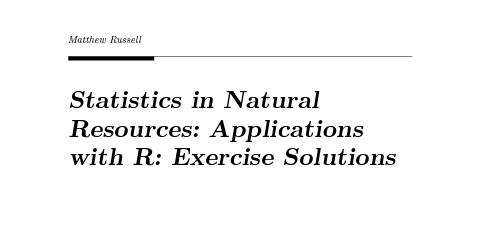

# 

{width=500px}

# 

A few years ago I completed the RStudio Instructor training course. It was a multi-day, online training workshop and I learned less about the ins and outs of coding and analysis in R, but more about the strategies and philosophy of teaching data science principles. 

The course prepares instructors to teach the principles of the **tidyverse**, especially drawing on the concepts for the excellent book [*R for Data Science*](). One of the best components of this book is the numerous questions and exercises that appear often within the chapters. Providing these formative assessments to a learner after reading about and seeing example code is an excellent way to learn new concepts. 

During the RStudio training, I also learned of [a companion book](https://jrnold.github.io/r4ds-exercise-solutions/) that worked through the solutions to each exercise in *R for Data Science*. I wasn't aware of this resource when I was working through R4DS a few years earlier. The instructor strongly encouraged everyone to incorporate it into their learning journey. 

As an educator, I had mixed feelings about making the solutions for exercises available to students. The disadvantages are that students may not put in sufficient effort to solve problems. Or, students may spend too much time looking for the solutions manual, or trying to adapt a solution for a problem they have they answer for to a new problem they're presented with. 

On a more selfish level, as an instructor there's a secure feeling you get by having confidence that you can reuse your questions later in the course or workshop or the next time you teach the material. Good questions take considerable time and effort to create, test, and revise. There's a certain amount of intellectual property that comes along with creating good questions.

Ultimately, as I was working through my text [*Statistics in Natural Resources: Applications with R*](https://stats4nr.com/), I decided to make the solutions to all exercises available online. [You can find them here on the Routledge website.](https://s3-eu-west-1.amazonaws.com/s3-euw1-ap-pe-ws4-cws-documents.ri-prod/9781032258782/stats_4_nr_solutions.pdf) In total, I think the benefits of doing this outweigh the disadvantages fom a learner's perspective.

1. First, learning happens when you **watch other people work**. Especially in statistics and data science, reading through someone else's code can help you see different ways of solving a problem. The solutions might use functions and techniques that you otherwise wouldn't have thought of.

2. Second, looking at the solutions can help you **get over a roadblock**. I've told learners in the past to "knock your head against the wall, but not so hard that it hurts." You learn by being uncomfortable and challenged, but if you've spent half a day and can't get over the hurdle, it's okay to get a helpful hint.

3. Lastly, solutions allow you to **check your work**. This is especially beneficial to learners being introduced to a topic (as is the audience for the *Statistics in Natural Resources* book). Learners can gain confidence in the material knowing that their efforts arrived at the correct answer, and the solution provides that immediate feedback. This last point is especially important today as so many learners are working independently, often in an asynchronous course structure.

To summarize, there are many benefits of making solutions available for statistics and data science exercises. As I've done with the [*Statistics in Natural Resources*](https://s3-eu-west-1.amazonaws.com/s3-euw1-ap-pe-ws4-cws-documents.ri-prod/9781032258782/stats_4_nr_solutions.pdf) book, proving solutions to exercises provides learners the ability to check their work, overcome challenges, and learn from the work of others.

--

*By Matt Russell. [Email Matt](mailto:matt@arbor-analytics.com) with any questions or comments.*

