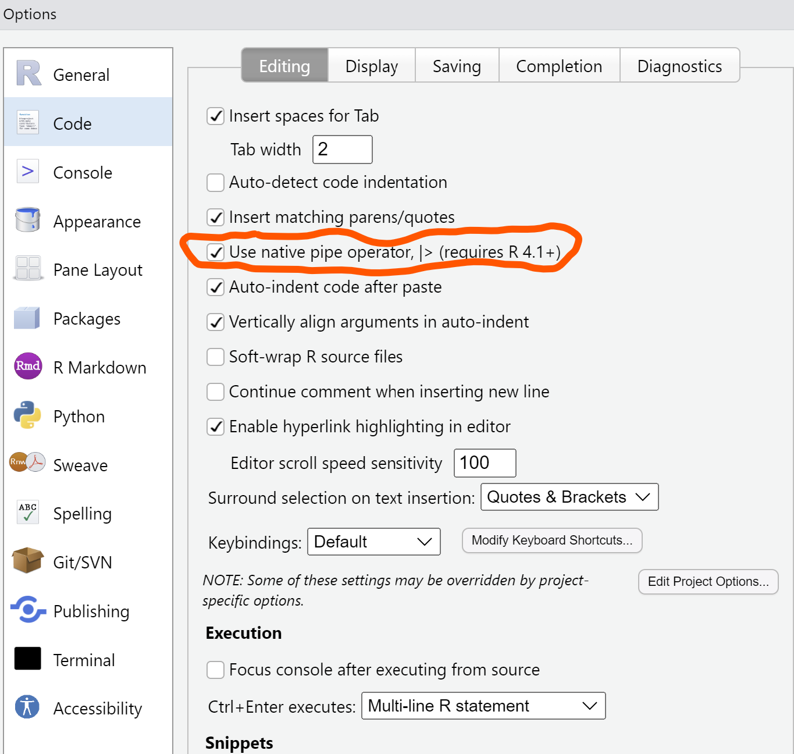

<center>

{width=250px}
</center>
#  

I recently watched the video ["Teaching the tidyverse in 2023"](https://youtu.be/KsBBRHAgAhM?si=Csp18DrhZhFe7r8x) by Mine Çetinkaya-Rundel to learn more about recent changes to my favorite R package. I learned quite a bit of new tricks and techniques for my everyday R coding and sharing a few of them here.  

I'll use the `elm` data set from the **stats4nr** package as I work through a few examples in the post. This data set contains observations on 333 cedar elm trees (*Ulmus crassifolia* Nutt.) measured in Austin, Texas:

```{r, warning = F, message =F}
library(tidyverse)

#devtools::install_github("mbrussell/stats4nr")
library(stats4nr)

data(elm)
```

Here are a few of the key points I took away from the video.

### The native pipe works.

R has a native pipe denoted as `|>`. The pipe is shorthand for saying “then.” In other words, you can say "use my data frame, then make a new variable in it." Now, the native pipe is a part of the the tidyverse. 

If you're a longtime user of the tidyverse, you might have been using `%>%`. Now, the pipe integrates with base R. For example, the code:

```{r, eval = F}
elm |> 
  summary()
```

provides the same output as:

```{r, eval = F}
elm %>% 
  summary()
```

If you're using RStudio, you can change the setting to use the native pipe by going to **Tools** -> **Global Options**, -> **Code**:

# 
<center>

{width=500px}
</center>
# 

### The lubridate package is now a part of the core tidyverse.

If your data contain a lot of dates and times, the **lubridate** package is your best friend. This package is now a part of the tidyverse and no longer needs to be called separately.

The **lubridate** package has several functions for working with date and time variables. For example, we can change strings of dates into year-month-date formats with the `ymd()` or `dmy()` functions:

```{r}
my_date <- "20230914"

my_date2 <- "14092023"

ymd(my_date)

dmy(my_date2)
```


### Easy ways to use a function in one package that's named the same in another package

Several packages in R use functions with the same name, which can present problems when you tell R to use a function. You will often see this as a warning when you first load a library into your R session when there are functions of the same name from other packages. As [Mine mentions in her post](https://www.tidyverse.org/blog/2023/08/teach-tidyverse-23/), R will often *silently* choose the function from a package to use. 

For example, the `lag()` function is available in both **dplyr** and the base R **stats** package. If we wanted to explicitly tell R to use this function from the **dplyr** package, we could write `dplyr::lag()`. But that could be repetitive if we use that function multiple times in our data analysis. 

Now with the `conflicts_prefer()` function from the **conflicted** package, you can tell R to use a specific function once, then forget about it for the rest of your analysis. For example, 

```{r}
library(conflicted)
conflicts_prefer(dplyr::lag)
```

This will choose the `lag()` function from **dplyr**. For example, say we wanted to use it to lag the tree diameter measurement in the **elm** data set:

```{r}
elm |> 
  mutate(DIA2 = lag(DIA))
```

### New updates to joining variables

It seems like joining data sets is one of the most common tasks I do in my work, and tidyverse has new ways of doing this. The `join_by()` function can take the place of the `by =` statements. The good thing is there is no need to quote variable names anymore in the `by()` statement!

For example, say we have a data set that contains the codes for all open grown trees in the **elm** data set:

```{r}
crown_class <- tribble(
  ~crown_code, ~CROWN_CLASS_NAME,
  1, "Open grown",
  2, "Not open grown",
  3, "Not open grown",
  4, "Not open grown",
  5, "Not open grown"
)
```

Then we could join this to the elm data set. What I love about `join_by()` is there's no need to have the variable name the same in both data sets that you want to merge by. Note that the code indicating crown class is named *CROWN_CLASS_CD* in the **elm** data set and *crown_code* in the **crown_class** data set. It can be joined by expressing the double equal sign `==`:

```{r}
elm |>
  left_join(crown_class, join_by(CROWN_CLASS_CD == crown_code)) |> 
  select(DIA, HT, CROWN_CLASS_CD, CROWN_CLASS_NAME)
```

The join functions also have more ways to identify unmatched rows in your data. If this is of interest to you, explore the `unmatched = “drop”` and  `unmatched = “error”` statements. 

### New function to group variables 

A typical summary operation with **dplyr** code to obtain a mean and standard deviation of a variable might go something like:

```{r}
elm |> 
  group_by(CROWN_CLASS_CD) |> 
  summarize(mean_DIA = mean(DIA),
            sd_DIA = sd(DIA))
```

Now, you can add a `.by` statement to add the grouping variable within the same call:

```{r}
elm |> 
  summarize(
    mean_DIA = mean(DIA),
    sd_DIA = sd(DIA),
    .by = CROWN_CLASS_CD
    )
```

I'm not sure how much this new technique will help in my analysis (and I'm wondering why the order of crown classes is different for both approaches), but it does make sense to keep the functions within the same call. This may be particularly useful if there are more operations happening after the grouping.

### New function to split columns and rows

New functions are available to help separate columns and rows into multiple columns or rows. For example, say we have a variable in the **elm** data set that separates the diameter and height measurements with a comma:

```{r}
elm |> 
  mutate(DIA_HT = paste0(DIA, ",", HT)) |> 
  select(DIA, HT, DIA_HT)
```

The `separate_wider_delim()` function separates columns into multiple one based on a delimiter. You can then rename the variables directly in the `names = ` statement:

```{r}
elm |> 
  mutate(DIA_HT = paste0(DIA, ",", HT)) |> 
  separate_wider_delim(DIA_HT, 
                       delim = ",",
                       names = c("DIA2", "HT2")) |> 
  select(DIA2, HT2)
```

This can be a handy function, particularly for those that work with character strings that need to split them up into component parts. Note that the original variable that you separate (i.e., the *DIA_HT* variable) is dropped after you use the function.

## Conclusion

Check out these new features in the tidyverse and try them in your own analysis. These new features are particularly well adapted for new learners of R/the tidyverse given they make more intuitive sense (and speed up performance). Let me know if any of the new techniques presented here help in your own data analysis.

--

*By Matt Russell. [Email Matt](mailto:matt@arbor-analytics.com) with any questions or comments.*
