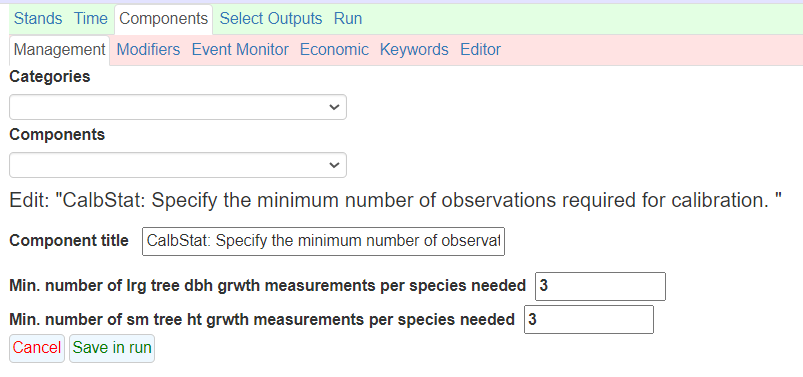
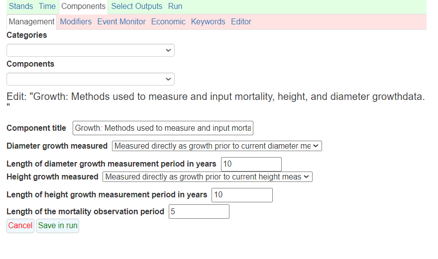

# 
<center>
{width=500px}
</center>
<center>
*A brook in western Maine, USA.*
</center>

#  

There's a recent paper [by Claudia Herbert and others](https://www.mdpi.com/1999-4907/14/3/604) that's come up in several meetings I've been in the last several months. The paper describes an analysis they used with forecasting forest carbon in California using the Forest Vegetation Simulator. They concluded that using FVS "out-of-the-box",  i.e.,  with no local calibrations of modifications, "overpredicts carbon sequestration in live trees that remain alive ten years later by 27%, on average."

The issues of forest growth models not agreeing with what's observed on the ground has long been a thorn in the side of many forest analysts and biometricians. The authors of the California paper conclude that "reliable growth projections will almost certainly require calibration of the FVS model."

The FVS model has [many strengths for making forest growth projections](https://arbor-analytics.com/post/2022-08-04-fvs-and-cbm-cfs3-comparing-two-forest-carbon-accounting-tools/), including the ability to quantify carbon stocks and stock changes with its Fire and Fuels Extension. The FVS model can simulate forest management activities, disturbances, and provide forest carbon and harvested wood products reports. A series of 22 different model variants provide regional differences in forest growth patterns. 

There are many ways to calibrate the FVS model, and I encourage you to read the discussion of the Herbert paper for their suggestions. Many of these include adding all forest inventory variables you have available to you as a part of the FVS run, such as a stand's site index or a tree's crown ratio. Growth and mortality rates can also be adjusted with a series of keywords available in the model.

One component of FVS calibration that I know is often overlooked is the ability to use previous diameter and height measurements made on the tree to calibrate tree growth. In most forestry applications, this might not be feasible. It's rare that diameter and height measurements are collected previously on the same trees we wish to model. However, I'm seeing more and more applications of FVS that using national forest inventory data,  such as the US' Forest Inventory and Analysis program. With the rise of [dynamic baseline approaches in forest carbon programs](https://www.nature.org/en-us/newsroom/verra-voluntary-carbon-market-accounting-methodology-dynamic-baseline/), forest inventory data such as FIA will continue to be relied on in the future to understand carbon storage and sequestration patterns.

The FIA program uses permanent sample plots and remeasures trees through time. In the eastern US, many of these plots have been remeasured up to five times, and in the western US where remeasurements are on a longer time scale, remeasurements are becoming more common. Fortunately, the FIA data contain a few handy variables that also record the previous height and diameter measurement collected on its trees. 

This post describes the magnitude and differences when using non-calibrated "out-of-the-box" FVS predictions with a calibrated version that uses the previous height and diameter measurement collected from trees.  

## Western Maine FIA data

Data were compiled from the FIA database from two counties in western Maine (Franklin and Oxford counties). Forests are mixed species but primarily of the maple-beech-birch or spruce-fir forest types. The most recent measurement was simulated in FVS, collected between 2017 and 2021. I used the Northeast variant of FVS and ran a simulation for 100 years.

Maine is on a five year remeasurement cycle, so previous diameter and height measurements were collected five years prior. In total there were 294 FIA plots, each run as an individual stand. A total of 13,974 trees made up these stands. Average diameter at the start of the simulation was 6.9 inches and average height was 39.8 feet. 

For perspective, the average 10-year diameter and height growth measured on these trees was 0.95 inches and 9.2 feet, respectively. Here is the distribution of basal area at the start of the simulation:

```{r, echo = F, warning = F, message = F}
library(tidyverse)
```

```{r, echo = F, warning = F, message = F}
# Set working directory

my_wd <- "C:/Users/matt/Documents/Arbor/Projects/Blog/maine_fvs/"
stats_carbon_corrected <- read_csv(paste0(my_wd, "stats_carbon_corrected.csv"))
stats_carbon_uncorrected <- read_csv(paste0(my_wd, "stats_carbon_uncorrected.csv"))
tree_list_corrected <- read_csv(paste0(my_wd, "tree_list_corrected.csv"))
tree_list_uncorrected <- read_csv(paste0(my_wd, "tree_list_uncorrected.csv"))
```

```{r, echo = F, warning = F, message = F}
stats_carbon_corrected |> 
  filter(Year == 2023) |> 
  ggplot(aes(x = BA)) +
  geom_histogram(col = "black", bins = 15) +
  labs(y = "Number of FIA plots",
       x = "Basal area (sq ft/ac)")+
    theme_bw() 
```


## Calibrating FVS growth

In the FVS input file, the **DG** and **HTG** variables were completed with FIA data. These variables represent the growth occurring in the period prior to the current measurement. The two primary keywords used in FVS to represent this growth were the **CalbStat** and **Growth** keywords, all of which are described in the [FVS Keyword Guide](https://www.fs.usda.gov/fmsc/ftp/fvs/docs/gtr/keyword.pdf).

For the **CalbStat** keyword, I changed the minimum number of growth measurements required for calibration to three (from the default of five) because these were mixed-species stands and I wanted the model to trigger the calibration:

{width=500px}
</center>

For the **Growth** keyword, I changed the length of the growth period to 10 years to correspond to the FVS cycle length used in the Northeast variant: 

{width=500px}
</center>

I ran two sets of simulations: one as FVS "out-of-the-box" with no calibrations and another with the calibrations as described above. No management treatments or disturbances were applied to the simulations. It's important to note that the Northeast variant of FVS doesn't have an ingrowth model built in (you have to manually add trees if you want regeneration). So all of the trees that appeared in the FIA inventory were carried through in the simulation: some grew more and some died by the end of the simulation in 2123.

## Comparing FVS calibrated and out-of-the-box predictions

On average, growth calibrations to the FVS model resulted in larger aboveground carbon stocks throughout the 100 year simulation for these plots in western Maine. Throughout the simulation, carbon stocks were consistently 2 to 4% greater using calibrations compared to out-of-the-box predictions. Here are the mean carbon stocks throughout the simulation, with 95% confidence limits to show the variability:       

```{r, echo = F, warning = F, message = F}
stats_carbon_uncorrected <- stats_carbon_uncorrected |> 
  mutate(scenario = "FVS Out-of-the-box")
stats_carbon_corrected <- stats_carbon_corrected |>  
  mutate(scenario = "FVS Calibrated")

stats_carbon_all <- rbind(stats_carbon_uncorrected, stats_carbon_corrected)

stats_carbon_all_summ <- stats_carbon_all |> 
  summarize(num_plots = n(),
            mean_carbon = mean(Aboveground_Total_Live),
            sd_carbon = sd(Aboveground_Total_Live),
            .by = c(scenario, Year)) |> 
  mutate(se_carbon = sd_carbon/sqrt(num_plots))

ggplot(stats_carbon_all_summ, aes(x = Year, y = mean_carbon, col = scenario)) +
  geom_point() +
  geom_line() +
  geom_errorbar(aes(ymin = mean_carbon - 2*(se_carbon), 
                    ymax = mean_carbon + 2*(se_carbon)), 
                width = 0.2) +
  labs(y = "Total aboveground carbon in live trees (metric tonnes/ac)",
       x = "Year") +
  theme_bw() +
  scale_color_brewer(palette = "Set1") 
```

At the individual tree level, diameter increment generally declined as the simulation reaches year 100. Calibrations showed greater growth compared to out-of-the-box predictions early in the simulation, then this growth increase declined through time:

```{r, echo = F, warning = F, message = F}
tree_list_uncorrected <- tree_list_uncorrected |> 
  mutate(scenario = "FVS Out-of-the-box")
tree_list_corrected <- tree_list_corrected |>  
  mutate(scenario = "FVS Calibrated")
tree_list_all <- rbind(tree_list_uncorrected, tree_list_corrected) |> 
  filter(Year >= 2033)
tree_list_2023 <- rbind(tree_list_uncorrected, tree_list_corrected) |> 
  filter(Year == 2023)

tree_spp <- tree_list_2023 |>
  summarize(num_spp = n(),
            .by = SpeciesFVS) |> 
  arrange(desc(num_spp))

ggplot(tree_list_all, aes(x = factor(Year), y = DG, fill = scenario)) +
  geom_boxplot(outlier.shape = NA, position = position_dodge()) +
  labs(y = "Diameter increment (in/10-yr)",
       x = "Year") +
  scale_y_continuous(limits = c(0, 2.1)) +
  theme_bw() +
  scale_fill_brewer(palette = "Set1") 
```

Looking at overall trends reveals important trends in this calibrations exercise. But looking at species differences can allow for more insight and allows the user to investigate model performance more closely. Comparing the eight most abundant species in this region, calibrations increased diameter increment for balsam fir, red maple, red spruce, and yellow birch. However, calibrations decreased diameter increment for eastern hemlock and paper birch. 

```{r, echo = F, warning = F, message = F}
tree_list_all_top_spp <- tree_list_all |> 
  filter(SpeciesFVS %in% c("BF", "RM", "RS", "PB", "YB", "AB", "SM", "EH") &
           Year %in% c(2033, 2073, 2123))
  
ggplot(tree_list_all_top_spp, aes(x = factor(Year), y = DG, fill = scenario)) +
  geom_boxplot(outlier.shape = NA, position = position_dodge()) +
  labs(y = "Diameter increment (in/10-yr)",
       x = "Year") +
  facet_wrap(~SpeciesFVS, nrow = 4) +
  scale_y_continuous(limits = c(0, 2.1)) +
  theme_bw() +
  scale_fill_brewer(palette = "Set1") 
```

When looking at the small tree height model for trees with diameters less than 5.0 inches, calibrations increased height increment early in the simulation (e.g., in 2020), then generally stayed similar throughout the 100-year forecast. There was some indication that calibrations decreased height increment in later years (e.g., in years 2083 and beyond), but there were likely few trees that remained less than 5.0 inches this far into the simulation:

```{r, echo = F, warning = F, message = F}

tree_list_all_height <- tree_list_all |> 
  filter(DBH < 5)

ggplot(tree_list_all_height, aes(x = factor(Year), y = HtG, fill = scenario)) +
  geom_boxplot(outlier.shape = NA, position = position_dodge()) +
  labs(y = "Height increment (ft/10-yr)",
       x = "Year") +
  scale_y_continuous(limits = c(0, 15)) +
  theme_bw() +
  scale_fill_brewer(palette = "Set1") 
```

When investigating the performance of the calibrations with respect to the small tree height model, there doesn't seem to be too many apparent differences when comparing within species:

```{r, echo = F, warning = F, message = F}

ggplot(tree_list_all_top_spp, aes(x = factor(Year), y = HtG, fill = scenario)) +
  geom_boxplot(outlier.shape = NA, position = position_dodge()) +
  labs(y = "Height increment (ft/10-yr)",
       x = "Year") +
  facet_wrap(~SpeciesFVS, nrow = 4) +
  scale_y_continuous(limits = c(0, 15)) +
  theme_bw() +
  scale_fill_brewer(palette="Set1")
```

## Conclusions

As these results show, calibrating the FVS model with previous diameter and height growth measurements can change the trajectory of stands when simulated for up to 100 years. Many individual tree growth models like FVS rely on the diameter and height growth functions heavily, as they are fed into other equations such as tree volume, biomass, and carbon.

I should note that dialing in the growth component of a model is just one type of calibration that can be made. The mortality and regeneration functions also have a considerable impact to stand level attributes. I was actually surprised to see the "growth bump" after calibrating FVS with these data, as I've often found FVS to already overpredict common stand attributes like volume and carbon without any calibrations applied. I suspect working more on calibrating the mortality functions would increase some of the mortality observed in these stands, providing a trade off with growth increases. In combination with growth calibrations, this could lead to model results that may be more dependable and meet forester expectations.
 
--

*By Matt Russell. [Email Matt](mailto:matt@arbor-analytics.com) with any questions or comments.*
