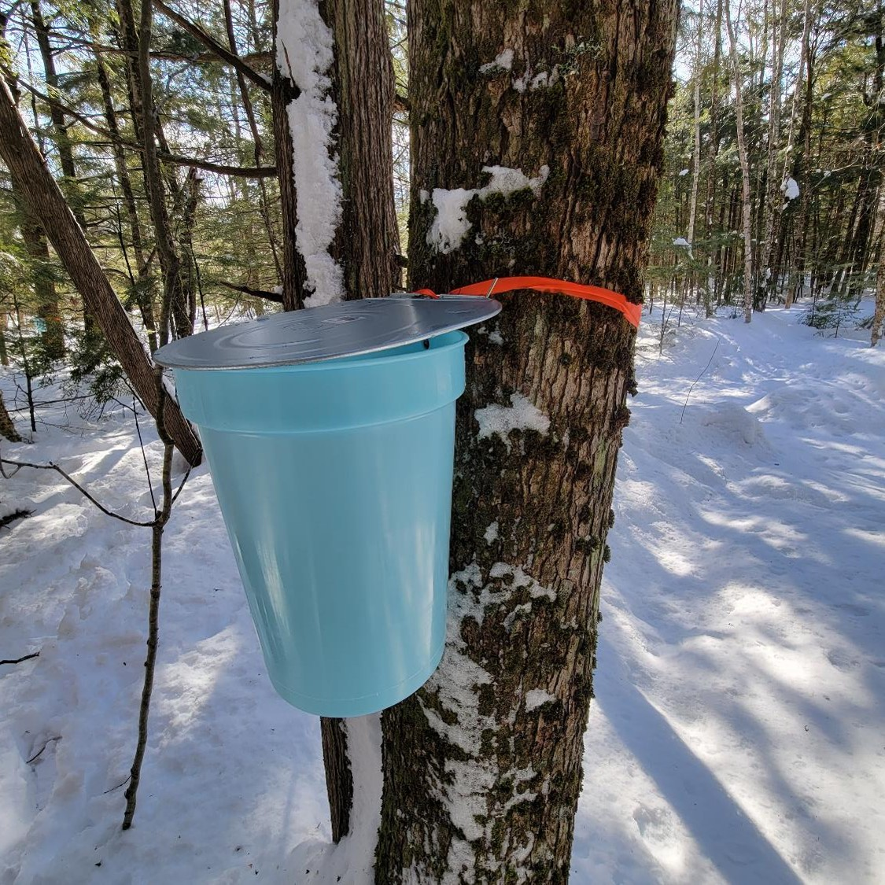

#  
<center>
{width=500px}  
</center>
#  

If you live in the Northeastern United States, maple trees abound. And in the late winter and early spring, collecting sap from those trees to turn into syrup is a great way to enjoy the woods.

For the last two years my wife and I have become amateur syrup producers. We have several red and sugar maples trees on our property that we've tapped. Over four to six weeks, we hang buckets from trees, collect sap every day or two, then boil it to make maple syrup.

```{r echo = F, warning = F, message = F}
library(tidyverse)
library(readxl)
library(GGally)
library(knitr)
library(formattable)
library(kableExtra)
```

```{r echo = F, warning = F, message = F}
sap <- read_excel("C:\\Users\\matt\\Documents\\Arbor\\Data\\russell_sap.xlsx",
                  sheet = "Sheet1") |> 
  mutate(year = year(date),
         month = month(date, label = T, abbr = T))
tree <- read_excel("C:\\Users\\matt\\Documents\\Arbor\\Data\\russell_sap.xlsx", 
                   sheet = "Sheet2") 
```

Beginning in late February, we place taps into the maples and hang buckets to collect. Sap begins to flow soon thereafter. In 2023 we tapped 11 trees, and then added two more in 2024. This is enough trees to keep us as busy as we want to be over this time, and gives us enough syrup for ourselves and to share with family and neighbors. We generally collect enough sap that produces around a gallon of syrup.

If we collect over a gallon of sap on an individual tree one a single day, that's good production. We see a large amount of sap produced shortly after tapping on many trees. Here's the daily-ish amount of sap produced at each tree over the last two seasons: 

```{r echo = F, warning = F, message = F}
ggplot(sap, aes(x = date, y = yield, col = factor(tree))) +
  geom_point() + 
  geom_line() +
  facet_wrap(~year, scales = "free_x") +
  labs(color = "TreeID",
       y = "Sap yield (gallons)",
       x = "Date") +
  theme_bw() +
    theme(axis.text.x = element_text(angle = 45, hjust = 1))
```

Some of our maples can provide over five gallons of sap over the course of a season. Average sap yield per tree was much greater in 2023 compared to 2024, likely because (1) we collected over a shorter time period (about four weeks in 2024 compared to six weeks in 2023) and (2) a warm winter likely impacted the sap run this year. Here are the average sap yields for each tree over the last two seasons:

```{r echo = F, warning = F, message = F}
sap_tree <- sap |> 
  group_by(tree, year) |> 
  summarize(total_sap = sum(yield))

ggplot(sap_tree, aes(x = factor(tree), y = total_sap, fill = factor(year))) +
  geom_bar(position = "dodge2", stat = "identity", col = "black") +
  scale_fill_brewer(palette = "Greens") +
  labs(fill = " ",
       y = "Sap yield (gallons)",
       x = "TreeID") +
  theme_bw()
```

We have a number of different sized maples that we tap, trying to select for trees with large crowns. The tree sizes generally range from 12 to 20 inches in diameter at breast height (DBH). I was curious to quantify the relationship between tree size and sap yield. Our results don't indicate much of a trend between sap yield and DBH (but maybe there's a slight correlation in 2024):

```{r echo = F, warning = F, message = F}
sap_tree2 <- inner_join(sap_tree, tree)

ggplot(sap_tree2, aes(x = dbh, y = total_sap)) +
  geom_point() + 
  stat_smooth(method = "lm", se = F) +
  facet_wrap(~year) +
  labs(color = "Species",
       y = "Sap yield (gallons)",
       x = "Tree DBH (inches)") +
  theme_bw()
```

```{r echo = F, warning = F, message = F}
sap_tree_summ <- sap_tree2 |> 
  mutate(species = ifelse(spp == "RM", "Red maple", "Sugar maple")) |> 
  group_by(tree, species, year) |> 
  summarize(total_sap2 = sum(total_sap))

sap_tree_year <- sap_tree2 |> 
  group_by(year) |> 
  summarize(total_sap2 = sum(total_sap))

sap_year <- sap_tree_summ|> 
  group_by(year, species) |> 
  summarize(`Num trees` = n(),
            `Mean sap yield/tree (gallons)` = round(mean(total_sap2), 2),
            `SD sap yield/tree (gallons)` = round(sd(total_sap2), 2)) |> 
  rename(Year = year,
         Species = species)
```

As for species, our sugar maple trees produce more sap on average than red maples. We also tap more sugar maples than reds:

```{r echo = F, warning = F, message = F}
sap_year %>% 
  kable("html", caption = 'Sap yields for Russell maple trees, 2023-2024.') %>%
 kable_styling()
```

All together, our sap yields in 2023 and 2024 were 62 and 33 gallons, respectively. Our boiling process tends to align with the "industry average" sap:syrup ratio of 40:1. We had quite a bit of syrup last year--this year not as much. 

Of course these data say nothing about the quality of syrup. That's a more subjective analysis :)

--

*By Matt Russell. For more, subscribe to my [monthly email newsletter](https://mailchi.mp/d96897dc0f46/arbor-analytics) to stay ahead on data and analytics trends in the forest products industry.*
