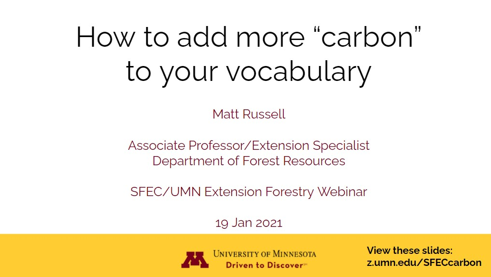

{width=500px}

 
Carbon may be regarded as the most highly coveted forest product of the 2020’s. A benefit of trees is that they store and sequester carbon dioxide from the atmosphere, making forests a natural climate solution.  

While foresters are familiar with measuring the number of boards and cords in a forest, less is known about how much carbon is found in an acre of woods. With a number of emerging markets that seek to pay landowners for the carbon in their trees, an increased understanding of the concepts and numbers behind forest carbon is needed. 

This presentation provides several tips and resources for foresters and other natural resource professionals for integrating forest carbon in their work.

[WATCH THIS WEBINAR](https://sfec.cfans.umn.edu/2021-webinar-january) presented by Matt Russell in January, 2021.

[READ THE SLIDES](http://z.umn.edu/SFECcarbon). 

