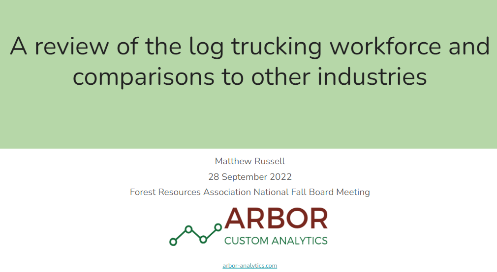

{width=500px}

##
 
The trucking industry is faced with a number of challenges, including recruiting workers, pending retirements, and an increase in demand due to e-commerce sales. These slides provide an overview of the log trucking workforce and were presented at the Forest Resources Association's Fall Board Meeting in Portland, ME.

[READ THE SLIDES](https://docs.google.com/presentation/d/17Dv47PLyi_z2K-iMbJy282Q9TMx_A7_zhwUTr0Oe_DE/edit?usp=sharing). 