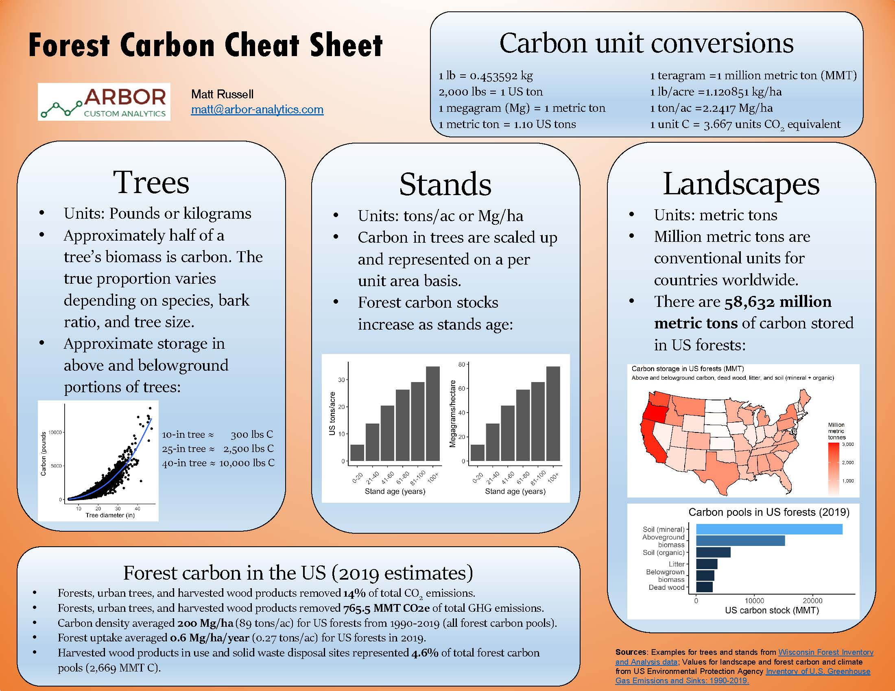

The Forest Carbon Cheat Sheet is a quick reference guide for converting forest carbon measurements and understanding typical carbon values at the tree, stand, and landscape levels. 

The Cheat Sheet has been updated with the most recent values published in the US Environmental Protection Agency [Inventory of U.S. Greenhouse Gas Emissions and Sinks: 1990-2019](https://www.epa.gov/ghgemissions/inventory-us-greenhouse-gas-emissions-and-sinks-1990-2019).  

[**DOWNLOAD (PDF)**](https://drive.google.com/file/d/11tcSClMfWrh9JjgkT6qmhiCjIuaZWg9E/view?usp=sharing)

[**DOWNLOAD (JPEG)**](https://drive.google.com/file/d/1LkWLI4E6FxkWeOuwHEb0PFu7oHexTA2y/view?usp=sharing)

{width=500px}

--

*By Matt Russell. [Email Matt](mailto:matt@arbor-analytics.com) with any questions or comments. Sign up for my [monthly newsletter](https://mailchi.mp/d96897dc0f46/arbor-analytics) for in-depth analysis on data and analytics in the forest products industry.*

