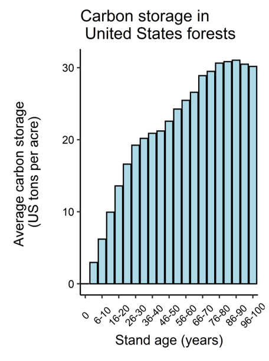

{width=250px}

*Carbon storage in US forests. Source: USDA Forest Service.*

## 
## 

Carbon is quickly becoming one of the hottest forest products of the 2020s. The term “carbon” is a broad one, and when reading an article or listening to a speaker, you may not know exactly which process or specific term is being referred to. 

Here are a few basic terms that will help guide your understanding:

**A carbon pool** is a component of the forest that can gain or lose carbon over time. We often think of this as the trees, but trees are not the only component where carbon is stored. Forests store carbon in five different pools: (1) in live trees, aboveground, (2) in live trees, belowground, (3) in dead wood, including standing dead trees and downed dead wood, (4) in litter, including leaves and other small woody material, and (5) in soil, including mineral and organic soils. The majority of carbon in US forests in found in the mineral soil, followed by aboveground live trees.

**Carbon storage** refers to the amount of carbon retained in a forest and/or carbon pool. For perspective, the average carbon density stored in aboveground trees across forests in the United States is 22.6 US tons per acre. Forests store the equivalent of 33 years of all carbon dioxide emissions produced across the US. Carbon storage across US forests has increased by 11% from 1990 to 2019.

**Carbon sequestration** is the process by which trees and plants use carbon dioxide and photosynthesis to store carbon as biomass. Across the US, forests, urban trees, and harvested wood products remove 14% of all carbon dioxide emissions in a given year. Averaged across the entire US, a 50 year-old forest will sequester approximately 0.3 US tons of carbon per acre.

In the US, forest carbon is typically expressed in US tons per acre, where 1 US ton = 2,000 lbs. In many carbon markets in the US and internationally, carbon is discussed in metric tons (also spelled “tonnes”). To convert, 1 metric ton = 1.10 US tons.

Last year I worked with the Forest Resources Association to develop [Forest Carbon Fact Sheets](https://forestresources.org/policy-priorities/policy-priorities/carbon-neutral-forest-based-biomass/carbon-fact-sheets) for every US state. The fact sheets present the status and trends in forest carbon storage and sequestration using data from the USDA Forest Service Forest Inventory and Analysis program. The fact sheets are a useful tool to show the importance of managed forestlands to address climate change at the national, regional, and state levels. [Find your state's fact sheet.](https://forestresources.org/policy-priorities/policy-priorities/carbon-neutral-forest-based-biomass/carbon-fact-sheets)

--

*By Matt Russell. [Email Matt](mailto:matt@arbor-analytics.com) with any questions or comments. Sign up for my [monthly newsletter](https://mailchi.mp/d96897dc0f46/arbor-analytics) for in-depth analysis on data and analytics in the forest products industry.*
