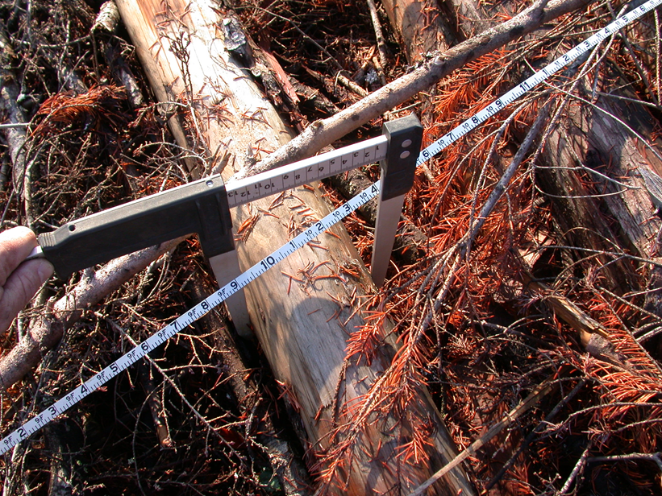
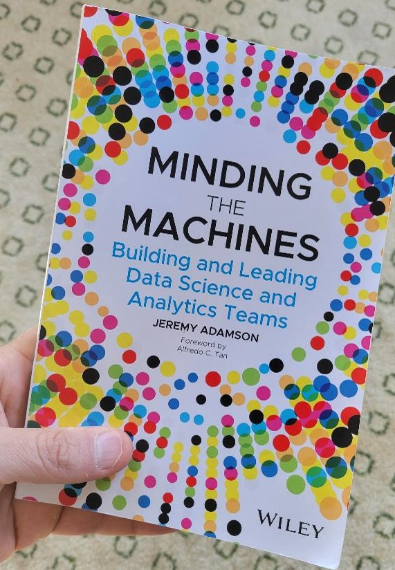

{width=500px}

# 
#  

As a part of my work with the University of Minnesota Extension, we run the [Assessing Vegetation Impacts from Deer](https://avid.umn.edu/) program. The AVID program engages citizen scientists to monitor tree seedlings that are susceptible to browse from white-tailed deer. With little information on deer browse impacts for most of Minnesota’s tree species, the data are beginning to provide insights on how deer browse degrades the health of the forest.

The success of the program relies on a powerful group of individuals: citizen scientists. These volunteers have been through a four-hour training program that taught them how to set up regeneration plots in a forest of their choosing, identify tree species, and collect tree seedling height measurements using a comprehensive protocol. 

A model citizen scientist in the AVID program is Kathy, a retired schoolteacher who has set up several AVID plots at locations around the Twin Cities Metro and at her family cabin in northern Minnesota. She is also a volunteer with the Master Naturalist program--to say she is an experienced naturalist is an understatement. 

Kathy is a model citizen scientist because of the passion she has for the AVID project and her attention to detail when collecting and reporting data. She emailed last year with photos asking if the oak seedling she was looking at was a bur oak or a white oak. In her first year collecting data she measured tree seedling heights to the nearest sixteenth of an inch. (A follow-up phone call with her conveyed that the nearest inch would do for most forestry applications.) 

I have learned a great deal from Kathy about the AVID program from the volunteer’s perspective. As an early participant in the program, Kathy provided feedback on the measuring stick we provided volunteers to collect data (it was a “cheap plastic” material). She also had suggestions for websites to find better quality photos of seedlings (“Minnesota Wildflowers has great photos of trees, too”).

While our team at the University of Minnesota is doing the data analysis using measurements collected by volunteers, without the passion of dozens of Kathy’s in the program, our project will not be successful. Kathy is not a data scientist, but performs the work of a “citizen data scientist”. 

## Citizen data scientists in forest analytics
There are likely citizen data scientists working with you that can provide value to your next analytics project. [Citizen data scientists](https://www.gartner.com/smarterwithgartner/how-to-use-citizen-data-scientists-to-maximize-your-da-strategy/) are practitioners that are involved in data science and analytics work, but their primary role is outside of the data analysis group within an organization.  

Citizen data scientists often have the following traits within an organization:

* They understand the structure and mission of the organization very well. 
* They have previous experience in applying analytics to solve problems in the organization. 
* They have expertise in a domain of interest (e.g., forestry or natural resources).
* They offer a unique perspective.

Citizen data scientists are analytically-minded individuals that can be used to fill the gap of an organization’s analytics needs. As many are aware, there is a shortage of highly-trained biometricians and data scientists within the forestry and natural resources profession. Add on top of that the [reduction of research in forestry](https://arbor-analytics.com/post/the-decline-of-researchers-in-forest-science/) and the increasing reliance on data and analytics to inform business decisions, you will recognize the value of citizen data scientists in your organization.

In forestry organizations, the job titles of citizen data scientists are likely diverse. At the foundation, foresters and field crew technicians provide timely updates and feedback on what is working and not working when collecting data. While most forest analytics happens in front of a computer screen, there is no replacing the insights and perspectives that boots on the ground can provide when interpreting the data that foresters collect.

Citizen data scientists are also likely professionals in your organization that have vast experiences in analyzing forestry data. They might be well versed in software like Excel and the  Esri suite of products. While they may not be acquainted with recently developed analytics tools like machine learning and cloud computing, they can continue to provide value to your organization. 

The best way to empower citizen data scientists in your organization is to democratize your data and analytics processes. Instead of permitting only your “numbers team” to do your analytics work, allow all practitioners the opportunity to weigh in, provide feedback, and analyze datasets when needed. In short, listen to all of the practitioners that have a stake in the collection and analysis of your data, and you will add value to your team and ultimately the work that results from it.

## Summary
Citizen data scientists are practitioners that do not have formal data science and analytics roles, but provide value to analytics teams within organizations. They often have previous experience in analytics applications or play an important role in the collection of data. By making your analytics processes more transparent and available, you can empower citizen data scientists in your organization to bring it more value.

{width=250px}

# 
# 

For more on citizen data scientists, I recommend reading Jeremy Adamson’s new book [*Minding the Machines*](https://www.wiley.com/en-us/Minding+the+Machines%3A+Building+and+Leading+Data+Science+and+Analytics+Teams-p-9781119785330). It provides an excellent background on the strategies and processes behind building analytics teams. Most importantly, it discusses how people fit into data science and analytics teams in the 2020s and beyond.  

--

*By Matt Russell. [Email Matt](mailto:matt@arbor-analytics.com) with any questions or comments. Sign up for my [monthly newsletter](https://mailchi.mp/d96897dc0f46/arbor-analytics) for in-depth analysis on data and analytics in the forest products industry.*