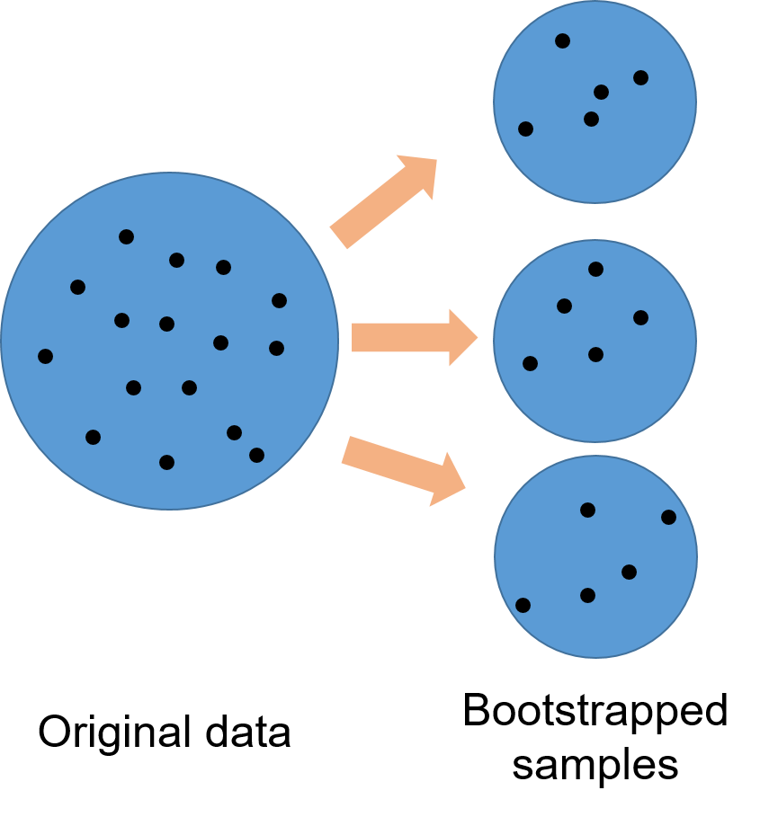

<center>
{width=500px}
</center>

#  
# 

Random forests have quickly become [one of the most popular analytical techniques](https://arbor-analytics.com/post/random-forests-in-a-nutshell/) used in forestry today. Random forests (RF) are a machine learning technique that differ in many ways to traditional prediction models such as regression. Random forests can handle a lot of data, can be applied to classification or regression problems, and rank the relative importance of many variables that are related to a response variable of interest.

I've written about the [theory behind random forests](https://arbor-analytics.com/post/random-forests-in-a-nutshell/). This post will present a tutorial of using random forests in R. 


## The Parresol tree biomass data

As an example, we'll use a data set of 40 slash pine trees from Louisiana USA presented in Parresol's 2001 paper [*Additivity of nonlinear biomass equations*](https://cdnsciencepub.com/doi/10.1139/x00-202). The data are presented in Table 1 of the paper, which is replicated in [this Google Sheet](https://docs.google.com/spreadsheets/d/1TPutUVyZLWr7XopKguT5Nvh9lo1EOG4wvOZ6_lD1F_M/edit?usp=sharing).

We'll read in the data using the `read_sheet()` function from the **googlesheets4** package. We will also load the **tidyverse** package to use some of its plotting features:

```{r, warning = F, message = F}
library(tidyverse)
library(googlesheets4)

tree <- read_sheet("https://docs.google.com/spreadsheets/d/1TPutUVyZLWr7XopKguT5Nvh9lo1EOG4wvOZ6_lD1F_M/edit?usp=sharing")
```

The data contain the following variables:

* `TreeID`: Tree observation record,
* `DBH`: Tree diameter at breast height, cm,
* `HT`: Tree height, m,
* `LCL`: Tree live crown length, m,
* `Age`: Age of the tree, years,
* `Mass_wood`: Green mass of the wood in the tree, kg,
* `Mass_bark`: Green mass of the bark in the tree, kg,
* `Mass_crown`: Green mass of the crown of the tree, kg, and
* `Mass_tree`: Green mass of all tree components, kg.

Our ultimate interest is in predicting the mass all tree components using common tree measurements such as tree diameter, height, live crown length, and age. Before we start modeling with the data, it is a good practice to first visualize the variables. The `ggpairs()` function from the **GGally** package is a useful tool that visualizes the distribution and correlation between variables:

```{r, warning = F, message = F}
library(GGally)

ggpairs(tree, columns = c(2:5, 9))
```

You can see a few variables have strong positive correlations with the mass of the tree (e.g., height and diameter) and some more moderate positive correlations (e.g., age).

## The randomForest R package

R and Python both have numerous packages that implement random forests. In R alone, there are nearly 400 packages with the word "tree" or "forest" in their name. (Sidebar: This is not ideal if you're a forest analyst of biometrician because [only 31 of them](https://arbor-analytics.com/post/31-r-packages-for-forest-analysts/) are actually about forestry.)

Breiman [wrote about random forests in 2001](https://link.springer.com/article/10.1023/A:1010933404324) and a year later [Liaw and Wiener](https://cogns.northwestern.edu/cbmg/LiawAndWiener2002.pdf) created an R package that implements the technique. To date, the **randomForest** R package remains one of the most popular ones in machine learning. 
 
We can install and load the **randomForest** package:

```{r, warning = F, message = F}
# install.packages("randomForest")
library(randomForest)
```

We will use the `randomForest()` function to predict total tree mass using several variables in the **tree** data set. A few other key statements to use in the `randomForest()` function are:

* `keep.forest = T`: This will save the random forest output, which will be helpful in summarizing the results.
* `importance = TRUE`: This will assess the importance of each of the predictors, essential output in random forests!
* `mtry = 1`: This tells the function to randomly sample one variable at each split in the random forest. For applications in regression, the default value is the number of predictor variables divided by three (and rounded down). In the modeling, several small samples of the entire data set are taken. Any observations that are not taken are called “out-of-bag” samples.
* `ntree = 500`. This tells the function to grow 500 trees. Generally, a larger number of trees will produce more stable estimates. However, increasing the number of trees needs to be done with consideration of time and memory issues when dealing with large data sets. 

Our response variable in the random forests model is `Mass_tree` and predictors are `DBH`, `HT`, `LCL`, and `Age`.

```{r, warning = F, message = F}
tree.rf <- randomForest(Mass_tree ~ DBH + HT + LCL + Age,
                        data = tree,
                        keep.forest = T,
                        importance = TRUE, 
                        mtry = 1,
                        ntree = 500)
tree.rf
```

Note the mean of squared residuals and the percent variation explained (analogous to R-squared) provided in the output. (We'll revisit them later.)

Another way to visualize the out-of-bag error rates of the random forests models is to use the `plot()` function. In this application, although we specified 500 trees, the out-of-bag error generally stabilizes after 100 trees:

```{r}
plot(tree.rf)
```

Some of the most helpful output in random forests is the importance of each of the predictor variables. The importance score is calculated by evaluating the regression tree with and without that variable. When evaluating the regression tree, the mean square error (MSE) will go up, down, or stay the same.

If the percent increase in MSE after removing the variable is large, it indicates an important variable. If the percent increase in MSE after removing the variable is small, it’s less important.

The `importance()` function prints the importance scores for each variable and the `varImpPlot()` function plots them:

```{r}
importance(tree.rf)
varImpPlot(tree.rf,type=1)
```

The output indicates that `DBH` is the most important variable for predicting `Mass_tree` and age the least important. 

## Comparing random forests and regression models

Forest analysts are often compare multiple models and determine which one has a better predictive ability. In this case, we can fit a multiple linear regression model to the data and compare to the random forests model.

The `lm()` function can be used to develop a parametric model for `Mass_tree`:

```{r}
tree.reg <- lm(Mass_tree ~ DBH + HT + LCL + Age, data = tree)
summary(tree.reg)
```

Note the residual standard error of 82.33 kg and the adjusted R-squared of 0.91. The residual standard error is slightly lower and the R-squared value slightly higher for the multiple regression model compared to the random forest output. In addition, further work may be conducted on the multiple regression model by removing the non-significant variables and refitting the model.

Another aspect of model evaluation is comparing predictions. Although random forests models are often considered a “black box” method because their results are not easily interpreted, the `predict()` function provides predictions of total tree mass:

```{r}
Mass_pred_rf <- predict(tree.rf, tree, predict.all = F)
Mass_pred_reg <- predict(tree.reg, tree, predict.all = F)
```

In an ideal setting we might test our model on an independent data set not used in model fitting. However, we can combine the predicted tree weights from both models to the **tree** data set:

```{r}
tree2 <- as.data.frame(cbind(tree, Mass_pred_rf, Mass_pred_reg))
```

Note that some predictions from the linear regression model on the 40 trees provide negative values for predicted total tree mass, an undesirable feature that may need to be addressed before implementing the model:

```{r}
tree2 %>% 
  summarize(Mass_tree, Mass_pred_rf, Mass_pred_reg)
```

We may also be interested in plotting residual values from both model types to compare their performance: 

```{r}
p.rf <- ggplot(tree2, (aes(x = Mass_pred_rf, y = Mass_tree - Mass_pred_rf))) +
  geom_point() + 
  scale_y_continuous(limits = c(-200, 200)) +
  labs(x = "Predicted tree mass (kg)",
       y = "Residual (kg)",
       subtitle = "Random forests model") 

p.reg <- ggplot(tree2, (aes(x = Mass_pred_reg, y = Mass_tree - Mass_pred_reg))) +
  geom_point() + 
  scale_y_continuous(limits = c(-200, 200)) +
  labs(x = "Predicted tree mass (kg)",
       y = "Residual (kg)",
       subtitle = "Regression model") 

library(patchwork)

p.rf + p.reg
```

With the heteroscedastic residuals in the models, we'd likely want to explore transforming the data prior to model fitting, or to explore other modeling techniques. 

## Summary

Random forests techniques are flexible and can perform comparably with other regression or classification methods. Random forests can handle all types of data (e.g., categorical, continuous) and are advantageous because they work well with data sets containing a large number of predictor variables. The **randomForest** package has seen a lot of development and can be used to help solve modeling problems in your future forest analytics work. 

--

*By Matt Russell. [Email Matt](mailto:matt@arbor-analytics.com) with any questions or comments. Sign up for my [monthly newsletter](https://mailchi.mp/d96897dc0f46/arbor-analytics) for in-depth analysis on data and analytics in the forest products industry.*