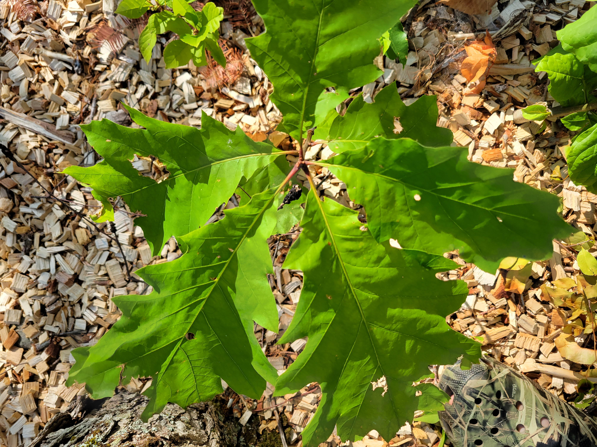

{width=250px}

## 
## 

In *Cabinet Battle #1*, one of the most popular songs from the musical *Hamilton*, Alexander Hamilton and Thomas Jefferson discuss the role of the federal government in assuming the financial debt of states. It’s the late 1780s, and Hamilton has ideas for a national bank that Jefferson and many Southerners aren’t fans of. 

Near the end of Hamilton’s verse, he states that it’s odd to take “civics lessons from a slaver”. He concludes by commenting on the South’s agricultural prosperity after saying “we know who’s really doing the planting.”

The scene is a useful reminder of the labor issues that play a large role in sectors such as agriculture. In particular, amid an ongoing supply chain crisis and the Great Resignation, labor issues continue to plague many organizations going into 2022.  

In the forest products industry, H-2B guest workers help to provide it with essential labor costs that otherwise cannot be filled. By no means am I equating issues relating to guest workers in forestry to slavery in the 18th century, but it brings a reminder of how many forestry practices are implemented across US forests.

### H-2B workers are essential to forestry

Guest workers under the H-2B program are essential for many organizations in the forest products industry. Guest workers help in efforts to plant trees, conduct site preparation and intermediate stand treatments, and work in nurseries and greenhouses to ensure tree seedlings are grown and planted with success.

I wrote last year that around [15,000 certified guest workers](https://arbor-analytics.com/post/h-2b-forestry-and-conservation-workers-by-the-numbers/) are employed in forestry-related occupations. While the total number of H-2B guest workers in forestry-related occupations has increased by 77% since 2011, challenges still remain to ensure forestry operations can continue to hire H-2B workers.

### The need for strong H-2B guest worker programs

Our recent analysis in the [*Journal of Forestry*](https://doi.org/10.1093/jofore/fvab022) surveyed 70 forestry businesses to inquire about their reliance on guest workers in the H-2B program. A few of of primary findings were:

* Forestry businesses reported only **2% of advertised forestry jobs were filled by American workers**, with the remaining 98% by H-2B visa guest workers. This reflects the strong need for an H-2B program that is supported.
* Forestry businesses noted that it is becoming **increasingly difficult**  to hire enough guest workers to complete forestry-related work, reflecting the limited supply of visas.
* Approximately 97% of forestry companies used H-2B guest workers for **tree planting**. Other common forestry practices done by guest workers included thinning (64% of companies), herbicide and vegetation control (61%), and clearing brush (57%).

Forestry companies have cited the need for a strong H-2B program to address current and future challenges relating to tree planting and maintaining forestry operations. As one respondent to our survey stated: “These workers are crucial to the reforestation on our forestland. Without them I would be forced to go out of business.”

--

*By Matt Russell. [Email Matt](mailto:matt@arbor-analytics.com) with any questions or comments. Sign up for my [monthly newsletter](https://mailchi.mp/d96897dc0f46/arbor-analytics) for in-depth analysis on data and analytics in the forest products industry.*