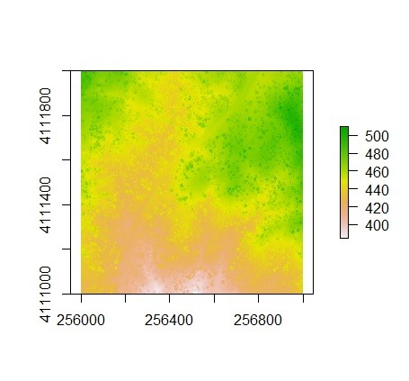

The R program is one of the most popular programs being used by forest analysts today. Forest analysts use R packages, or collections of functions and data sets, to help guide their everyday work.

Last year I wrote about [31 R packages available to forest analysts](https://arbor-analytics.com/post/31-r-packages-for-forest-analysts/) available on the  [Comprehensive R Archive Network (CRAN) package repository](https://cran.r-project.org/web/packages/). For perspective, as of today CRAN has archived 18,732 packages since 2006.

R users also make packages available on GitHub, particularly for specific disciplines like forest inventory and measurements. While CRAN has a formal policy for publishing R packages, packages available through GitHub are also extremely valuable to analysts. 

While there will always be popular packages like the **tidyverse** that many analysts using R rely on everyday, this post focuses on packages that are specific to the discipline of forest inventory. These are packages developed "by foresters, for foresters". For those packages available on CRAN (three of the five in this list), I used [an app from David Robinson](https://ipub.com/dev-corner/apps/r-package-downloads/) to quantify number of installations. Here are five R packages every forest analyst should be using.

# 1. lidR

The [**lidr** package](https://cran.r-project.org/web/packages/lidR/index.html) manipulates and visualizes airborne lidar data for forestry applications. It can read and write .las and .laz files and works with point cloud data. [An online book](https://jean-romain.github.io/lidRbook/index.html) has been developed for the package which shows many of its functions and provides tutorials. To install the package:

```{r, eval = F}
install.packages("lidR")
library(lidR)
```

```{r, echo = F, warning = F, message = F}
library(lidR)
setwd("C://Users//russellm//Downloads")
```

I'll use [an example .las file from NEON](https://figshare.com/articles/dataset/NEON_Teaching_Data_LiDAR_Point_Cloud_las_Data/4307750) of a forest to walk through some functions. The `readLAS()` function reads in a .las file, and it can be plotted to visualize the forest. The graph output appears in a separate window and enables the user to display, rotate and zoom in on a point cloud:

```{r, eval = F}
las <- readLAS("NEONDSSampleLiDARPointCloud.las")
plot(las)
```

<center>
{width=500px}
</center>

A canopy high model can also be created based on the .las file provided. The package allows for point-to-raster and triangulation approaches to develop the canopy height model. The following code uses the `grid_canopy()` function to create a canopy height model using an algorithm created by Khosravipour et al.:

```{r, eval = F}
thr <- c(0, 2, 5, 10, 15)
edg <- c(0, 1.5)
chm <- grid_canopy(las, 1, pitfree(thr, edg))

plot(chm)
```

<center>
{width=500px}
</center>

The `segment_trees()` function allows a user to perform individual tree segmentation, based either on a digital canopy model or the point-cloud:

```{r, eval = F}
las <- segment_trees(las, li2012())
col <- random.colors(200)
plot(las, color = "treeID", colorPalette = col)
```

In addition, the package has several functions for performing wall-to-wall processing across a geographic area of interest. It also works with full waveform lidar data. The package has been installed by users almost 120,000 times.

# 2. tidyFIA 

The [**tidyFIA** package](https://github.com/SilviaTerra/tidyFIA) was developed by the forest biometricians at NCX and allows you to download and import data from the USDA Forest Service's Forest Inventory and Analysis program into your R session. It relies heavily on the **tidyverse** suite of functions. 

Last year I wrote a [full tutorial on tidyFIA](https://arbor-analytics.com/post/2021-04-03-importing-fia-data-to-analyze-biomass-data-with-tidyfia/), and there are a few key functions that are worth highlighting.

To install tidyFIA on your version of R, you can obtain it from GitHub:

```{r, eval = F}
remotes::install_github("SilviaTerra/tidyFIA")
library(tidyFIA)
```

```{r, echo = F, warning = F, message = F}
library(tidyFIA)
```

The `tidy_fia()` function will import any data table from the FIA database using either a state (e.g., `states = "MN"`) or an area of interest. I’ll use the package to import the *PLOT* table from Minnesota:

```{r, warning = F, message = F}
mn_data <- tidy_fia(
  states = "MN",
  table_names = c("plot"),
  postgis = FALSE
  )
```

States with a large volume of data will take some time to load, particularly if you're using a large table like the *TREE* table. From here, a number of additional functions are available to query data, plot geospatial distributions of inventory plots, and summarize tree and plot measurements.

The **tidyFIA** package is a useful one to quickly bring in FIA data into R. It works easily with the **tidyverse** suite of functions, making it one of my favorites for importing FIA data.

# 3. rFIA

The [**rFIA** package](https://rfia.netlify.app/) is another R package that queries and analyzes Forest Inventory and Analysis data. It provides estimates for a variety of forest attributes such as volume, biomass, and carbon stocks. The package has been installed over 15,000 times:

```{r, eval = F}
install.packages("rFIA")
library(rFIA)
```

```{r, echo = F, warning = F, message = F}
library(rFIA)
```

The `getFIA()` function downloads FIA data to a specific location in your directory. For example, we can read in all data from Rhode Island, a small state which can illustrate how the functions are used:

```{r, message = F, warning = FALSE}
ri <- getFIA(states = 'RI', dir = 'C://Users//russellm//Downloads')
```

The `readFIA()` function loads the FIA data tables into R from .csv files stored in the local directory you specified:

```{r}
ri_db <- readFIA('C://Users//russellm//Downloads')
```

You are able to view each data file contained in your directory, e.g., by typing `ri_db$PLOT` or `ri_db$TREE` to view the *PLOT* and *TREE* data tables. The `tpa()` function is one of the most handy functions in the package, providing a basic summary of basal area and trees per acre values for your data: 

```{r}
tpa(ri_db)
```

Adding statements such as `bySizeClass = TRUE` allow you to group the output by diameter class:

```{r}
tpa(ri_db, bySizeClass = TRUE) 
```

You can also group the summary statistics by species, a common need in any forest inventory analysis. Incorporating spatial data and producing alternative estimators are also available through a number of functions in **rFIA**. 

# 4. vegan

The [**vegan** package](https://cran.r-project.org/web/packages/vegan/index.html) is a great tool for anyone that regularly needs to produce diversity metrics from forest inventory data. It is branded as a tool for community ecologists and has been installed almost *three million times*.

```{r, eval = F}
install.packages("vegan")
```

Consider an example data set from the package containing stem counts of trees on one-hectare plots on Barro Colorado Island in the Panama Canal. Data were collected at 50 sites:

```{r, message = F, warning = F}
library(vegan)
data(BCI)
```

The `specnumber()` function defines the number of species for each site and the `diversity()` function defines the Shannon's diversity metric for each site:

```{r}
specnumber(BCI)
diversity(BCI)
```

The Renyi's measure of diversity is widely used in ecology and can be determined using the `renyi()` function. The `plot()` command visualizes the diversity profiles for four randomly selected sites.

```{r}
k <- sample(nrow(BCI), 4)
R <- renyi(BCI[k,])
plot(R)
```

There are a ton more functions that are available in the **vegan** package, and calculating measures of diversity are just one of a number of tools available. Other functions include ones for partitioning variability in models and performing ordinations and other multivariate analyses.

# 5. allodb

I recently learned about the [**allodb** package](https://github.com/ropensci/allodb) from a colleague. This package was designed to standardize and simplify tree biomass estimation for temperate and boreal forests. The development version can be installed from GitHub:

```{r, eval = F}
remotes::install_github("ropensci/allodb")
library(allodb)
```

```{r, echo = F, warning = F, message = F}
library(allodb)
```

The package provides local estimates of aboveground biomass for over 700 species and includes 570 different allometric equations. With all of the interest in generating tree biomass and carbon estimates from trees to stands and landscapes, the package is valuable to efficiently work with tree lists to summarize biomass and carbon attributes.

As an example application, consider four balsam fir and red spruce trees of different diameters growing at the Penobscot Experimental Forest in Maine, USA. The **tree** data set contains their measurements: 

```{r, message = F, warning = F}
library(tidyverse)

tree <- tribble(
  ~genus, ~species, ~dbh,
  "abies", "balsamea", 10,
  "abies", "balsamea", 20,
  "abies", "balsamea", 30,
  "abies", "balsamea", 40,
  "picea", "rubens", 10,
  "picea", "rubens", 20,
  "picea", "rubens", 30,
  "picea", "rubens", 40
)
```

The `get_biomass()` function can be used to determine aboveground biomass (in kg) using species and diameter (in cm): 

```{r}
tree <- tree %>% 
  mutate(agb = get_biomass(dbh = dbh, 
                           genus = genus, 
                           species = species, 
                           coords = c(-68.6, 44.9)))
tree
```

We can see that balsam fir have slightly greater biomass than red spruce for the same diameter:

```{r}
ggplot(tree, aes(x = dbh, y = agb, col = species)) +
  geom_point() +
  geom_line()
```

The `new_equations()` function in **allodb** allows you to choose a different equation to estimate biomass, or provide your own. You can dig into the package documentation and [the supporting article]( https://doi.org/10.1111/2041-210X.13756) to learn more about the specific equations it uses.

--

Which R package is missing from the list? [Email me](mailto:matt@arbor-analytics.com) with your comments and I'd love to hear which forestry packages you use. 

--

*By Matt Russell. Sign up for my [monthly newsletter](https://mailchi.mp/d96897dc0f46/arbor-analytics) for in-depth analysis on data and analytics in the forest products industry.*
