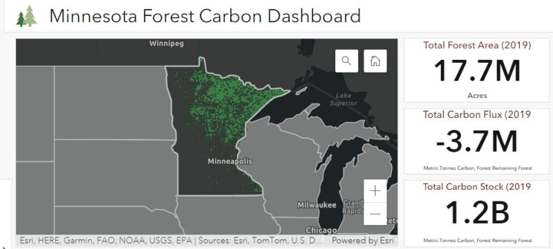

{width=500px}

##

By total forest land area, Minnesota ranks 21st in the United States. At 17.7 million acres, the state has an incredible amount of carbon being stored and sequestered in its trees and forests.

I was recently a part of a year-long project funded by the Minnesota Forest Resources Council to do a deep dive into the state’s forest carbon resource. This project involved two primary tasks: (1) to create a report summarizing the current status and opportunities with forest carbon in Minnesota and (2) develop a data dashboard to effectively visualize current and past forest carbon attributes across the state.

## Report: Carbon in Minnesota’s Forests

The report [Carbon in Minnesota’s Forests: Current Status and Future Opportunities](https://mn.gov/frc/assets/Carbon_in%20Minnesota_10_June_2022_tcm1162-531123.pdf) is a scoping document that outlines the current status and future opportunities of forest carbon in the state. The project involved compiling relevant literature and data sources, delivering a series of outreach events, holding focus group sessions with key stakeholders, and performing data analysis and forest growth simulations.

Here are a few highlights of the report:

* **Nine information needs and opportunities were identified.** The project identified nine major thematic information needs and opportunities that warrant closer exploration and research related to forest carbon in Minnesota. These themes came about through a series of focus groups with stakeholders that helped identify them. The themes focus on three broad areas: carbon markets, forest management, and data and technology. 

* **Forest Inventory and Analysis data provide detailed forest carbon estimates.** Data from the USDA Forest Service’s Forest Inventory and Analysis program were used to quantify baseline information on forest carbon. In Minnesota, carbon attributes were summarized from over 6,300 forested plots, representing approximately one plot for every 2,791 acres. Forest carbon information was also obtained for the state using [greenhouse gas emissions and removals data](https://www.fs.usda.gov/rds/archive/Catalog/RDS-2021-0035) reported on a statewide basis. 

* **States are tackling forest carbon differently.** Every state is looking at forest carbon opportunities in different ways. In the report, Table 1 lists 15 different states with a number of current projects ongoing within their boundaries. The table serves as a handy resource to compare state-level investments in forest carbon programs and research opportunities. 

* **Growth and yield simulations provide a glimpse into how management impacts forest carbon.** To better understand carbon dynamics, the project simulated carbon stocks for several forest types and forest management treatments. Three silvicultural treatments were simulated for each forest type: a no management treatment, a “business as usual” treatment (i.e., a commonly-implemented forest management strategy used throughout Minnesota), and a climate-adapted treatment. The Forest Vegetation Simulator, an individual tree model that uses lists of trees to forecast forest growth through time, was used to perform the simulation. 

* **Carbon markets present opportunities for al landowners.** The report also lists the current status of several carbon markets available to landowners. With an emphasis on voluntary markets and impacts to private woodland owners with small acreages, the report can serve as a useful roadmap to better understanding market-based approaches to forest carbon.

## Forest carbon data dashboard

Another component of the project was the development of the [Minnesota Forest Carbon Dashboard](https://experience.arcgis.com/experience/28fc7281e9e84168b5ec50b7de2480c2/). This data dashboard provides a summary of Minnesota's forest carbon resource, with the ability to query information by forest type, ownership, regions, and stocking levels.

The dashboard was developed by ArcGIS Online. Data tables present carbon stocks and flux estimates dating back to 1990 with a number of units, including carbon and carbon dioxide equivalent.

Special thanks to the Minnesota Forest Resources Council for their support with this project and especially to Chris Edgar and the University of Minnesota USpatial team for developing the data dashboard.

What data on forest carbon would be most beneficial to you and your organization? [Email me](mailto:matt@arbor-analytics.com) and I’d love to learn more. 

--

*By Matt Russell. Sign up for my [monthly newsletter](https://mailchi.mp/d96897dc0f46/arbor-analytics) for in-depth analysis on data and analytics in the forest products industry.*

