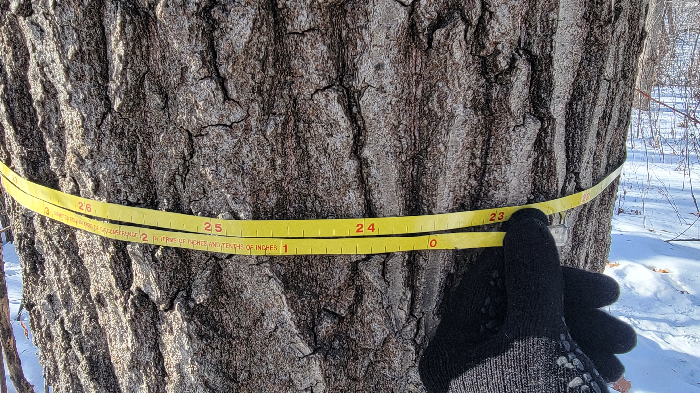

{width=400px}

##

Being an excellent data analyst requires you to understand the techniques that go into analyzing data and how to communicate them effectively. While having a foundation in statistics and the quantitative sciences is essential, the most effective data analysts communicate information that influences decision makers.

Unfortunately, there are plenty of examples of sloppy data analyses that distort the reality of what data can tell us. As an example, genetics researchers have found that Microsoft Excel’s [autocorrecting feature](https://theconversation.com/excel-autocorrect-errors-still-plague-genetic-research-raising-concerns-over-scientific-rigour-166554) had led to errors in 30% of gene list observations over a six year span. Perusing [Reddit’s Data Is Ugly page](https://www.reddit.com/r/dataisugly/) is a reminder of how poor data visualization can go very wrong.    

Here I share a few red flags that may help to identify data analyses of poor quality. These come mostly from my experience in consulting with forestry companies and organizations, mentoring graduate students, and [serving as a journal reviewer](https://arbor-analytics.com/post/2021-07-19-peer-review-lessons-learned-from-reviewing-100-forest-science-manuscripts/).

### Sample sizes aren’t shown.
If a polling company reported that 70% of voters support candidate A over candidate B, you might think they’re a lock to win. But if only 10 people were polled, you’ll have more uncertainty and suspicion about the usefulness of the poll. Not reporting the number of observations can often obscure one’s interpretation of statistical results.

A good practice is to always show the number of samples taken when providing a summary of a data set. This can be as simple as adding a footnote or a column in a table that provides the reader more insights into the data being shown.

### Measure of variability isn’t reported.
Nate Silver’s [“The Signal and the Noise”](https://www.penguinrandomhouse.com/books/305826/the-signal-and-the-noise-by-nate-silver/) popularized a lot of methods used in political polling and statistics. The *signal* is generally understood as the trend in which the data points to, while the *noise* encompasses all of the uncertainty and variability associated with the data. It is often the noise which is the most challenging (but oftentimes fun) to deal with.

Always present a measure of variation when summarizing a variable from a data set. When collecting data from a population, the statistical variance or standard deviation is a useful metric. After a sample is taken, the standard error is a useful value that can also be used to determine the appropriate confidence interval. 

Understand the typical amount of variation you should expect for measurements you work with frequently. For example, the coefficient of variation (CV) is a useful measure which standardizes variability as a reflection of the mean value. The CV of stand volume in mixed-species uneven-aged forests is typically around 100%, while the CV for single-species stands grown in a plantation is typically around 30%. Understanding typical values of variation can also help in determining the appropriate number of samples to collect in future projects, saving time and cost.

### Distribution of data is unknown.
While the mean and variation of a variable is informative, understanding the complete distribution of the data is essential. Having the complete distribution of a variable is important to identify outlier data points and identify clustering, in addition to determining whether or not subsequent statistical procedures can be applied to the data. 

Visualizations help immensely to show distributions of data. Histograms and box plots have long been used to show distributions. A newer visualization type, [termed raincloud plots](https://www.r-bloggers.com/2021/07/ggdist-make-a-raincloud-plot-to-visualize-distribution-in-ggplot2/), combines density plots with box plots to display a full depiction of the distribution of data. 

### Too many results are displayed.
Beware of the report you’re reading with 50 pages of analysis that don’t seem to answer the question that needs to be answered. Oftentimes, analysts will present too many results because they have lost sight or are unsure what the motivation for the work originally was. 

In my experience, analysts will often show too much data because they’re not confident in the results that are produced. I've sat through too many presentations where the speaker has shown tables with a dozen rows and columns and only allowed the audience 15 seconds to interpret the results. Presenting too many results leaves the reader unsure and suspect of your analysis.

The Law of Parsimony, which states that the simplest explanation is most likely the correct one, is a good adage to follow here. Be parsimonious with what you share. Only show them what they need to see to make an informed decision. But, always have additional results close by and be willing to share them if you’re asked.

### Output is copy/pasted from software.
One of the benefits of having great software for analyzing data is that we can too easily rely on the output it produces. For example, all too often, we only need a key number or two after running a statistical test, yet a dozen tables and figures can be provided by software which show information related to a test.

Simply copying output from software and pasting it into a report is lazy and indicates you haven’t spent time thinking about how to communicate your data. To combat this, I will often look at other reports and papers that quantify the same kinds of data that I’m analyzing. In doing this, you can be inspired with ideas and unique ways to present information that will resonate with your audience.  

### Tables and figures are not used effectively. 
Tables are often one of the best ways to present data in a compact form. But too many people present tables that are too large to comprehend. Figures are useful to convey trends and showcase differences from one variable to another. 

Tables should be used (1) to convey precise numbers or text, (2) to compare individual values, and, (3) to present several variables each with different units of measure. Figures can be used to (1) showcase trends or relationships between different values and (2) display photographs, maps, or other illustrations.

--

*By Matt Russell. Which data analysis practices are “red flags” to you? Leave me a comment on [the LinkedIn post for this article](https://www.linkedin.com/feed/update/urn:li:activity:6988925136041041920) and I’d love to hear it.*

---
