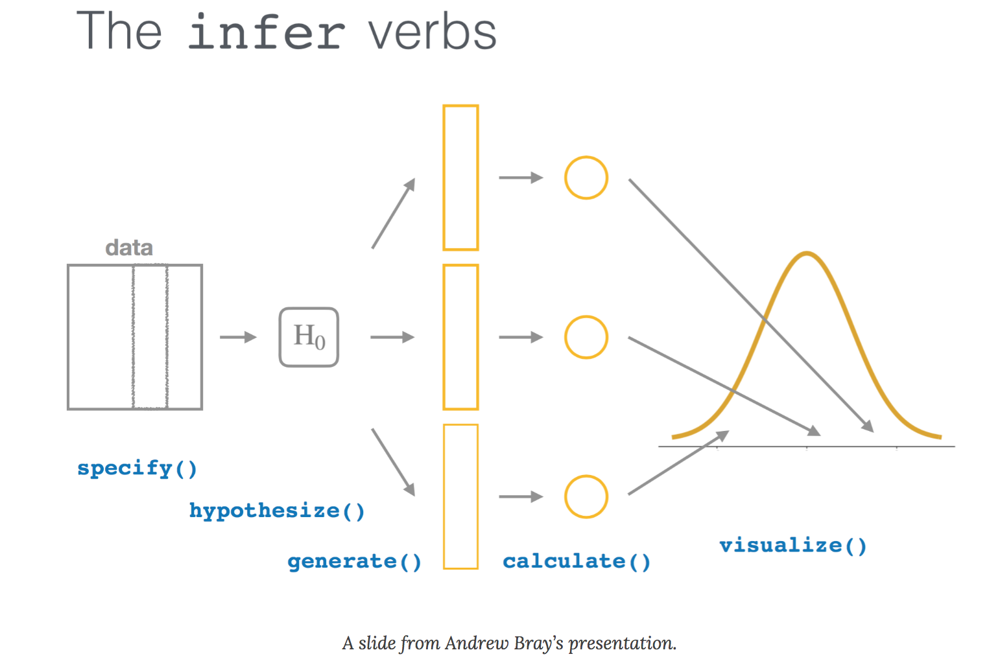

<center>

{width=400px}
</center>

## 

If you use R software for your data analysis, you are likely familiar with the tidyverse. The **tidyverse** package is a “megapackage” in R that includes several packages that import, reshape, and visualize data in a consistent manner, among other tasks. 

Like many analysts, I use the tidyverse suite of functions often for importing, wrangling, and visualizing data. More and more I'm using the **tidymodels** package to apply statistical modeling techniques like regression and random forests on data I work with.

I've often wondered how to perform basic statistical tasks, like *t*-tests and simple linear regression, using a "tidy" approach. In writing code, I always found if clunky to mix writing a series of pipes (`%>%`), common syntax in the tidyverse, with dollar signs (`$`), common syntax in base R that specifies a variable associated with a data set. This syntax-switching was always difficult to convey to students learning statistics. While we use one set of syntax for wrangling and visualizing data, we use a different syntax in the same programming language for performing statistical operations. It's like trying to learn Latin American Spanish and Castilian Spanish at the same time.    

I recently read the excellent article [*An educator's perspective of the tidyverse*](https://arxiv.org/abs/2108.03510) by Mine Çetinkaya-Rundel and colleagues that describes the **infer** package in R. The [**infer** package](https://infer.netlify.app/) performs statistical inference using grammar and syntax that is similar to the tidyverse design framework.

I wanted to learn more about the doing statistical tasks in the tidyverse, so in this post I compare how the code written with the **infer** package compares to those available in base R. I use data sets from my book [*Statistics in Natural Resources: Applications with R*](https://stats4nr.com/), available in the [**stats4nr** package](https://github.com/mbrussell/stats4nr). 

## One-sample t-test: base R and infer

First, I'll load the packages to use throughout this comparison:

```{r, message = F, warning = F}
library(tidyverse)
library(infer)
library(stats4nr)
```

The first statistical task I'll perform is a one-sample t-test for a mean. I'll use the **chirps** data set from the **stats4nr** package to perform a two-sided one-sample t-test at a level of significance of $\alpha = 0.05$. The data contain the number of chirps that a striped ground cricket makes each second (`cps`) at various temperatures:

```{r}
ggplot(chirps, aes(cps)) +
  geom_boxplot() +
  labs(x = "Chirps per second")
```

For our statistical test, assume an entomologist makes a claim that a cricket makes 18 chirps per second. Our hypotheses are then:

* The null hypothesis is that the true mean of the number of chirps a cricket makes is equal to 18.
* The alternative hypothesis is that the true mean of the number of chirps a cricket makes is not equal to 18.

In base R, the `t.test()` function performs a number of hypothesis tests related to the *t*-distribution. We can write the code as:

```{r}
t.test(chirps$cps, mu = 18)
```

The output provides the *t*-statistic, degrees of freedom, *p*-value, mean number of chirps, and the 95% confidence interval. The *p*-value of 0.008407 is less than our level of significance of $\alpha = 0.05$, hence, we can conclude that we have evidence to reject the null hypothesis and conclude that the true mean of the number of chirps a striped ground cricket makes is not equal to 18.

With the chirps data, we can use the `t_test()` wrapper function available in the **infer** package to provide similar calculations:

```{r}
t_test(chirps, response = cps, mu = 18)
```

The output is stored in a small data set (a "tibble") that can be used in subsequent analyses. With **infer**, more information can be obtained from the analysis by specifying four primary functions, each which are expressed as verbs:

* `specify()` lists the variable you want to examine, 
* `hypothesize()` specifies the null hypothesis,
* `generate()`) produces data based on the null hypothesis, and
* `calculate()` calculates a distribution of statistics based on the null hypothesis.

We can perform the same hypothesis test, this time by generating the null distribution using a bootstrap approach with 1,000 samples:

```{r}
chirps_null_dist <- chirps %>%
  specify(response = cps) %>% 
  hypothesize(null = "point", mu = 18) %>% 
  generate(reps = 1000, type = "bootstrap") %>% 
  calculate(stat = "mean")
```

This code produces a data set with 1,000 replicates each with a calculated test statistic (the mean). We can visualize the null distribution and test statistic using the `visualize()` function:

```{r}
observed_test_stat <- chirps %>%
  specify(response = cps) %>%
  calculate(stat = "mean")

chirps_null_dist %>%
  visualize() + 
  shade_p_value(observed_test_stat,
                direction = "two-sided")
```

From the visualization, we can see that our observed mean of 16.7 chirps per second would be unlikely if the true mean was 18 chirps per second.

## Analysis of variance: base R and infer

The second statistical task I'll perform is an analysis of variance. I'll use the **iron** data set from the **stats4nr** package which contains iron levels measured at several water depths in Chesapeake Bay. Experimenters took three measurements at six water depths: 0, 10, 30, 40, 50, and 100 feet. The response variable was iron content, measured in mg/L. 

Here is the distribution of iron contents at the different water depths:

```{r}
ggplot(iron, aes(factor(depth), iron)) + 
  geom_boxplot()+
  ylab("Iron content (mg/L)") +
  xlab("Water depth (feet)")
```

First, we’ll convert the water depth variable (currently stored as a number) to a factor variable. This is because the water depths are labeled as numbers, but they represent categorical variables in our treatment of them in the ANOVA:

```{r}
iron <- iron %>% 
  mutate(depth.fact = as.factor(depth))
```

In this ANOVA, our hypotheses are:

* The null hypothesis is that there are no differences among the mean iron contents collected across the six water depths.
* The alternative hypothesis is that there is at least one mean value of iron content that differs from the rest.

In base R, we can perform a one-way ANOVA with the `lm()` function and view the ANOVA table with the `anova()` function:

```{r}
iron.aov <- lm(iron ~ depth.fact, data = iron)

anova(iron.aov)
```

The output provides the ANOVA table with degrees of freedom, sums of squares, and mean squares. The *F*-statistic and *p*-value provide the results of the ANOVA. Here, we see that with a small *p*-value of the ANOVA *F*-test (9.248e-07), we reject the null hypothesis that all iron contents are equal and conclude that at least one mean differs from the rest.

Using the **infer** package, We can perform the ANOVA by generating the null distribution. We can permute the variables in the iron data set to match each water depth with the iron content levels:

```{r}
iron_null_dist <- iron %>%
  specify(iron ~ depth.fact) %>%
  hypothesize(null = "independence") %>%
  generate(reps = 1000, type = "permute") %>%
  calculate(stat = "F")
```

Then, we can calculate the *p*-value from the observed statistic and null distribution using the `get_p_value()` function:

```{r}
observed_f_stat <- iron %>%
  specify(iron ~ depth.fact) %>%
  hypothesize(null = "independence") %>%
  calculate(stat = "F")

iron_null_dist %>%
  get_p_value(obs_stat = observed_f_stat,
              direction = "greater")
```

In this case, a *p*-value of 0 is reported, which should be understood after seeing the "Please be cautious..." warning. This result is likely because the observed *F*-statistic is quite large and unlikely given the null hypothesis:

```{r}
iron %>%
  specify(iron ~ depth.fact) %>%
  hypothesize(null = "independence") %>%
  calculate(stat = "F")
```

We can visualize the null distribution and test statistic using the `visualize()` function to see that the *F*-statistic is unlikely given null hypothesis:

```{r}
iron_null_dist %>%
  visualize() + 
  shade_p_value(observed_f_stat,
                direction = "greater")
```

Indeed, observing an *F*-statistic of 35.1 would be quite unlikely given the ANOVA hypothesis.

## Takeaways from the infer package

There are many advantages for using the **infer** package for completing elementary statistical tasks and teaching them to students. Here are a few:

* The package uses verbs as a part of it's grammar. The user writes the code to *do this action*, a concept that is consistent within the tidyverse ecosystem.
* Visualization of statistical output is easy. I've often found that when teaching hypothesis testing, I ask students to "do the math", then draw the distribution (even a simple sketch will do) to see where the observed statistic falls. This is essentially what the `visualize()` function does, and the red line in the graphs above is a handy comparison to the null distribution.
* For those functions with a wrapper function, infer outputs statistics into a table which facilitates using them in subsequent analyses, particularly when multiple tests are run in an analysis.

There are some drawbacks to using and teaching introductory statistics with the infer package:
 
* There is a need to write more lines of code to obtain output. There seems to be more output that can be provided with infer functions compared to base R, but you'll need to write the code out. In contrast, it seems that many statistical functions in base R provide an overload of output that learners will need to sift through.  
* The package does not have a wrapper functions for some common statistical tests like ANOVA. This could mean more code to produce similar results that base R functions provide.

In summary, I'm glad there is a package that provides a "tidy" approach to performing statistical tests. The syntax and grammar used in the **infer** package is compatible with how many students are learning R today by using the tidyverse suite of functions and packages.

--

*By Matt Russell. Sign up for [my monthly newsletter](https://mailchi.mp/d96897dc0f46/arbor-analytics) for in-depth analysis on data and analytics in the forest products industry.*

