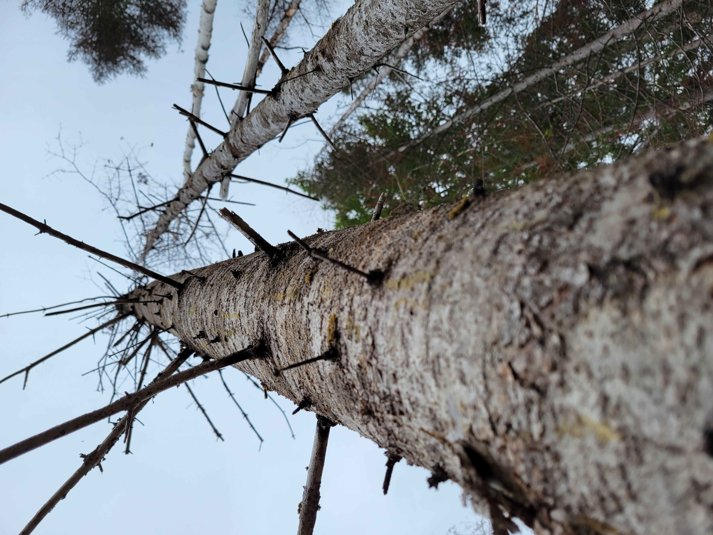

<center>

{width=400px}

</center>


<center>
*A standing dead balsam fir tree in Maine.*
</center>

##

Quantifying the presence and abundance of standing dead trees (SDTs) is notoriously difficult. While live and healthy trees generally appear similar in form and appearance to other live and healthy trees, no two standing dead trees are alike. 

Trees that recently died within a few months can have most of their tops and limbs intact. Their foliage may even still be attached. Trees that have been standing dead for a decade or more can only have a portion of the bole remaining with the rest already decaying on the forest floor.   

These attributes make quantifying the carbon found within SDTs incredibly complex. The popular [Jenkins biomass equations](https://www.fs.usda.gov/research/treesearch/6996) were developed for live trees, and cannot be applied to SDTs directly.  If you're only using common forest inventory measurements like species and diameter, there's really no way to quantify the difference in the amount of carbon in a tree that recently died to one that has been standing dead for decades. 

Fortunately, most inventories that measure dead wood will collect data on the stage of decay of SDTs. These data are needed to refine estimates of SDT biomass and carbon by including structural loss and decay adjustments.

In this post I implement a method for quantifying the amount of carbon in standing dead trees using R, drawing especially from functions in the **tidyverse** package. The approach presented here follows the component ratio method approach for determining carbon developed by the USDA Forest Service. A few key resources that go through the methods of this approach:

* [*Accounting for density reduction and structural loss in standing dead trees: implications for forest biomass and carbon stock estimates in the United States*](https://cbmjournal.biomedcentral.com/articles/10.1186/1750-0680-6-14) by Domke et al. 2011. This paper describes the method and how it impacts the Forest Inventory and Analysis data.
* [Additional file 1 from the paper (PDF).](https://static-content.springer.com/esm/art%3A10.1186%2F1750-0680-6-14/MediaObjects/13021_2011_72_MOESM1_ESM.PDF) The supplemental file presents equations the equations used estimate above and belowground SDT biomass and carbon and provides an example calculation.

## Standing dead tree data

I compiled a few records of standing dead trees from four Forest Inventory and Analysis plots located in Maine. The four plots were measured in 2021 and the data set contains 10 SDTs. Here is the data that can be read into R with the `tribble()` function from the **tidyverse** package:

```{r, warning = FALSE, message = FALSE}
library(tidyverse)
```

```{r}
tree <- tribble(
  ~STATECD, ~COUNTYCD, ~PLOT, ~TREE, ~SPCD, ~DIA, ~ACTUALHT, ~DECAYCD,
  23, 29, 130, 6, 95, 6.7, 27, 3,
  23, 29, 130, 9, 95, 5.6, 9, 2,
  23, 29, 688, 1, 12, 7.9, 35, 1,
  23, 29, 688, 6, 12, 8.6, 31, 1,
  23, 29, 701, 1, 371, 11, 17, 5,
  23, 29, 701, 6, 531, 5.5, 49, 1,
  23, 29, 846, 8, 241, 13.6, 26, 2,
  23, 29, 846, 12, 12, 6.2, 10, 4,
  23, 29, 846, 17, 12, 6.8, 5, 4,
  23, 29, 846, 23, 12, 5.1, 29, 2,
)
```

The variables are:

* `STATECD`: Numeric state ID code (23 = Maine), 
* `COUNTYCD`: Numeric county ID code (29 = Washington County),  
* `PLOT`: Numeric plot ID code,  
* `TREE`: Numeric tree ID code,  
* `SPCD`: Numeric FIA tree species code,  
* `DIA`: Tree diameter (inches), 
* `ACTUALHT`: Height of the tree (feet), from ground level to the highest remaining portion of the tree, 
* `DECAYCD`: Numeric code indicating the stage of decay in a standing dead tree; ranges from 1 (all limbs and branches are present) to 5 (no evidence of branches remains; top is broken) 


## Calculating volume, biomass and carbon in standing dead trees
### Tree volume
The first step to calculating the amount of carbon stored in SDTs is to determine their volume. In your region, there are likely regional volume equations that are used for the species you're interested in. For this example, I'll use [equations developed by Honer in 1967](http://ifmlab.for.unb.ca/People/Kershaw/Courses/For1001/Honer.html) which are widely used for commercial species in the northeastern US and Canada.

The Honer equations predict volume in cubic feet and rely on species, diameter at breast height (`DBH`; measured in inches) and total tree height (`HT`; measured in feet):

$$ VOL = \frac{DBH^2}{a = \frac{b}{HT}}$$
where `a` and `b` are species-specific coefficients. 

Here is an R function to determine the volumes of the five species of SDTs in the data set:

```{r}
fx_HONER_VOL <- function(SPCD, DBH, HT){
       if(SPCD == 12){a = 2.139; b = 301.634}   # balsam fir
  else if(SPCD == 95){a = 1.588; b = 333.364}   # black spruce
  else if(SPCD == 241){a = 4.167; b = 244.906}  # northern white-cedar
  else if(SPCD == 371){a = 1.449; b = 344.754}  # yellow birch
  else if(SPCD == 531){a = 0.959; b = 334.829}  # American beech
  VOL = DBH**2/(a+(b/HT))
  return(VOL)
  }
```

Now, we can estimate the total volume of SDTs by applying the function to the `tree` data set. I use the `mutate()` function along with `mapply()` to create the new variable `VOL`:

```{r}
tree <- tree %>% 
  mutate(VOL = mapply(fx_HONER_VOL, SPCD = SPCD, DBH = DIA, HT = ACTUALHT))
```

A graph of the tree diameter-volume trends highlights the data. Note that because many of the SDTs may have a broken top, trees can be a large diameter with relatively small volume, which adds some "noise" to the relationship:

```{r}
ggplot(tree, aes(x = DIA, y = VOL, col = factor(SPCD))) +
  geom_point() +
  labs(x = "Diameter (in.)",
       y = "Volume (cu.ft.)")
```

### Species data
To determine biomass and carbon attributes of dead trees, the **species reference data set** (`REF_SPECIES.csv`) provided by the FIA program is a must. This file contains species-specific values of wood density, decay ratios, and more. We'll read the .csv file in from the USDA website, then select the core variables needed to determine biomass and carbon for SDTs:

```{r, warning=F, message=F}
ref_spp <- read_csv(url("https://apps.fs.usda.gov/fia/datamart/CSV/REF_SPECIES.csv")) %>% 
  select(SPCD, WOOD_SPGR_GREENVOL_DRYWT, BARK_SPGR_GREENVOL_DRYWT, BARK_VOL_PCT,
         WOOD_SPGR_MC12VOL_DRYWT, SFTWD_HRDWD, JENKINS_TOTAL_B1,JENKINS_TOTAL_B2,
         STANDING_DEAD_DECAY_RATIO1, STANDING_DEAD_DECAY_RATIO2, 
         STANDING_DEAD_DECAY_RATIO3,
         STANDING_DEAD_DECAY_RATIO4, STANDING_DEAD_DECAY_RATIO5,
         RAILE_STUMP_DOB_B1, RAILE_STUMP_DIB_B1, RAILE_STUMP_DIB_B2)
```

Next, we'll join the `ref_spp` data set to the `tree` data set:

```{r}
tree <- inner_join(tree, ref_spp, by = "SPCD")
```

Now, we'll modify some of the species-specific factors from the reference species table. The `STANDING_DEAD_DECAY_RATIO` variable contains the ratio of decayed wood density to non-decayed wood density. It's stored in five different variables for each of the five different decay classes, so the code below will turn it into a data set organized in a long format:

```{r}
ref_spp_dead <- ref_spp %>% 
  select(SPCD, STANDING_DEAD_DECAY_RATIO1, STANDING_DEAD_DECAY_RATIO2, 
         STANDING_DEAD_DECAY_RATIO3, STANDING_DEAD_DECAY_RATIO4, 
         STANDING_DEAD_DECAY_RATIO5) %>% 
  pivot_longer(STANDING_DEAD_DECAY_RATIO1:STANDING_DEAD_DECAY_RATIO5, 
               names_to = "DECAY_NAME", 
               values_to = "STANDING_DEAD_DECAY_RATIO") %>% 
  mutate(DECAYCD = as.numeric(str_sub(DECAY_NAME, 26, 26))) %>% 
  select(-DECAY_NAME) %>% 
  relocate(SPCD, DECAYCD, STANDING_DEAD_DECAY_RATIO)
```

For example, here are the decay ratios for standing dead trees for the five decay classes for balsam fir:

```{r}
print(ref_spp_dead[ref_spp_dead$SPCD == 12, ])
```

### Structural loss adjustments
While decay ratios account for decay and decomposition of wood, they don't account for structural losses. Standing dead trees experience  sloughing and breakage as a result of wind damage, animal activity, and many more issues. For this, structural loss adjustments are needed to accurately determine the biomass and carbon stored in SDTs.  

The structural loss adjustments can be obtained in [Table 2 of the Domke et al. paper](https://cbmjournal.biomedcentral.com/articles/10.1186/1750-0680-6-14/tables/2). These decay-class-specific adjustments are for the bole, bark, tops and limbs, stumps, and roots. The table `sla` produces these values. We can then merge the `sla` table with the `ref_spp_dead` table, then merge that to the `tree` table:

```{r}
sla <- tribble(
  ~DECAYCD, ~BOLE_SLA, ~BARK_SLA, ~TOP_SLA, ~STUMP_SLA, ~ROOTS_SLA,
  1, 1, 0.92, 1, 1, 1,
  2, 1, 0.66, 0.5, 1, 0.95,
  3, 1, 0.39, 0.20, 1, 0.80,
  4, 1, 0.21, 0.10, 1, 0.65,
  5, 1, 0, 0, 1, 0.50)

ref_spp_dead <- left_join(ref_spp_dead, sla, by = "DECAYCD")

tree <- left_join(tree, ref_spp_dead, by = c("SPCD", "DECAYCD")) 
```

Phew! That was a lot of work and we haven't even begun to calculate biomass yet. No fear, now we have all of the variables required in the `tree` data set to begin the biomass and carbon calculations.

## Determing component biomass in standing dead trees
### Stem and bark 

We start by calculating the biomass in wood found the the stem of the tree ($B_{ODW}$; kg). We will also need the specific gravity of wood for that species, i.e., the `WOOD_SPGR_GREENVOL_DRYWT` variable from the reference species file and `W`, the weight of one cubic meter of water (1,000 kg). The structural loss adjustment for the bole (`BOLE_SLA`) is multiplied by these values:
$$B_{ODW} = VOL\times \text{WOOD_SPGR_GREENVOL_DRYWT}\times \\ W \times \text{STANDING_DEAD_DECAY_RATIO}\times \text{BOLE_SLA}$$ 

The biomass found in the bark of the tree is the next component to predict($B_{ODB}$; kg). For this we'll also need to know the species-specific values for the percent of wood volume that is bark (`BARK_VOL_PCT`), the specific gravity of bark (BARK_SPGR_GREENVOL_DRYWT), and the structural loss adjustment for the bark component (`BARK_SLA`):

$$B_{ODB} = VOL\times \text{BARK_VOL_PCT/100}\times \text{BARK_SPGR_GREENVOL_DRYWT} \times \\ W \times \text{STANDING_DEAD_DECAY_RATIO}\times \text{BARK_SLA}$$ 
Total SDT bole and bark biomass ($B_{ODT}$) can be found by adding the two components:

$$B_{ODT} = B_{ODW} + B_{ODB}$$ 

Because this approach uses the component ratio method (CRM) to determine biomass stored in SDTs, the next step is to calculate the biomass in each SDT and them compute the ratios. First we need to calculate the bole biomass (kg) from the Jenkins et al. equation (`JENKINS_AG_TREE`). These equations have different parameters for 10 species groups:

$$ \text{JENKINS_AG_TREE} = exp(\text{JENKINS_TOTAL_B1} + \\ \text{JENKINS_TOTAL_B2}*log(DIA)) $$
The bole ratio from the Jenkins et al. 2003 paper (their Table 6) can be computed for softwood species as:

$$ \text{BOLE_RATIO_SFWD} = exp(-0.3737 + (-1.8055/(DIA)) $$
and for hardwood species as:

$$ \text{BOLE_RATIO_HDWD} = exp(-0.3065 + (-5.4240/(DIA)) $$
      

Ratios of bark can be computed for softwood species as:

$$ \text{BARK_RATIO_SFWD} = exp(-2.0980 + (-1.1432/(DIA)) $$

and for hardwood species as:

$$ \text{BOLE_RATIO_HDWD} = exp(-2.0129 + (-5.4240/(DIA)) $$
Merchantable oven-dry biomass (`MST`) is then calculated as:

$$MST = (\text{JENKINS_AG_TREE} * \text{BOLE_RATIO}) + \\ (\text{JENKINS_AG_TREE} * \text{BARK_RATIO})$$


Then, the CRM adjustment factor ($CRM_{AdjFac}$) for each SDT can be calculated as:

$$ CRM_{AdjFac} = B_{ODT}/MST $$

### Stumps

Volume of stumps is calculated next. These equations are adopted from [Raile's equations](https://www.fs.usda.gov/research/treesearch/10745). Stump volume is calculated as:

$$ S_{VOL} = (\frac{\pi*DIA^2}{4*144})[((A-B)^2h+11B(A-B)ln(h+1)- \\ (\frac{30.25}{h+1}B^2)]_a^b)\times0.02832 $$

where:

* `S_VOL` is stump volume inside bark ($S_{VISB}$) or outside bark ($S_{VOSB}$), 
* `A` and `B` are species-specific coefficients (`RAILE_STUMP_DOB_B1`, `RAILE_STUMP_DIB_B1`, and `RAILE_STUMP_DIB_B2`), 
* `h` is the height above ground (ft), 
* `a` is the lower stump height (ft; typically set to 0), and 
* `b` is the upper stump height (ft; typically set to one.

The biomass in the wood of stumps is calculated by multiplying the volume of stumps (inside bark) by the species specific gravity and the weight of water:

$$S_{ODSW} = S_{VISB}\times \text{WOOD_SPGR_GREENVOL_DRYWT} \times W$$
A similar approach can be used for calculating the biomass in bark, this time subtracting the volume inside and outside the bark:

$$S_{ODSB} = (S_{VOSB}-S_{VISB})\times \text{BARK_SPGR_GREENVOL_DRYWT} \times W$$
Total biomass in the stump ($S_{ODT}$) can be calculated by applying the $CRM_{AdjFac}$ and the structural loss adjustment for the stump ($STUMP_{SLA}$):

$$S_{ODT} = (S_{ODSW} + S_{ODSB}) \times CRM_{AdjFac} \times STUMP_{SLA}$$

### Tops and limbs
Next comes estimating the biomass in tops and limbs. Although foliage biomass is not calculated for SDTs, we calculate it to subtract it from total biomass. The foliage ratio is different for softwood and hardwood species and can be computed as:

$$ \text{FOL_RATIO_SFWD} = exp(-2.9584 + (-4.4766/(DIA)) $$

for softwood species and:

$$ \text{FOL_RATIO_HDWD} = exp(-4.0813 + (-5.8816/(DIA)) $$
      
for hardwood species. The top and branch biomass can be calculated from subtracting all other components and multiplying by the structural loss adjustment for tops and limbs:                          

$$T_{ODT} = (\text{JENKINS_AG_TREE} - MST - (S_{ODSW} + S_{ODSB}) - \\ (\text{JENKINS_AG_TREE} * \text{FOL_RATIO})) * CRM_{AdjFac} * TOP_{SLA}$$
       
### Belowground (roots)       
       
The belowground (coarse roots) ratio from the Jenkins et al. 2003 paper (their Table 6) can be computed for softwood species as:

$$ \text{ROOT_RATIO_SFWD} = exp(-1.5619 + (0.6614/(DIA)) $$
and for hardwood species as:

$$ \text{ROOT_RATIO_HDWD} = exp(-1.6911 + (0.8160/(DIA)) $$       
   
Belowground biomass ($BG_{ODT}$) can then be calculated as: 
 
$$BG_{ODT} = (\text{ROOT_RATIO} \times \text{JENKINS_AG_tree}) \\ \times CRM_{AdjFac} \times ROOTS_{SLA}$$
 
 
### Total standing dead tree biomass and carbon

Finally, the total biomass of a standing dead tree, including aboveground and belowground components, can be calculated as:

$$\text{BIOMASS_TOTAL_SDT} = B_{ODT} + S_{ODT} + T_{ODT} + BG_{ODT}$$

And we can multiply by 0.5, assuming half of biomass is carbon, to compute total carbon in a standing dead tree:  

$$\text{CARBON_TOTAL_SDT} = \text{BIOMASS_TOTAL_SDT} \times 0.5$$


 
## R functions to determine standing dead tree biomass and carbon     
The R functions that calculate these values are written below:

```{r}
# Stem wood biomass
fx_B_ODW <- function(VOL, WOOD_SPGR_GREENVOL_DRYWT, W, 
                    STANDING_DEAD_DECAY_RATIO, BOLE_SLA){
  B_ODW = VOL*WOOD_SPGR_GREENVOL_DRYWT*W*STANDING_DEAD_DECAY_RATIO*BOLE_SLA
  return(B_ODW)
}

# Bark biomass
fx_B_ODB <- function(VOL, BARK_VOL_PCT, W, BARK_SPGR_GREENVOL_DRYWT,
                    STANDING_DEAD_DECAY_RATIO, BARK_SLA){
  B_ODB = VOL*(BARK_VOL_PCT/100)*BARK_SPGR_GREENVOL_DRYWT*1000*
    STANDING_DEAD_DECAY_RATIO*BARK_SLA
  return(B_ODB)
}

# Total SDT biomass (stem wood and bark)
fx_B_ODT <- function(B_ODW, B_ODB){
  B_ODT = B_ODW + B_ODB
  return(B_ODT)
}

# Jenkins aboveground biomass
fx_JENKINS_AG_TREE <- function(JENKINS_TOTAL_B1, JENKINS_TOTAL_B2, DIA){
  JENKINS_AG_TREE = exp(JENKINS_TOTAL_B1 + JENKINS_TOTAL_B2*log(DIA))
  return(JENKINS_AG_TREE)
}

# Bole ratio
fx_BOLE_RATIO <- function(SFTWD_HRDWD, DIA){
       if(SFTWD_HRDWD == "S"){a=-0.3737; b =-1.8055}
  else if(SFTWD_HRDWD == "H"){a=-0.3065; b =-5.4240}
  BOLE_RATIO = exp(a + (b/(DIA)))
  return(BOLE_RATIO)
}

# Bark ratio
fx_BARK_RATIO <- function(SFTWD_HRDWD, DIA){
       if(SFTWD_HRDWD == "S"){a=-2.0980; b =-1.1432}
  else if(SFTWD_HRDWD == "H"){a=-2.0129; b =-1.6805}
  BOLE_RATIO = exp(a + (b/(DIA)))
  return(BOLE_RATIO)
}

# Merchantable oven-dry biomass
fx_MST = function(JENKINS_AG_TREE, BOLE_RATIO, BARK_RATIO){
  MST = (JENKINS_AG_TREE * BOLE_RATIO) + (JENKINS_AG_TREE * BARK_RATIO)
  return(MST)
}

# Component ratio adjustment factor
fx_CRM_AdjFac = function(B_ODT, MST){
  CRM_AdjFac = B_ODT/MST
  return(CRM_AdjFac)
}

# Stump volume outside bark,

fx_STUMP_VOSB <- function(DIA, RAILE_STUMP_DOB_B1){
  STUMP_VOSB = (3.14159265*((DIA)**2))/(4*144)*(((1-RAILE_STUMP_DOB_B1)**2*1+11*
                RAILE_STUMP_DOB_B1*(1-RAILE_STUMP_DOB_B1)*log(1+1)-30.25/(1+1)* 
                  RAILE_STUMP_DOB_B1**2)-((1-RAILE_STUMP_DOB_B1)**2*0+11*
                                            RAILE_STUMP_DOB_B1*(1-RAILE_STUMP_DOB_B1)*
                                            log(0+1)-30.25/(0+1)*RAILE_STUMP_DOB_B1**2))*0.0283168
   return(STUMP_VOSB)
} 
  
# Stump volume inside bark
fx_STUMP_VISB <- function(DIA, RAILE_STUMP_DIB_B1, RAILE_STUMP_DIB_B2){
  STUMP_VISB = (3.14159265*((DIA)**2))/(4*144)*(((RAILE_STUMP_DIB_B1-RAILE_STUMP_DIB_B2)**2*1+11*
                 RAILE_STUMP_DIB_B2*(RAILE_STUMP_DIB_B1-RAILE_STUMP_DIB_B2)* log(1+1)-30.25/(1+1)*             
                   RAILE_STUMP_DIB_B2**2)-((RAILE_STUMP_DIB_B1-RAILE_STUMP_DIB_B2)**2*0+11*                                                            RAILE_STUMP_DIB_B2*(RAILE_STUMP_DIB_B1-RAILE_STUMP_DIB_B2)*
                                             log(0+1)-30.25/(0+1)*RAILE_STUMP_DIB_B2**2))*0.0283168
   return(STUMP_VISB)
} 
   
# Stump wood biomass
fx_S_ODSW <- function(STUMP_VISB, WOOD_SPGR_GREENVOL_DRYWT, W){
  S_ODSW = STUMP_VISB*WOOD_SPGR_GREENVOL_DRYWT*W
  return(S_ODSW)
}
  
# Stump bark biomass
fx_S_ODSB <- function(STUMP_VOSB, STUMP_VISB, BARK_SPGR_GREENVOL_DRYWT, W){
  S_ODSB = (STUMP_VOSB - STUMP_VISB)*BARK_SPGR_GREENVOL_DRYWT*W
  return(S_ODSB)
}

# Total stump biomass:
fx_S_ODT <- function(S_ODSW, S_ODSB, CRM_AdjFac, STUMP_SLA){
  S_ODT = (S_ODSW + S_ODSB)*CRM_AdjFac*STUMP_SLA
}

# Foliage ratio
fx_FOL_RATIO <- function(SFTWD_HRDWD, DIA){
       if(SFTWD_HRDWD == "S"){a=-2.9584; b =-4.4766}
  else if(SFTWD_HRDWD == "H"){a=-4.0813; b =-5.8816}
  FOL_RATIO = exp(a + (b/(DIA)))
  return(FOL_RATIO)
}

# Top and branch biomass
fx_T_ODT <- function(JENKINS_AG_TREE, MST, S_ODSW, S_ODSB,
                    FOL_RATIO, CRM_AdjFac, TOP_SLA){
  T_ODT = (JENKINS_AG_TREE - MST - (S_ODSW + S_ODSB) - 
             (JENKINS_AG_TREE * FOL_RATIO)) * CRM_AdjFac * TOP_SLA
  return(T_ODT)
}

# Coarse root ratio
fx_ROOT_RATIO <- function(SFTWD_HRDWD, DIA){
       if(SFTWD_HRDWD == "S"){a=-1.5619; b =0.6614}
  else if(SFTWD_HRDWD == "H"){a=-1.6911; b =0.8160}
  ROOT_RATIO = exp(a + (b/(DIA)))
  return(ROOT_RATIO)
}
      
# Belowground biomass
fx_ROOT_ODT <- function(ROOT_RATIO, JENKINS_AG_TREE, CRM_AdjFac, ROOTS_SLA){
  ROOT_ODT = (ROOT_RATIO*JENKINS_AG_TREE) * CRM_AdjFac * ROOTS_SLA
return(ROOT_ODT)
}

# Total biomass
fx_BIOMASS_TOTAL_SDT <- function(B_ODT, S_ODT, T_ODT, ROOT_ODT){
  BIOMASS_TOTAL_SDT = B_ODT + S_ODT + T_ODT + ROOT_ODT
return(BIOMASS_TOTAL_SDT)
}

# Total carbon
fx_CARBON_TOTAL_SDT <- function(BIOMASS_TOTAL_SDT){
  CARBON_TOTAL_SDT = BIOMASS_TOTAL_SDT * 0.5
return(CARBON_TOTAL_SDT)
}
      
```

Now, we'll apply the SDT functions to the `tree` data set. Note we'll need to convert the volume from cubic feet to cubic meters by multiplying by 0.0283168, and change the diameter from inches/centimeters where needed:

```{r}
tree <- tree %>% 
  mutate(B_ODW = mapply(fx_B_ODW, 
                        VOL = VOL*0.0283168, 
                        WOOD_SPGR_GREENVOL_DRYWT = WOOD_SPGR_GREENVOL_DRYWT, 
                        W = 1000, 
                        STANDING_DEAD_DECAY_RATIO = STANDING_DEAD_DECAY_RATIO, 
                        BOLE_SLA = BOLE_SLA),
         B_ODB = mapply(fx_B_ODB,
                        VOL = (VOL*0.0283168),
                        BARK_VOL_PCT = BARK_VOL_PCT,
                        BARK_SPGR_GREENVOL_DRYWT = BARK_SPGR_GREENVOL_DRYWT,
                        W = 1000,
                        STANDING_DEAD_DECAY_RATIO = STANDING_DEAD_DECAY_RATIO,
                        BARK_SLA = BARK_SLA),
         B_ODT = mapply(fx_B_ODT, 
                        B_ODW = B_ODW,
                        B_ODB = B_ODB),
         JENKINS_AG_TREE = mapply(fx_JENKINS_AG_TREE,
                                  JENKINS_TOTAL_B1 = JENKINS_TOTAL_B1, 
                                  JENKINS_TOTAL_B2 = JENKINS_TOTAL_B2, 
                                  DIA = DIA*2.54),
          BOLE_RATIO = mapply(fx_BOLE_RATIO, 
                              SFTWD_HRDWD = SFTWD_HRDWD, 
                              DIA = DIA*2.54),
         BARK_RATIO = mapply(fx_BARK_RATIO, 
                             SFTWD_HRDWD = SFTWD_HRDWD, 
                             DIA = DIA*2.54),
         MST = mapply(fx_MST,
                      JENKINS_AG_TREE = JENKINS_AG_TREE,
                      BOLE_RATIO = BOLE_RATIO,
                      BARK_RATIO = BARK_RATIO),
         CRM_AdjFac = mapply(fx_CRM_AdjFac,
                             B_ODT = B_ODT,
                             MST = MST),
         STUMP_VOSB = mapply(fx_STUMP_VOSB,
                             DIA = DIA,
                             RAILE_STUMP_DOB_B1 = RAILE_STUMP_DOB_B1),
         STUMP_VISB = mapply(fx_STUMP_VISB,
                             DIA = DIA,
                             RAILE_STUMP_DIB_B1 = RAILE_STUMP_DIB_B1,
                             RAILE_STUMP_DIB_B2 = RAILE_STUMP_DIB_B2),
         S_ODSW = mapply(fx_S_ODSW,
                          STUMP_VISB = STUMP_VISB,
                          WOOD_SPGR_GREENVOL_DRYWT = WOOD_SPGR_GREENVOL_DRYWT,
                          W = 1000),
         S_ODSB = mapply(fx_S_ODSB,
                         STUMP_VOSB = STUMP_VOSB,
                         STUMP_VISB = STUMP_VISB,
                         BARK_SPGR_GREENVOL_DRYWT = BARK_SPGR_GREENVOL_DRYWT,
                         W = 1000),
         S_ODT = mapply(fx_S_ODT,
                        S_ODSW = S_ODSW,
                        S_ODSB = S_ODSB,
                        CRM_AdjFac = CRM_AdjFac,
                        STUMP_SLA = STUMP_SLA),
         FOL_RATIO = mapply(fx_FOL_RATIO,
                            SFTWD_HRDWD = SFTWD_HRDWD, 
                            DIA = DIA*2.54),
         T_ODT = mapply(fx_T_ODT,
                        JENKINS_AG_TREE = JENKINS_AG_TREE,
                        MST = MST,
                        S_ODSW = S_ODSW,
                        S_ODSB = S_ODSB,
                        FOL_RATIO = FOL_RATIO,
                        CRM_AdjFac = CRM_AdjFac,
                        TOP_SLA = TOP_SLA),
         ROOT_RATIO = mapply(fx_ROOT_RATIO,
                            SFTWD_HRDWD = SFTWD_HRDWD, 
                            DIA = DIA*2.54),
         ROOT_ODT = mapply(fx_ROOT_ODT,
                           ROOT_RATIO = ROOT_RATIO, 
                           JENKINS_AG_TREE = JENKINS_AG_TREE, 
                           CRM_AdjFac = CRM_AdjFac, 
                           ROOTS_SLA = ROOTS_SLA),
         BIOMASS_TOTAL_SDT = mapply(fx_BIOMASS_TOTAL_SDT,
                                    B_ODT = B_ODT,
                                    S_ODT = S_ODT,
                                    T_ODT = T_ODT,
                                    ROOT_ODT = ROOT_ODT),
         CARBON_TOTAL_SDT = mapply(fx_CARBON_TOTAL_SDT,
                                   BIOMASS_TOTAL_SDT = BIOMASS_TOTAL_SDT))
```

Now we can plot the diameter-carbon trends, and we end up with a graph that looks similar to to the volume-diameter trends from before:

```{r}
ggplot(tree, aes(x = DIA, y = CARBON_TOTAL_SDT*2.20462, col = factor(SPCD))) +
  geom_point() +
  labs(x = "Diameter (in.)",
       y = "Total carbon (pounds)")
```

We may be interested in a plot-level summary of SDT carbon. The code below summarizes the per-acre values of SDT carbon, by converting to pounds and multiplying by the tree's expansion factor (In the FIA data, one tree sampled represents approximately six trees sampled on a per acre basis): 

```{r, warning=F, message=F}
dead_sum <- tree %>% 
  mutate(CARBON_TOTAL_SDT_part = CARBON_TOTAL_SDT*2.20462*6.018046) %>% 
  group_by(STATECD, COUNTYCD, PLOT) %>% 
  summarize(CARBON_TOTAL_SDT_lbs_ac = sum(CARBON_TOTAL_SDT_part))
```

As we can see, we have anywhere between 0.2 and 0.7 tons per acre of standing dead tree carbon from these four inventory plots:

```{r}
ggplot(dead_sum, aes(x = factor(PLOT), y = CARBON_TOTAL_SDT_lbs_ac/2000)) +
  geom_bar(stat = "identity") +
  labs(x = "PLOT ID",
       y = "Total carbon (tons/ac)")
```

## Other notes 

A few other notes about determining the biomass and carbon in standing dead trees:

* Depending on the data collected on the SDTs from your inventory, there may also be measurements such as whether or not the stem is **cull or rotten**. After all, these characteristics are likely if the tree is dead. Some deductions in volume can be taken at the start before determining biomass and carbon. 
* The selection of **which volume equation to use** has a large influence on the amount of carbon. If using FIA data, the `VOLCFSND` variable is the one that's used in the component ratio method. These are regionally specific equations that use either height or site index. If **taper equations** are available for your area, consider using those given the variability in heights (e.g., broken limbs) on standing dead trees. That's an approach I applied [on some SDT data in Maine](https://www.sciencedirect.com/science/article/pii/S0378112712004793). (At least the peer reviewers didn't complain.)
* Some inventories, like FIA's, collect a height measurement that assumes the tree has it's top and limbs intact (e.g., the `HT` variable in FIA) and a **true height** (e.g., the `ACTUALHT` variable in FIA). When computing volume, biomass, and carbon of SDTs a true actual height is a better representation because it would incorporate broken stems. 
* These data and equations use a five-class **decay class system**. This approach can be adapted by refining the decay ratios and structural loss adjustments for trees in the region you work in.
* The approach outlined here is similar to estimating the biomass and carbon in **live trees**. It's the regional volume equations that are more complex and vary across the US.
* These approaches often calculate terms in mixed English and metric units. See the [Forest Carbon Cheat Sheet](https://arbor-analytics.com/post/2022-12-21-forest-carbon-cheat-sheet-updated-for-2022/) for a handy list on common units and conversion factors. 
* The USDA Forest Service will soon release [**updated equations**](https://www.fs.usda.gov/research/research/inventory/FIA/VBC) for determining volume, biomass, and carbon of trees. No doubt this will also influence the calculation of standing dead trees. 

-- 

*By Matt Russell. Sign up for my [monthly newsletter](https://mailchi.mp/d96897dc0f46/arbor-analytics) for in-depth analysis on data and analytics in the forest products industry.*
