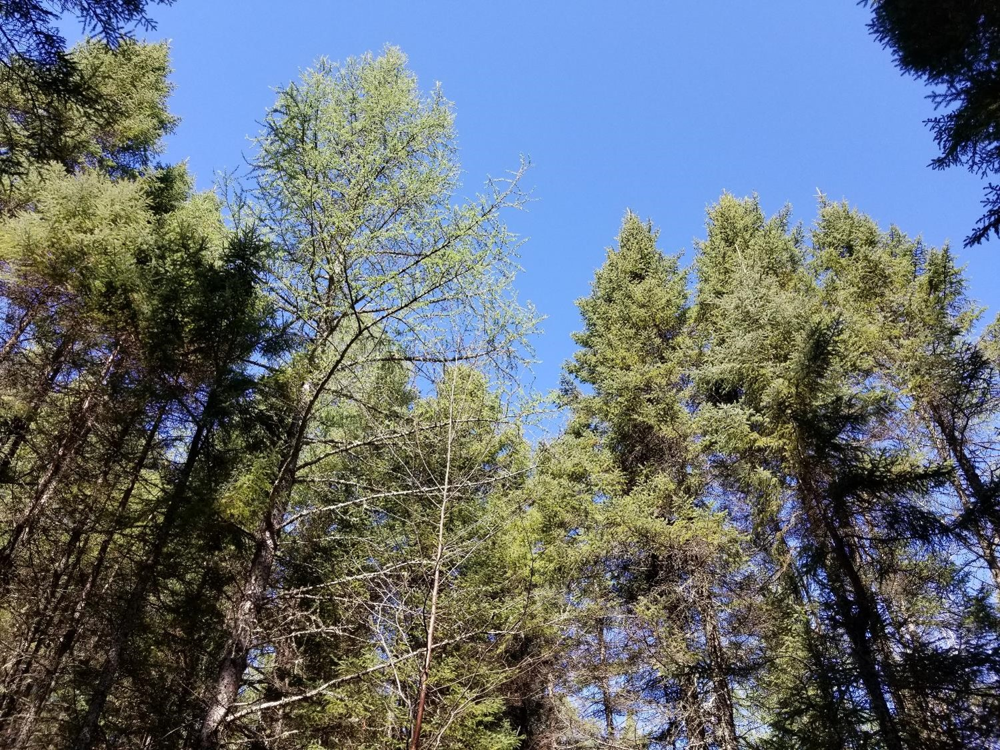

 
<center>

{width=500px}
</center>
<center>
*A canopy of lowland conifer trees in northern Minnesota.*
</center>

## 

One of the first things you learn in an forestry field course is how to measure the height of trees. Doing so is tricky, as it's difficult to locate the tops of many trees in dense forests (especially deciduous ones during leaf-on periods). Many foresters will sub-sample tree heights, for example only measuring the heights for every fifth tree or the four closest trees to plot center. Accurate tree height information is critical yet time consuming and expensive to collect in the field. 

Foresters require high-quality information on the heights of stands for estimating forest volume, growth, and other forest characteristics. With inventory data in hand, foresters have many ways to represent the average height of a stand. Because top height is widely used in determining forest site productivity, understanding how the definition of top height impacts site index is important, as [work by Sharma and others](https://www.sciencedirect.com/science/article/pii/S037811270100737X) have reported. A popular technique to represent average top height of a stand is **Lorey's height**.

Lorey's height is a measure of average stand height that is weighted by basal area. A benefit is that if you're using horizontal point sampling to collect data, the average height of all "in" trees *is* Lorey's mean height. 

Lorey's height is popular in the remote sensing community because the height of the largest diameter trees is more likely to be detected by active or passive sensors. Although technologies have come a long way, the ability to account for the heights of shorter trees underneath the canopy remains difficult. That may be okay--in a forestry context it's often the larger trees that provide more economic value and store more carbon relative to shorter and smaller trees in the stand.

Many remote sensing papers that use it seem to point to [a paper written by Naesset in 1997](https://www.sciencedirect.com/science/article/pii/S0924271697830006) that used it to quantify tree canopy heights from lidar data collected in Norway. It's a variable that is provided in many spatial databases, such as from [lidar collects in the US](https://daac-news.ornl.gov/content/global-estimates-forest-canopy-height) and [Canada](https://open.canada.ca/data/en/dataset/836082d5-d55f-46c3-9b9c-aaf1a306c247).

This post describes the calculation of Lorey's height using data collected from the US national forest inventory program in New York State. It then compares this definition of top height to other common ones used in forestry.

## Calculating Lorey's height

Lorey's height ($h_L$) can be defined as:

$$h_L=\frac{\sum{n_ig_ih_i}}{\sum{n_ig_i}}$$

where 

* $n_i$ is the number of trees in the *i*th diameter class, 
* $g_i$ is the average basal area of the *i*th diameter class, and 
* $h_i$ is the average height of trees in the *i*th diameter class.

As an example, we can put together a small data set named **tree** where we can calculate Lorey's height. Assume these trees were sample from a single fixed-radius plot that is 1/5th-acre in size. The `tribble()` function from the **tidyverse** package can be used for this:

```{r, message = F, warning = F}
library(tidyverse)
```

```{r}
tree <- tribble(
  ~treeid, ~dbh, ~ht,
  1, 4.5,	30.8,
  2, 4.6,	32.7,
  3, 11.7, 62.8,
  4, 13.8, 66.9,
  5, 4.7,	29.3,
  6, 7.3,	51.3,
  7, 14.5,	65.5,
  8, 9.6, 58.9,
  9, 12.1, 67.5,
  10, 16.9, 75.8,
  11, 11.9,	69,
  12, 13.2,	65.1,
  13, 12,	63.3,
  14, 14.2,	68.2,
  15, 6.3, 47.9,
  16, 4.9, 32.4,
  17, 8.1, 49.2,
  18, 9.1, 48.1,
  19, 11.2,	48,
  20, 9.9, 49.5,
  21, 5.7, 26.8,
  22, 12.9, 58.7,
  23, 5.8, 35.4,
  24, 4.9, 35.4,
  25, 24,	89.6,
  26, 6.2, 47.4,
  27, 5.9, 54.4,
  28, 4.5, 40.3
  )
```

We can define the expansion factor (`expf` = 5) and then determine Lorey's mean height. The denominator of the calculation is the basal area in the stand: 

```{r}
expf <- 5

tree %>% 
  mutate(ba_tree = (0.00545415*dbh^2)*expf,
         lorey_num = (0.00545415*dbh^2)*ht*expf) %>% 
  summarize(BA = sum(ba_tree),
            LOREY_HT = sum(lorey_num) / BA)
```

As an aside, the [**sitreeE** package in R](https://cran.r-project.org/web/packages/sitreeE/index.html) also has a function for determining Lorey's height:

```{r, message = F, warning = F}
# install.packages("sitreeE")

library(sitreeE)

BA2 <- pi*(tree$dbh/2)^2

LOREY_HT2 <- lorey.height(BA2, tree$ht)

print(LOREY_HT2)
```

So, we can conclude that this stand has a mean Lorey's height of 65.7 feet.

## FIA data from New York State

For an example data set, let's query data from the US Forest Inventory and Analysis program collected in New York State. This is an excellent data set to use in this application because tree heights are measure on all sized trees in a network of permanent sample plots. There are approximately 3,200 forested plots in the New York FIA data.

We can read in the data using [the **rFIA** package](https://rfia.netlify.app/). Specifically, we want to acquire the TREE and PLOT tables (uncomment to run code_:

```{r, eval = F, warning=F, message=F}
library(rFIA)
```

```{r, echo = F, warning=F, message=F}
nyfia_TREE <- read_csv("C:/Users/matt/Documents/Arbor/Data/NY_TREE.csv")
nyfia_PLOT <- read_csv("C:/Users/matt/Documents/Arbor/Data/NY_PLOT.csv")
```

```{r, echo = T, eval = F, message = F, warning = F}
# nyfia <- getFIA(states = 'NY', 
#                tables = c("TREE", "PLOT"),
#                dir = 'your/path/goes/here')
```

The `plotFIA()` function maps the approximate locations of all plots: 

```{r, eval = F}
plotFIA(nyfia)
``` 


<center>
{width=500px}
</center>

## 
 
Next, we want to filter the data to only live trees (`STATUSCD` = 1) with a diameter at breast height (`DIA`) greater than 5.0 inches. I'll also filter the data to obtain the most recent measurement of trees. In New York, this equates to all trees measured since about 2013:

```{r, echo = F}
nytree <- nyfia_TREE %>% 
  filter(STATUSCD == 1 & DIA >= 5.0 & INVYR >= 2013)
```

```{r, eval = F}
nytree <- nyfia$TREE %>% 
  filter(STATUSCD == 1 & DIA >= 5.0 & INVYR >= 2013)
```

Next, we can calculate the number of trees, basal area, and Lorey's height for all New York plots. The `PLT_CN ` variable records each plot identifier:

```{r}
nyplot <- nytree %>% 
  mutate(ba_tree = (0.00545415*DIA^2)*TPA_UNADJ,
         lorey_num = (0.00545415*DIA^2)*ACTUALHT*TPA_UNADJ) %>% 
  group_by(PLT_CN) %>% 
  summarize(num_trees = n(),
            BA = sum(ba_tree),
            LOREY_HT = sum(lorey_num) / sum(ba_tree))
nyplot

```

We can visualize the distribution of Lorey's height with a violin plot. We can see that the heights are approximately normal distributed, albeit slightly right-skewed: 

```{r}
ggplot(nyplot, aes(x = LOREY_HT, y = 1)) +
  geom_violin(draw_quantiles = c(0.5)) +
  labs(x = "Lorey's height (feet)") +
  theme(axis.title.y = element_blank(),
        axis.text.y = element_blank(),
        axis.ticks.y = element_blank())
```

## Comparing Lorey's height to other top height definitions

In their text, [Kershaw et al. 2016](https://onlinelibrary.wiley.com/doi/book/10.1002/9781118902028) describe three other approaches to determine top height. In addition to Lorey's height, these include:

* The **arithmetic mean height** of all trees in a stand. This is a non-weighted measure of stand height and considers trees of all sizes in a stand (including ones in the lower canopy). 
* The average height of **dominant and co-dominant trees, only**. This is the height calculation I first learned as a forestry student because it's typically used in site index equations in North America.
* The average height of the **largest diameter trees** (or tallest trees). Some examples include selecting the largest 20% of trees based on diameter, or the tallest 50 trees per unit area. 

We may be interested in comparing how these three different metric of top height compare to Lorey's height. The arithmetic mean height simply averages all heights in a stand. The average height of dominants and co-dominants can be determined by querying FIA's `CCLCD` variable, a designation of the crown class code of each tree. (We'll filter all trees with a `CCLCD` of 2 and 3 which represent dominant and co-dominant trees, respectively.) For the average height of the largest diameter trees, let's take the largest diameter trees found in the top 20th percentile (or 80th quantile):  

```{r, warning=F, message=F}
nyplot_q <- nytree %>% 
  group_by(PLT_CN) %>% 
  summarize(pctl_80 = quantile(DIA, p = 0.8))

nyplot <- nytree %>% 
  inner_join(nyplot_q) %>% 
  mutate(ba_tree = (0.00545415*DIA^2)*TPA_UNADJ,
         lorey_num = (0.00545415*DIA^2)*ACTUALHT*TPA_UNADJ,
         ACTUALHT_dom_codom = ifelse(CCLCD %in% c(2,3), ACTUALHT, NA),
         ACTUALHT_pctl_80 = ifelse(DIA >= pctl_80, ACTUALHT, NA)) %>% 
  group_by(PLT_CN) %>% 
  summarize(num_trees = n(),
            BA = sum(ba_tree),
            LOREY_HT = sum(lorey_num) / sum(ba_tree),
            ARITH_HT = mean(ACTUALHT),
            DOM_CODOM_HT = mean(ACTUALHT_dom_codom, na.rm = T),
            LARGE_HT = mean(ACTUALHT_pctl_80, na.rm = T))

nyplot
```

Let's plot the distributions of the different top height definitions:

```{r, warning = F, message = F}
nyplot_long <-nyplot %>% 
  pivot_longer(LOREY_HT:LARGE_HT, names_to = "Top height definition", 
               values_to = "Height (feet)")

ggplot(nyplot_long, aes(x = `Height (feet)`, 
                        y = `Top height definition`)) +
  geom_violin(draw_quantiles = c(0.5)) +
  labs(x = "Top height (feet)") +
  scale_y_discrete(labels = c("Arithmetic mean", "Dominant/co-dominant", 
                              "Largest 20% diameter", "Lorey's"))
```

The definition of average height of the largest diameter trees produces the greatest median height, followed by the average height of dominants and co-dominants, Lorey's height, and then the arithmetic mean height. 

We can visualize the correlations between these different top height definitions. The **GGally** package has a `ggpairs()` function that produces a sharp-looking correlation matrix with scatter plots, densities, and Pearson correlation coefficients:  

```{r, warning = F, message = F}
library(GGally)
```

```{r, warning = F, message = F}
ny_plot_ht <- nyplot[,4:7]

ggpairs(ny_plot_ht, 
        title = "Correlation of top height definitions from New York FIA data")
```

All of the top height definitions provide a correlation in excess of 0.9. The correlation is lowest between arithmetic mean height and the average height of the largest diameter trees (*r* = 0.907). The correlation is highest between Lorey's height and the average height of the largest diameter trees (*r* = 0.976).  

## Conclusion

With the increasing use of remote sensing in forestry, Lorey's height will likely continue to be a popular choice of representing average stand height in the future. Lorey's height is advantageous because it weights average height by tree size (basal area) and is equal to the mean height if horizontal point sampling is used. It's useful to understand how different stand height definitions can result in different estimates of growth and productivity when used in forestry applications.

--

*By Matt Russell. [Email Matt](mailto:matt@arbor-analytics.com) with any questions or comments.*