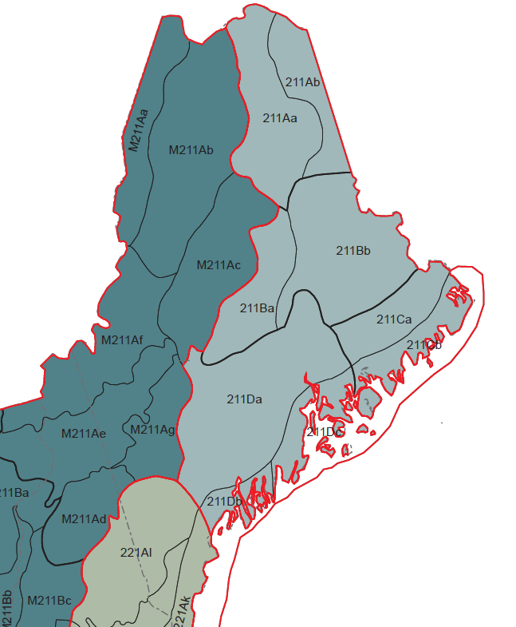

<center>

{width=500px}
</center>
##

To get a better feel for how they work, I've been digging into the new [tree volume, biomass, and carbon models](https://www.fs.usda.gov/research/programs/fia/nsvb) released by the USDA Forest Service last month. These new equations replace volume equations developed at the regional level and are now nationally-consistent. Importantly for anyone that works with forest carbon inventory data, these new equations replace the Component Ratio Method (CRM).

Although the equations replace regional ones previously implemented, they do require a geographical variable not widely used in forest biomass and carbon equations: ecological division. These divisions are outlined in the US National Hierarchical Framework of Ecological Units, described in detail in a map produced by [Cleland and others](https://www.fs.usda.gov/research/treesearch/48672) in 2007. Within divisions there are ecological provinces. Within those provinces there are ecological sections and subsections. 

If you're doing an analysis on an individual ownership, you can simply look up the property's ecological division and find the equations for the tree species that you need. But if you're doing an analysis at a larger scale, e.g., across a US state, there may exist multiple ecological divisions within your project area. Ecological divisions don't line up with regional, state, or county boundaries, making it tricky to keep track of which volume, biomass, and carbon equation to use. For example, a state like Maine has three different ecological divisions. Hence, the same-sized eastern white pine tree located in three different locations in the state could have three different estates of tree biomass.

This issue will arise for analysts that do statewide assessments using Forest Inventory and Analysis (FIA) data. While the FIA database has been updated with the new estimates of tree volume, biomass, and carbon, analysts often will need to use the FIA data and write customized functions based on the data.

Fortunately, the **PLOT** table in the FIA database contains the ecological subsection where the plot resides, stored in the **ECOSUBCD** variable. As described in the [FIA Database User Guide](https://www.fia.fs.usda.gov/library/database-documentation/), ecological subsections are defined as areas of "similar surficial geology, lithology, geomorphic process, soil groups, subregional climate, and potential natural communities." This represents the most detailed level within the hierarchical framework. 

You'll need to do some work to pull the ecological division out from this variable, and it's messy because of the alpha-numeric characteristics and differing lengths of of the **ECOSUBCD** variable. For example, **ECOSUBCD** 211Da in central Maine is termed the Central Maine Embayment Subsection.

I'll use some functions from the **stringr** package in R to do this, which can be called from the tidyverse library:  

```{r, warning = F, message = F}
library(tidyverse)
```

```{r, echo = F, warning = F, message = F}
# Set working directory

my_wd <- "C:/Users/matt/Documents/Arbor/Projects/Blog/"
me_plot<- read_csv(paste0(my_wd, "ME_PLOT.csv"))
```

First, I'll make a data table called *eco_codes* of all of the **ECOSUBCD** values list in Maine's PLOT table from FIA's *ME_PLOT.csv* file using the `as_tibble()` function. Then I'll rename the variables to something that makes sense. You can see that Maine has 19 unique ecological subsections:  

```{r, warning = F, message = F}
eco_codes <- as_tibble(table(me_plot$ECOSUBCD), .name_repair = "unique") |> 
  rename(ECOSUBCD = ...1,
         num_plots = n)

eco_codes
```

We can determine the ecological province (**eco_province**) by using the `str_sub()` function by "trimming off" the subsection letters at the end of the subsection name. This can be done by specifying `end = -3` in the function.

If only it were that simple. To obtain the ecological division we need to "round down" the ecological province. For example, Ecological province 211 (Northeastern Mixed Forest Province) corresponds to ecological division 210 (Warm Continental Division). To do this you can replace the last character in the **eco_province** variable with a zero. This can be done with the `str_replace()` function and replacing the last character using the `".$"`  command.

In the end, you can see the relationships between the ecological subsection, province, and division codes: 

```{r}
eco_codes <- eco_codes |> 
  mutate(eco_province = str_sub(ECOSUBCD, end = -3),
         eco_division = str_replace(eco_province, ".$", "0"))
eco_codes
```

You can see that most FIA plots in Maine are found in the Division 210 (Warm Continental Division), followed by M210 (Warm Continental Division - Mountain Provinces) and 220 (Hot Continental Division): 

```{r}
eco_codes |> 
  summarize(num_plots_division = sum(num_plots),
            .by = "eco_division")
```

Surely, there must exist an ecological subsection lookup table that contains each subsection and its corresponding values for ecological sections, divisions, and so forth. I haven't been able to find one yet, but if you're aware of one, do let me know! For know I'll likely continue use functions like this to pull out these values.  

--

*By Matt Russell. [Email Matt](mailto:matt@arbor-analytics.com) with any questions or comments.*
