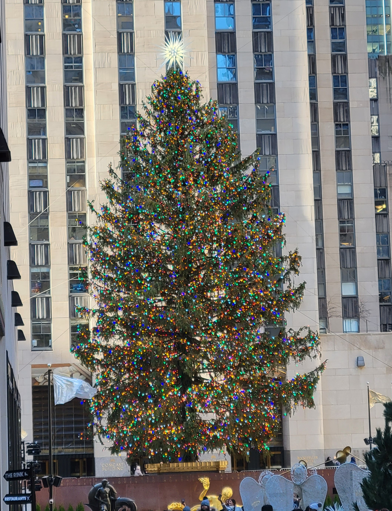

# 
<center>

{width=500px}
</center>
#  

One of my favorite things about the holiday season is the Rockefeller Christmas tree. Every year the Christmas tree at Rockefeller Center in New York City brings a wonderful burst of green amid the dull winter colors of a big city. Although I don't live in New York, it's fun to watch the tree lighting special on NBC and see it pop into some of my favorite holiday movies like *Elf*. 

The first Christmas tree at Rockefeller Center was in 1931 and was a meager [20-foot tall balsam fir](https://www.rockefellercenter.com/holidays/rockefeller-center-christmas-tree-lighting/#tree-history). The tree was erected by construction workers who would meet at the tree to receive their paychecks. This was during the Great Depression and the tree had a special meaning at the time.

With a lack of tall trees within the New York City limits, the tree is always chosen from the surrounding region A few weeks before it arrives, in the news are stories about where the tree originated from, the family whose property it came from, and how far it traveled to get to Rockefeller Center. As an example, the 2023 Rockefeller Center Christmas tree was from Vestal, New York and traveled nearly 200 miles to get to Manhattan.

```{r, echo = F, message = F, warning =F}
library(tidyverse)
library(maps)
library(geosphere)
library(ggrepel)

tree <- read_csv("C:/Users/matt/Documents/Arbor/Data/rocktree.csv")
```

The [Rockefeller Christmas Tree data](https://en.wikipedia.org/wiki/Rockefeller_Center_Christmas_Tree) set contains 75 years of data about the tree, including its species, height, and the town where it originated. Here are a few fun facts about the tree.

## Species and tree height
Since at least 1982, the species chosen has always been a Norway spruce, a large and fast-growing conifer known for its drooping branches. Prior to that, white spruce and balsam fir were chosen more than once for the tree:

```{r, echo = F, message = F, warning =F}
tree |> 
  group_by(Species) |> 
  summarize(num = n()) |> 
  arrange(desc(num)) |> 
  filter(!is.na(Species)) |> 
  ggplot(aes(x = reorder(Species, num), y = num)) +
  geom_bar(stat = "identity", fill = "darkgreen", col = "black") +
  coord_flip()+
  labs(y = "Number of trees", x = "Species") +
  theme_bw()
```

For the 92 trees which there are data, the average height of all of the Rockefeller Christmas trees was 72.3 feet. The Rockefeller tree has generally gotten taller through the years. Prior to 2000 there were several trees less than 70 feet tall. Since 2000 the average height of the tree has been 78.4 feet:

```{r, echo = F, message = F, warning =F}
# tree |> 
#   summarize(n_trees = n(),
#             mean_ht = mean(Height_ft, na.rm = T))
# tree |> 
#   filter(Year >= 2000) |> 
#   summarize(n_trees = n(),
#             mean_ht = mean(Height_ft, na.rm = T))

ggplot(tree, aes(Year, Height_ft)) +
  geom_point() +
  stat_smooth(method = "lm") +
  labs(y = "Height of Rockefeller tree (feet)") +
  theme_bw()
```

# Where the Rockefeller trees come from

Rockefeller Christmas trees have originated from 11 states in the northeastern US and one Canadian province (Ontario). The tallest trees have come from Connecticut, with an average height of 78 feet. The tree has only come from the state of Vermont six times in its history, and this state produces the shortest trees at 63 feet:

```{r, echo = F, message = F, warning =F}
tree %>% 
  group_by(OriginState) %>% 
  summarize(num = n(),
            mean_ht = mean(Height_ft, na.rm = T)) %>% 
  arrange(desc(mean_ht)) %>% 
  filter(num >2 & !is.na(OriginState)) %>%
  ggplot(aes(x = reorder(OriginState, mean_ht), y = mean_ht)) +
  geom_bar(stat = "identity", fill = "darkgreen", col = "black") +
  coord_flip()+
  labs(y = "Mean height of Rockefeller tree (feet)", x = "State",
       caption = "* At least three trees from a state.") +
  theme_bw()
```

The mean distance between a tree’s home and Rockefeller Center is 95 miles. The closest trees originated from Tenafly, New Jersey in 1973, just 11 miles away from Rockefeller Center. The furthest tree originated from Richfield, Ohio, a Norway spruce 401 miles away from Rockefeller Center. 

```{r, echo = F, message = F, warning =F}
states <- map_data("state")
tree_states <- subset(states, 
                region %in% c("connecticut", "pennsylvania", 
                              "new york","ohio", "new jersey", "rhode island",                                         
                              "vermont", "massachusetts", "delaware",
                              "new hampshire", "maryland", "maine"))

counties <- map_data("county")

tree_counties <- subset(counties, 
                region %in% c("connecticut", "pennsylvania", 
                              "new york","ohio", "new jersey", "rhode island",                                          
                              "vermont", "massachusetts", "delaware",
                              "new hampshire", "maryland", "maine"))
# ggplot(data = tree_states, 
#        mapping = aes(x = long, y = lat, group = group)) + 
#   geom_polygon(data = tree_counties, fill = NA, color = "gray") +
#   geom_polygon(color = "black", fill = NA) +
#   coord_map("conic", lat0 = 40) +
#   theme_bw()

ggplot(data = tree_states, 
                      mapping = aes(x = long, y = lat, group = group)) + 
  geom_polygon(color = "black", fill = "white") +
  geom_point(data = tree, aes(x = OriginLong, y = OriginLat), 
             color = "red", size = 2, inherit.aes = F) +
  geom_point(aes(y=40.759358, x=-73.978502), 
             color = "darkgreen", size = 5) +
  coord_map("conic", lat0 = 40) +
  theme_bw()

tree <- tree %>% 
  mutate(LatRock = 40.759358,
         LongRock = -73.978502,
         dist_to_rock_m = distHaversine(
            cbind(OriginLong, OriginLat), 
            cbind(LongRock, LatRock)),
         dist_to_rock_miles = dist_to_rock_m * 0.000621371)

#mean(tree$dist_to_rock_miles, na.rm = T)
```

Most trees are less than 150 miles away from their “new home” in Rock Center:

```{r, echo = F, message = F, warning =F}
ggplot(data = tree, aes(x = dist_to_rock_miles, y = 1)) + 
  geom_violin(col = "darkgreen", size = 2) +
  theme_bw()+
  xlab("Distance to Rockefeller Center (miles)")+
  theme(axis.text.y = element_blank(),
        axis.ticks.y = element_blank(),
        axis.title.y = element_blank())+
  geom_boxplot(width=0.1, col = "red")

```

The Rockefeller Center Christmas tree is a fun one to explore and teach with. See [this GitHub page](https://github.com/mbrussell/RockTree/blob/main/rocktree.csv) for the data. 

Happy holidays, all! 

--

*By Matt Russell. Subscribe to my [monthly email newsletter](https://mailchi.mp/d96897dc0f46/arbor-analytics) for data and analytics trends in the forest products industry.*