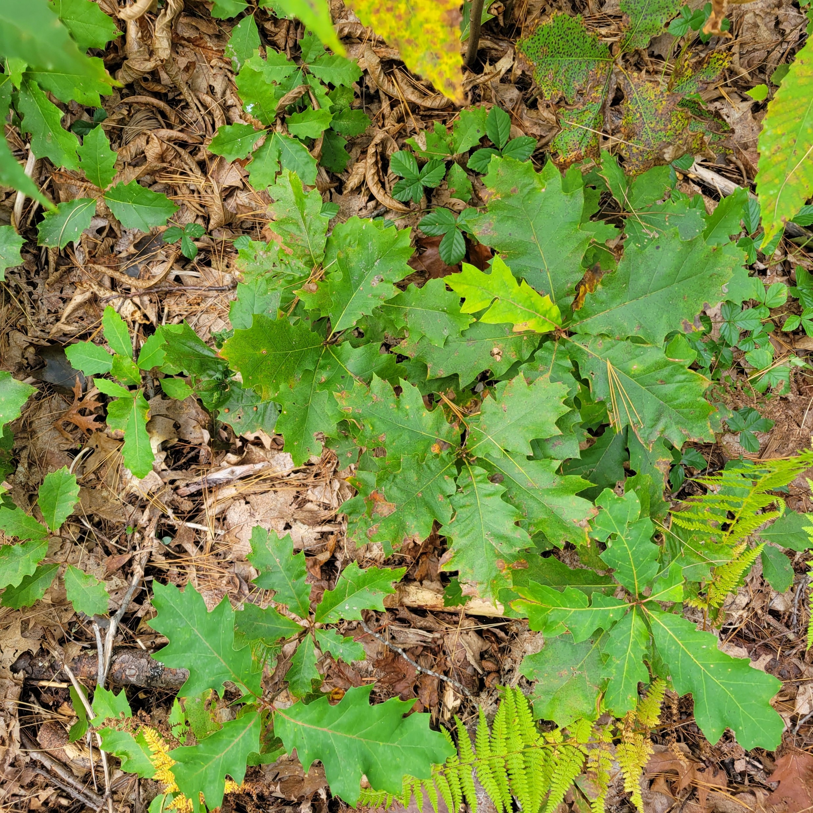
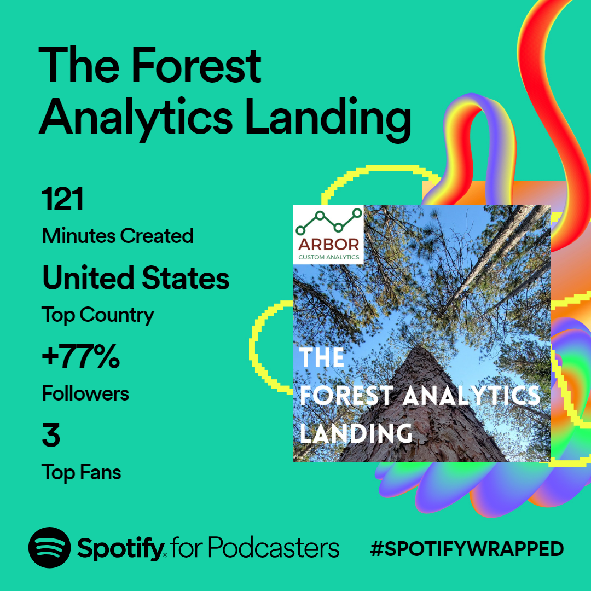

{width=500px}

#

The end of the year is an excellent time to reflect on your work. One of the things I value is providing content that the forest analytics community enjoys and learns from. 

In addition to publishing a [weekly-ish newsletter on LinkedIn](https://www.linkedin.com/newsletters/6962772901330616320/) with 2,000+ subscribers, I published 22 posts to the Arbor Custom Analytics blog in 2023 on topics relating to data and forests. Here are the most read posts from the Arbor Custom Analytics blog in 2023:

* [Getting your data into R from Google Sheets](https://arbor-analytics.com/post/getting-your-data-into-r-from-google-sheets/)
* [Mixed models in R: a primer](https://arbor-analytics.com/post/mixed-models-a-primer/)
* [A list of R packages for forestry applications](https://arbor-analytics.com/post/2023-11-24-a-list-of-r-packages-for-forestry-applications/)
* [Lorey's height: the remote sensing way to estimate tree height](https://arbor-analytics.com/post/2023-04-21-lorey-s-height-the-remote-sensing-way-to-estimate-tree-height/)

From January through June, I also published *The Forest Analytics Landing* podcast every other week. Here's a Spotify Wrapped image showing the analytics in 2023 of the Forest Analytics Landing podcast:

# 

{width=500px}

# 

Here are the most listened podcasts from the year:

* 027: [Forest carbon trends to watch in 2023](https://open.spotify.com/episode/4XMqRaIGHOsuxVUUgCTAHr?si=aa626e37d9174cf1)
* 034: [Recent data on greenhouse gas emissions and removals from US forests](https://open.spotify.com/episode/57vrQK7lNbDK5GhFVLybhL?si=05258cc30540479f)
* 028: [Forestland on the blockchain](https://open.spotify.com/episode/10zkwdWjCHvFCxmezXFlO2?si=a7aa324d36e5473f)
* 035: [Carbon sequestration and harvested wood products](https://open.spotify.com/episode/5PgWHhsBFRZHnNDSdwiTve?si=2597bd5276c84bcd)

Have an idea for a future topic you'd like to learn about? [Send me an email](mailto:matt@arbor-analytics.com) with any suggestions!

--

*Thanks to everyone for reading and listening this year. Have a blessed New Year!* 
