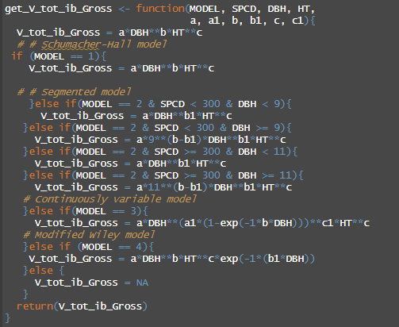

# 

{width=500px} 

#  

Last fall the USDA Forest Service released the [National Scale Volume Biomass (NSVB)](https://www.fs.usda.gov/research/programs/fia/nsvb), a new modeling system for estimating volume, biomass, and carbon stored in individual trees. These new equations replace the previously-used Component Ratio Method (CRM) and are the result of several years of research. Volume, biomass, and carbon attributes in the US Forest Inventory and Analysis (FIA) database have been updated with values from the new equations. 

Forest analysts may also be interested in applying the new NSVB equations to their own forest inventory data. As the new equations are largely thought to become the “national standard”, being able to apply the equations outside of the FIA database is needed within the forestry community. This can support a number of use cases including forest carbon projects and forest management planning, among many others.

To my knowledge, no R package or similar library currently exists that allows a user to apply the NSVB equations to their own forest inventory data, a disappointment given all the research and funding that’s gone into developing the equations. But most of the documentation is laid out in [this report by Westfall and others](https://www.fs.usda.gov/research/treesearch/66998) that contains four excellent examples that apply the equations to tree observations.

I’ve recently “coded up” the new equations in R, which may be another post to share in the future. Here are a few initial thoughts on implementing the new equations:

## 1. Get to know your neighborhood ecological division.

One of the primary differences in the NSVB models is the use of ecological provinces and divisions. I may have learned about ecological provinces and divisions in my forestry schooling, but I don’t use them regularly. Species within each ecological division (provided there were enough observations in the modeling data set) have their own set of model parameters that are used in the framework. As an example, there are 10 different volume equations for Douglas-fir dependending on which ecological division the forest is located in.

These divisions are outlined in the US National Hierarchical Framework of Ecological Units, described in detail in a map produced by [Cleland and others in 2007](https://www.fs.usda.gov/research/treesearch/48672). Within divisions there are ecological provinces. Within those provinces there are ecological sections and subsections. At various stages in the NSVB modeling framework, the division or province will need to be known to apply the appropriate set of coefficients.  

I wrote about ecological divisions [a few months ago](https://arbor-analytics.com/post/2023-11-17-a-handy-function-for-getting-ecological-division-from-fia-data/) because they’re an important part of the new modeling framework. For projects that span multiple divisions and provinces, users may need to apply the Cleland map to see where their forests lie. Ecological divisions don’t follow boundaries like state and county lines, so analysts may need to incorporate these into their own workflow.

## 2. Be cautious when dealing with species codes.
In addition to the multiple equations for a species depending on ecological division, species are handled delicately in the NSVB framework. Species-level coefficients may also be provided across all ecological divisions or may be grouped into species groups for estimation. These species groups follow ones presented in [Jenkins et al. 2003](https://www.fs.usda.gov/research/treesearch/6996). Some of the grouped equations use a mixed model form with a random effect, providing “quasi” species-level estimates.   

In total, there should be an equation to use for every species in your tree list depending on where the tree is located. Keeping track of which equation to use can be cumbersome, but it’s best to closely follow the coefficients listed in the supplemental data tables provided [in the report](https://www.fs.usda.gov/research/treesearch/66998). 

## 3. There are only four model forms, which are (relatively) easy to work with.  

The new framework provides four different model forms, with the one that fit the data best ultimately chosen as the one to represent that species. These models depend on a tree’s diameter and height. An equation to predict a tree’s height along its stem at the merchantable diameter limit is a bit tricky, but a required value to determine merchantable volume. 

Using relatively few model forms is parsimonious and makes the analysis straightforward. Users of the former CRM method and the abundant volume equation forms that differ by region and species might be relieved.
 
## 4. Models rely on height/actual height and cull estimates.

The NSVB models require estimates of actual height and cull percentage on individual trees. These variables were also required in the CRM method, but it’s worth mentioning here because these values are not always collected in forest inventories. 

**Actual height** measures the height of the tree from ground level to the highest remaining portion of the tree. This differs from the **height** variable used in the FIA program which assumes a tree has all of its tops and limbs intact. **Cull** refers to the proportion of a live or dead tree that is rotten or missing. 

Not having a measurement of height assuming an intact stem or an visual estimate of cull can lead to likely overestimations of volume, biomass, and carbon. Users that require an accurate estimate of carbon in standing dead trees or are working in recently disturbed forests should take note, as these conditions contain trees with broken tops. 

Healthy trees will likely have an actual height equal to their true height, and users may be able to get around this by assuming the two values are equal. If the proportion of a tree that is in cull was not collected in an inventory, users could make some rough approximations if the tree is designated as unacceptable growing stock or other defects are noted in the tree. Or, use any other historical data your organization might have that allows you to best determine these attributes.

--

*By Matt Russell. For more, subscribe to my [monthly email newsletter](https://mailchi.mp/d96897dc0f46/arbor-analytics) to stay ahead on data and analytics trends in the forest products industry.*