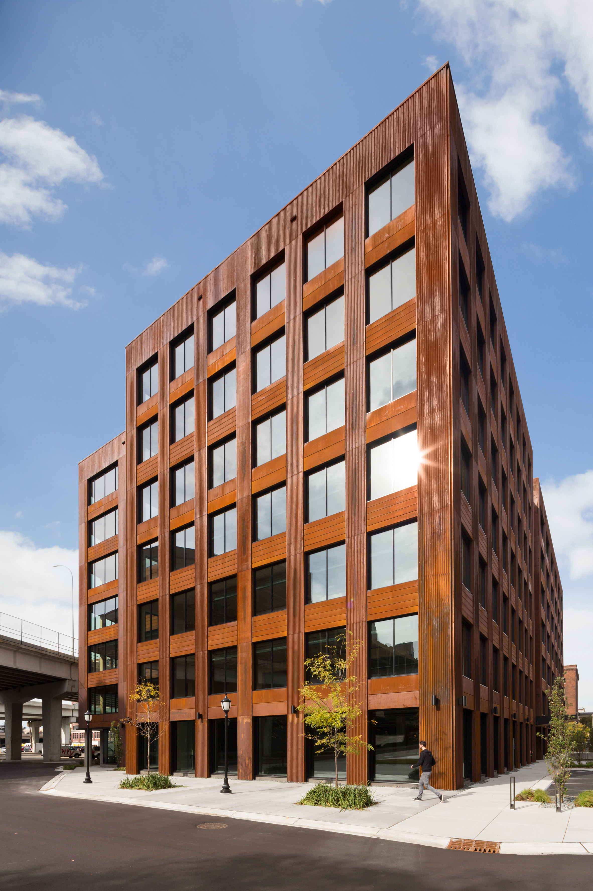

<center>

{width=500px}

</center> 

```{r echo=F,warning=F,message=F}
knitr::opts_chunk$set(echo = TRUE)
options(scipen=999)
library(tidyverse)
library(GGally)
library(knitr)
library(formattable)
library(kableExtra)
```

```{r,echo=F,warning=F,message=F}
# Some data compiled from websites on mass timber buildings
building<-data.frame(Building=c("T3","Carbon12","T3 West Midtown","Brock Commons Tallwood House","The Cube Building"),
                     Location=c("Minneapolis, MN","Portland, OR","Atlanta, GA","Vancouver, BC","London, UK"),
                     YearBuilt=c(2016,2018,2018,2017,2015),
                     Stories=c(7,8,7,18,10),
                     SquareFeet=c(224000,42000,205000,162700,72650))
```

[Mass timber buildings](https://www.thinkwood.com/building-better/taller-buildings) are increasingly being built and have a number of environmental benefits. They are lighter than other common building materials like steel, are fire resistant, and their use reduces carbon dioxide emissions compared to other building materials. Buildings are even being constructed with [beetle-killed wood](https://www.naturallywood.com/sustainable-forests/forest-management/interior-forests/mountain-pine-beetle) to mitigate the impacts of forests disturbances on the carbon cycle. Because of these benefits, building codes are being changed or altered that support the construction of mass timber buildings. 

But just how much "mass" of wood typically goes into making a mass timber building? Comparing how much wood is needed to build a typical residential home can help to provide insights into the volume of wood that is used in mass timber buildings.

Traditional homes are ["stick built"](https://www.hunker.com/13401138/the-amount-of-lumber-needed-for-a-1200-square-foot-house), typically made of narrow dimensional lumber like 2 x 4s. Each style of home varies depending on its size, number of doors and windows, and how the interior walls are oriented. 

A few estimates specifying the amount of wood required to build a home are online, but the style and size of the home are the primary drivers of how much wood is needed. From several online sources, a __2,000 square foot home__ requires approximately __16,000 board feet of wood__ in its construction. A board foot represents 144 cubic inches, or a piece of wood that is 12 inches x 12 inches x 1 inch.

For the same square footage, the amount of wood needed to make a mass timber building would be much greater than for a home. Instead of using dimensional lumber, mass timber buildings are typically made of materials like [cross laminated timber (CLT)](https://www.apawood.org/cross-laminated-timber). Finished panels are between two and ten feet wide and are up to 60 feet long and 20 inches thick. Here are five examples of mass timber building across the world:  


```{r,echo=F,warning=F,message=F}
t.building <- building[, 1:5] %>% 
  head(6) 
t.building %>% 
  kable("html", caption = 'Some example recently-constructed mass timber buildings with their total square footage.') %>%
 kable_styling()
```
 
How can we use the board foot volume of wood used in a house to determine how many trees go into the construction of a mass timber building? Using the typical amounts of wood needed to build a home (i.e., 2,000 square foot home = 16,000 board feet of wood), a few key assumptions can be made to "scale up" to find out how much board feet is required for a mass timber building:

 * First, mass timber buildings have no studs in their walls. We can assume that they have **"continuous walls"**. If typical stud widths in homes are 16 inches apart with two-inch pieces of wood, we can assume a continuous wall has **eight times as much wood** occupying a wall.
 * Second, mass timber walls (both interior and exterior) are **thicker** than home walls. If a mass timber wall is 20 inches think, **five times as much wood** would occupy a wall. 

To summarize these assumptions, one square foot of a home requires 0.125 board feet of wood. One square foot of a mass timber building requires 5 board feet of wood.  

Mass timber buildings typically use western conifers like Douglas-fir in construction material such as CLT. [Growth and yield tables](https://andrewsforest.oregonstate.edu/sites/default/files/lter/pubs/pdf/pub3401.pdf) for a typical fully-stocked stand of Douglas-fir on an average quality site can produce **100,000 board feet** of wood per acre at 100 years. This stand would typically contain 182 trees per acre that are seven inches in diameter or larger. This provides a useful reference point to quantify not only the volume of wood needed for a mass timber building, but also an approximation of how many trees and acres of forestland that wood may represent.


```{r,echo=F,warning=F,message=F}
stud<-8
thick<-5
building<-building %>% mutate(
  # BoardFeet = (SquareFeet/(2000/16000))*thick*stud,
  BoardFeet = SquareFeet*5,
  Acres = round(BoardFeet/100000),
  Trees=round(182*Acres)) 

t.building2 <- building[, c(1,6,7,8)] %>% 
    head(6) 
t.building2 %>% 
  kable("html", caption = 'Estimates of total board feet, acres harvested, and total number of trees needed to construct mass timber buildings.') %>%
 kable_styling()
```

Assuming the trees were harvested from fully-stocked stands, the total number of trees required to make a mass timber building ranges from as high as **2,002 trees** for the T3 building in Minneapolis to **364 trees** for the Carbon12 building in Portland. These numbers of trees equate to the volume of trees from 11 and 2 acres of forestland, respectively.


```{r,echo=F,warning=F,message=F}
p.trees<-ggplot(building,aes(reorder(factor(Building),Trees),Trees))+
  geom_bar(stat="identity",fill="darkgreen",col="black")+
  coord_flip()+
  ylab("Number of trees needed to make mass timber building")+
  xlab("")+
    theme(panel.background = element_rect(fill = "NA"), 
        axis.line=element_line(color="black"),
        axis.title.x = element_text(size=12,color="black"),
        axis.title.y = element_text(size=12,color="black"),
        axis.text.x = element_text(size=12,color="black"),
        axis.text.y  = element_text(size=12,color="black"))
p.trees
```

It's difficult to find detailed information on how much wood is required to design mass timber buildings. There is no doubt that these values would differ substantially depending on the design of each building. The building's square footage, interior and exterior design, and other features would influence the total volume of wood required. 

These results suggest that some of the largest mass timber buildings in the world may have been constructed from the use of thousands of trees. The use of all of those trees has a long-lasting benefit to the health of forests by keeping all of that wood as a long-lived forest product.

*Updated 27 September 2022. Special thanks to Lydia Link for pointing out calculation error in board foot value of buildings.*

*By Matt Russell. Leave a comment below or [email Matt](mailto:matt@arbor-analytics.com) with any questions or comments.*